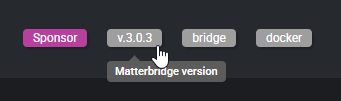

Somfy est un groupe industriel français, spécialisé dans la motorisation, l'automatisation des ouvertures de l'habitat et du bâtiment, ainsi que dans la maison connectée.

Grâce à l'application TaHoma® by Somfy et une box domotique, il est possible de gérer à distance des volets, stores, portes de garage, portails, systèmes de sécurité, caméras, et autres interphones connectés.


Actuellement, la gestion complète de la maison se limite à cette application et une connexion au cloud Somfy.

Alors pour aller plus loin dans les interactions, Gladys va permettre une gestion plus étendue grâce à ses diverses intégrations.

La version 4.58 de **Gladys Assistant** introduit le support officiel du standard **Matter**.
Grâce au projet open‑source [Matterbridge](https://github.com/luligu/matterbridge), vous pouvez rendre compatibles avec Matter des appareils qui ne le sont pas nativement, et ainsi les contrôler dans Gladys aussi facilement que des appareils natifs.
C'est ce que nous allons faire pour les appareils Somfy.

Ce guide pas à pas vous expliquera comment exposer et piloter vos volets roulants, stores, et autres ouvrants Somfy.

### Prérequis

- Gladys Assistant 4.58 installé et fonctionnel
- Réseau local IPv6 activé
- Docker + Docker Compose disponibles sur la machine hôte
- Accès terminal/SSH & éditeur de texte
- Une box Somfy : **Connexoon** (protocole io-homecontrol®), **TaHoma** (io, RTS), **TaHoma Switch** (io, RTS, Zigbee)
- Un compte Somfy valide et actif

### 1. Déployer Matterbridge avec Docker

Sur votre serveur Gladys, créez un dossier `matterbridge` :

```bash
mkdir ~/matterbridge && cd ~/matterbridge
```

Copiez‑collez le `docker-compose.yml` ci‑dessous (avec nano par exemple, `nano docker-compose.yml`):

```yaml
services:
  matterbridge:
    image: luligu/matterbridge:latest
    container_name: matterbridge
    restart: unless-stopped
    network_mode: host
    environment:
      - TZ=Europe/Paris
    ports:
      - "8283:8283" # Expose l’UI Web de Matterbridge
    volumes:
      - "${HOME}/matterbridge:/root/Matterbridge" # Mounts the Matterbridge plugin directory
      - "${HOME}/.matterbridge:/root/.matterbridge" # Mounts the Matterbridge storage directory
```

Lancez le conteneur :

```bash
docker compose up -d
```

Suivez les logs pour récupérer le code QR de commissionnement :

```bash
docker compose logs -f
```


**Accédez à l’interface Web** : ouvrez `http://ADRESSE-IP-DE-VOTRE-SERVEUR:8283`.

Rendez‑vous sur la page principale de matterbridge. Vous devrez vérifier en tout premier lieu si une mise à jour est disponible. Si c'est le cas exécutez la et patientez jusqu'au redémarrage




### 2. Installation du plugin Somfy/TaHoma

Pour installer le plugin Somfy/TaHoma, cliquez sur les 3 points, sélectionnez **matterbridge-somfy-tahoma** puis cliquer sur **INSTALL**,


Une fois le plugin installé, Matterbridge devrait redémarrer automatiquement au besoin. Si ce n'est pas le cas, vous pouvez redémarrer manuellement en cliquant sur l'icône en haut à droite de l'interface.


Le plugin est installé et un message d'erreur dans les logs nous indique qu'il faut configurer le plugin :


Pour cela, cliquez sur l'icône **Plugin config** :


Remplissez **mail** et **mot de passe** de votre compte Somfy, sélectionnez le serveur **Somfy Europe**, et validez sur **Confirm** :


Un redémarrage manuel de Matterbridge est nécessaire pour activer la configuration du plugin :


Une fois redémarré, vos appareils (devices) apparaissent dans Matterbridge sous **Devices** dans la ligne du plugin et dans l'onglet **Devices** :


### 3. Commissionner le bridge dans Gladys

Récupérez tout d'abord le **Manual pairing code** de la page principale **Home**

Si celui-ci n'apparaît pas, vous pouvez forcer son affichage en cliquant sur **Share fabrics** dans le menu en haut à droite `...` :


Dans Gladys, ouvrez l'intégration "Matter" depuis le menu **Intégrations** → **Matter**.
Si ce n'est pas déjà fait, activez "Matter" depuis le menu **Paramètres** :


Cliquez sur l'onglet **Ajouter un appareil**, puis collez ou renseignez le **Code d'appairage** affiché précédemment par Matterbridge. Cliquez sur **Ajouter à Gladys**


Patientez quelques secondes : vous pouvez maintenant intégrer vos équipements **Somfy** compatibles dans **Gladys Assistant** :


Vous pouvez ajouter ces équipements en cliquant sur **Ajouter à Gladys**.

Le bridge apparaît maintenant dans l'onglet **Paramètres** :


### 4. Aller plus loin

- Activer d’autres plugins Matterbridge : Zigbee2MQTT, Shelly, Home Assistant, etc.
- Ajouter ces équipements sur votre tableau de bord
- Créer des scènes Gladys (ex. : fermer tous les volets de l'étage quand il commence à faire nuit puis ceux du rez-de-chaussée 30mn plus tard).

### 5. Développements futurs :

- **API locale**
  Actuellement tout passe par le Cloud Somfy : il faut donc avoir une connexion Internet fonctionnelle pour pouvoir piloter ses ouvrants.
  Le développement pour pouvoir utiliser l'API locale de la box Somfy a commencé mais n'est pas encore opérationnel. Des mises à jours du plugin permettront à terme de tout faire en local.

- **Position (%) des volets**
  Matterbridge gère les ouvrants de manière autonome, c'est-à-dire qu'il n'y a pas d'interrogation des serveurs Somfy pour connaître la position actuelle des ouvrants si ceux-ci sont pilotés par leurs télécommandes ou l'application mobile Tahoma :
  
  Une réflexion est en cours pour pouvoir récupérer les différentes positions.

### Conclusion

En quelques minutes, vous avez transformé vos ouvrants **Somfy** en appareils compatibles **Matter** pleinement intégrés à **Gladys Assistant**.

Merci au standard **Matter** et au projet **Matterbridge** qui rendent l’écosystème encore plus ouvert !

### Ressources utiles

- [Intégrer des appareils Matter dans Gladys Assistant](/fr/docs/integrations/matter/)
- [Repository GitHub Matterbridge](https://github.com/luligu/matterbridge)
