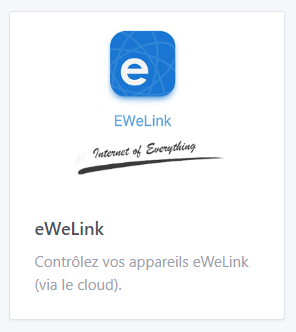
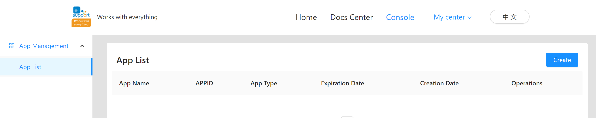
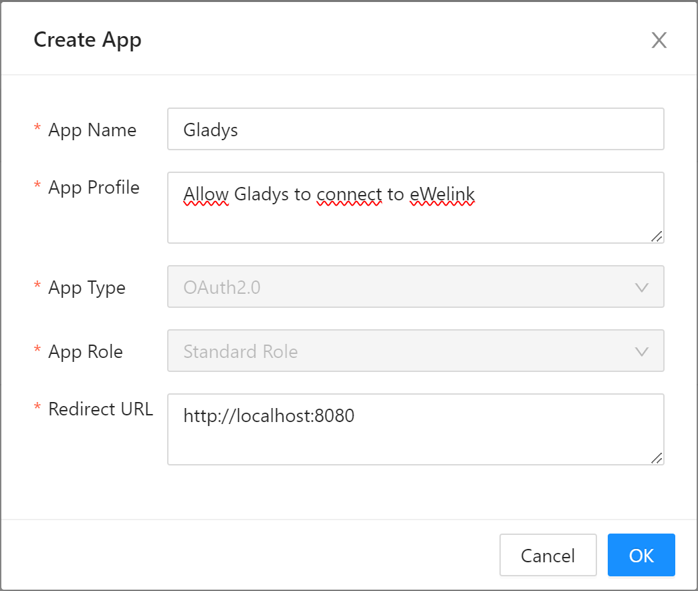
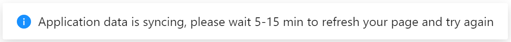
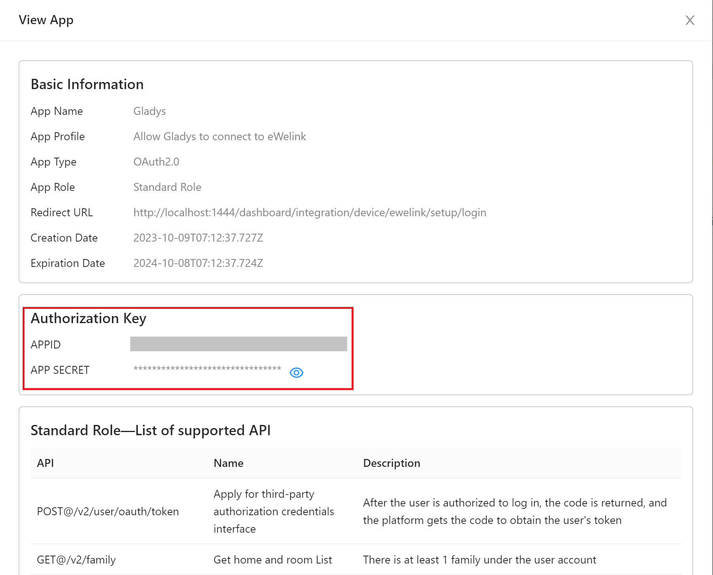
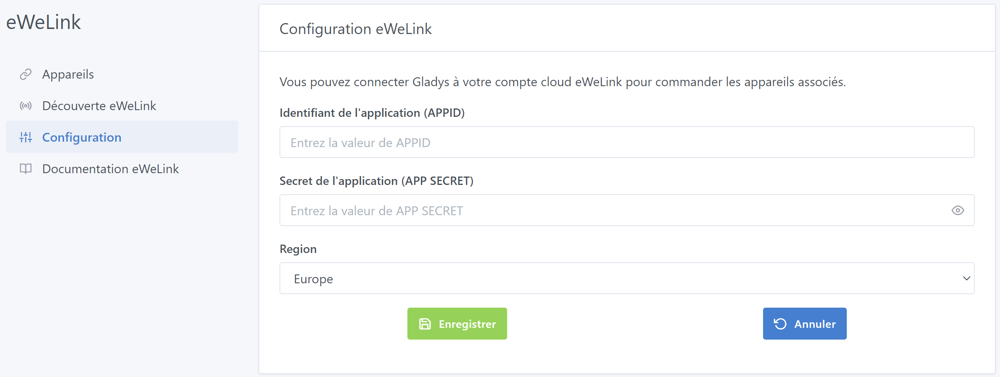
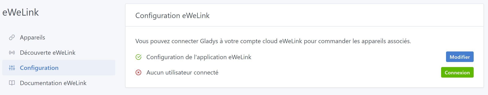

Les appareils Sonoff peuvent aussi être utilisé avec le firmware OpenSource [Tasmota](https://gladysassistant.com/fr/docs/integrations/tasmota/).

## Prérequis

Vous devez disposer d'un compte cloud "eWeLink" :

- [eWeLink pour Android](https://play.google.com/store/apps/details?id=com.coolkit)
- [eWeLink pour iPhone/iPad](https://apps.apple.com/fr/app/ewelink-smart-home/id1035163158)

## Configuration de l’accès au cloud eWeLink

Afin de pouvoir contrôler vos appareils eWeLink avec Gladys, il vous faudra configurer un accès développeur sur la plateforme eWeLink.

### Créer un compte développeur

Rendez-vous sur le site [https://dev.ewelink.cc/](https://dev.ewelink.cc/), cliquez sur le lien "Login/Register" afin d’avoir accès aux fonctionnalités de développement du cloud eWeLink.

Lors de la création d’un nouveau compte, il peut se passer jusqu’à 48 heures avant que celui-ci ne soit approuvé par les équipes eWeLink. Vous recevrez une e-mail dès que le compte sera réellement créé et actif. Merci d’être patient.

### Créer une application

Maintenant, il vous faut créer une application en cliquant sur le bouton "Create".

Cette application vous ouvrira les accès aux APIs eWeLink, ainsi Gladys pourra de nouveau se connecter à vos appareils.

Il faut maintenant remplir le formulaire de création avec les informations nécessaires : 

- App Name : un nom simple permettant d’identifier rapidement l’usage (exemple : _Gladys_)
- App Profile : une description simple de l’application (exemple : _Permet à Gladys de se connecter aux APIs_)
- App Type : laissez _OAuth2.0_
- App Role : laissez _Standard Role_
- Redirect URL : entrez l’adresse Web de votre instance Gladys, suivie par `/dashboard/integration/device/ewelink/setup/login` (exemple : _http://localhost:1440/dashboard/integration/device/ewelink/setup/login_)

La création prend quelques minutes, vous verrez alors ce message… patientez…

### Récupérer les informations de connexion

Une fois l’application correctement créée, il faudra alors récupérer les informations nécessaires pour que Gladys s’y connecte : _APPID_ et _APP SECRET_. Ces informations sont disponibles en cliquant sur le bouton "View".

## Intégration dans Gladys

### Configurer Gladys avec les informations eWeLink

Une fois les informations *APPID* et *APP SECRET* disponibles, récupérez les et entrez les dans vos instance Gladys : 

1. allez sur la page `Intégration -> eWeLink`
2. sélectionnez le menu `Configuration`
3. renseignez les informations sur l’application
4. enregistrez

### Connecter son compte utilisateur eWeLink dans Gladys

Une fois les informations de l’application renseignées, vous devez alors vous connecter avec votre utilisateur eWeLink en cliquant sur le bouton "Connexion".

### Ajouter un appareil dans Gladys

Une fois l'intégration configurée et votre utilisateur connecté, toujours depuis Gladys :

1. allez sur la page `Intégration -> eWeLink`
2. sélectionnez le menu `Découverte eWeLink`
3. cliquez sur le bouton `Scanner` en haut à droite (si le périphérique n'est pas déjà dans la liste)
4. enfin, cliquez sur `Sauvegarder`

Et voilà !

Je vous invite à poster un message sur [le forum](https://community.gladysassistant.com/), si jamais vous avez besoin d’aide.
