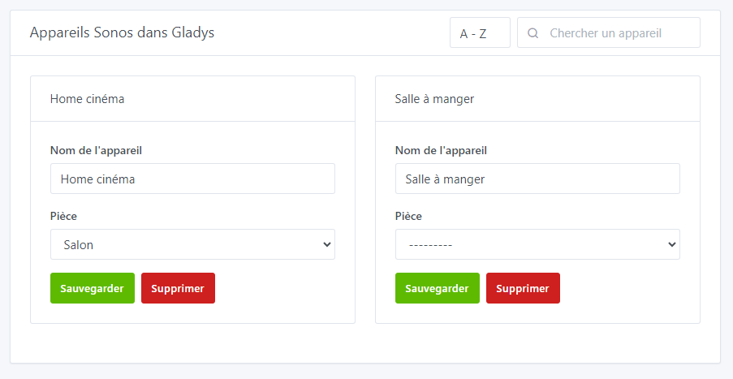

# Connecter une enceinte Sonos à sa domotique

## Prérequis

Vous devez disposer de l’application Sonos pour connecter vos enceintes Sonos (sonos Play 1, sonos One, sonos Playbar, sonos Sub, sonos Port, …)

- [Sonos pour Android](https://play.google.com/store/apps/details?id=com.sonos.acr2&hl=fr&gl=US)
- [Sonos pour Apple](https://apps.apple.com/fr/app/sonos/id1488977981)

Si vous créez un groupe d’enceintes dans l’application Sonos ce groupe sera reconnu comme une seule enceinte dans Gladys. Si vous avez un Sonos Port, il sera également détecté dans l’intégration.

## Ajouter une enceinte dans Gladys

Après avoir ajouté vos enceintes dans l’application Sonos, retournez dans Gladys:

1. allez sur la page `Intégration -> Sonos` dans Gladys
2. sélectionnez le menu `Découverte Sonos`
    
    
    
3. cliquez sur le bouton `Scanner` en haut à droite (si le périphérique n'est pas déjà dans la liste)
4. enfin, cliquez sur `Sauvegarder` pour les enceintes que vous voulez intégrer à Gladys
5. et voilà !

## Renommer / placer une enceinte dans une pièce

Si nécessaire, vous pouvez vous rendre dans le menu `Appareils` pour modifier / compléter la configuration de vos enceintes en les ajoutant dans une pièce ou en les renommant.

## Contrôler la musique sur le tableau de bord

Vous pouvez maintenant rajouter un **widget musique** sur votre tableau de bord et contrôler vos enceintes Sonos grâce au player musique.

Rendez-vous sur le dashboard de Gladys et cliquez sur le bouton `éditer` pour modifier le dashboard.

Cliquez sur `ajouter +` puis sélectionnez le widget `musique` vous pouvez le déplacer dans une colonne.

Sélectionnez votre enceinte, et cliquez sur `Enregistrer`

Voilà ! Votre widget est visible sur le dashboard.

Je vous invite à poster un message sur [le forum](https://community.gladysassistant.com/), si jamais vous avez besoin d’aide.