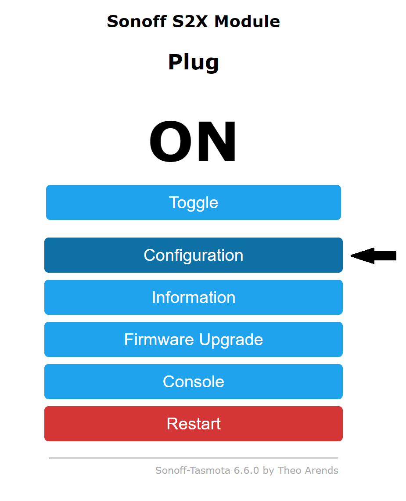
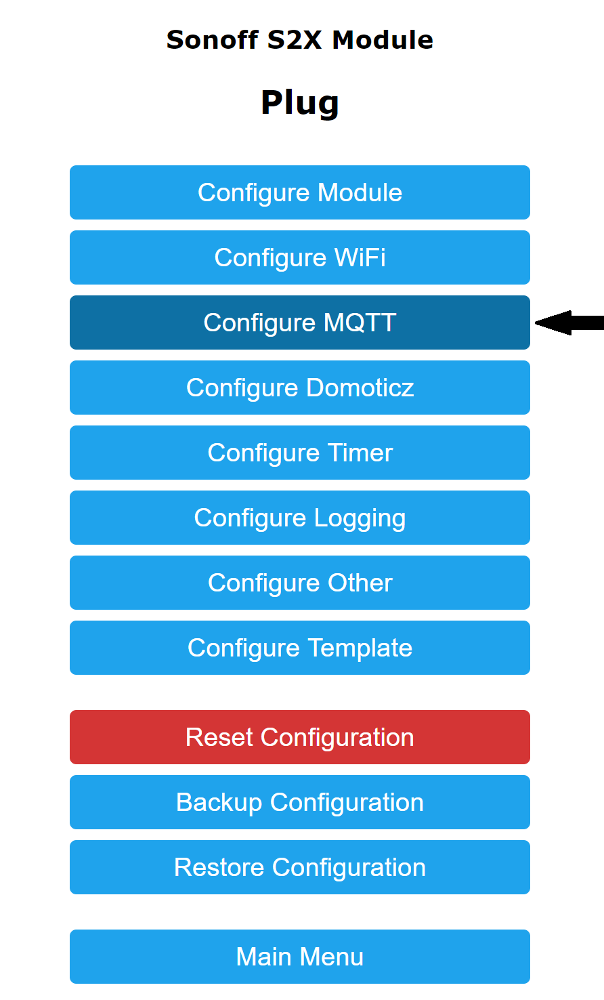
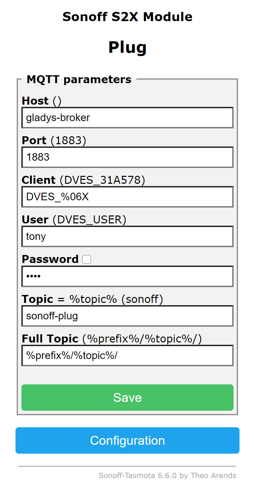

---
id: tasmota
title: Tasmota
sidebar_label: Tasmota
---

Tasmota est un firmware OpenSource pour des appareils basé sur des ESP8266.

Pour connecter vos appareils :

- installez Tasmota sur votre appareil
- configurez votre appareil
- allez dans `Intégrations / Tasmota` dans Gladys

## Installation du firmware Tasmota

Merci de suivre les instructions sur <a href="https://tasmota.github.io/docs/Getting-Started/" target="_blank">le guide d'installation de Tasmota</a>.

Il existe des multiples guides d'installation du firmware sur Internet, l'installation est spécifique à chaque appareil.

## Configuration du périphérique

Une fois que le firmware Tasmota est correctement installé, rendez-vous sur la page web du périphérique et configurez le protocole MQTT comme indiqué sur <a href="https://tasmota.github.io/docs/MQTT/" target="_blank">la page de configuration de MQTT pour Tasmota</a>.

Remplissez les informations selon votre agent (broker) MQTT, et saisissez l'identifiant unique du périphérique dans le champ <i>Topic</i>.

Cliquez sur le menu `Configuration`.

Cliquez sur le menu `Configuration MQTT`.

Puis remplissez le formulaire avec vos informations :

- `Host` : l'adresse du broker MQTT
- `Port` : le port du broker
- `User` : l'identifiant pour se connecter au broker
- `Password` : le mot de passe pour se connecter au broker
- `Topic` : le Topic sur lequel vous allez communiquer avec Gladys. Attention, l'usage d'un sous-niveau de Topic par une barre oblique (/) est interdit car Gladys découvre les appareils Tasmota uniquement sur le niveau de Topic 1
- `Topic Complet` : Ne rien renseigner

## Ajouter un appareil dans Gladys

Une fois l'appareil configuré, il ne reste qu'à :

1. aller sur la page `Intégration -> Tasmota`
2. sélectionner le menu `Découverte MQTT`
3. cliquer sur le bouton `Scanner` en haut à droite (si le périphérique n'est pas déjà dans la liste)
4. enfin, cliquer sur `Sauvegarder`
5. et voilà !
