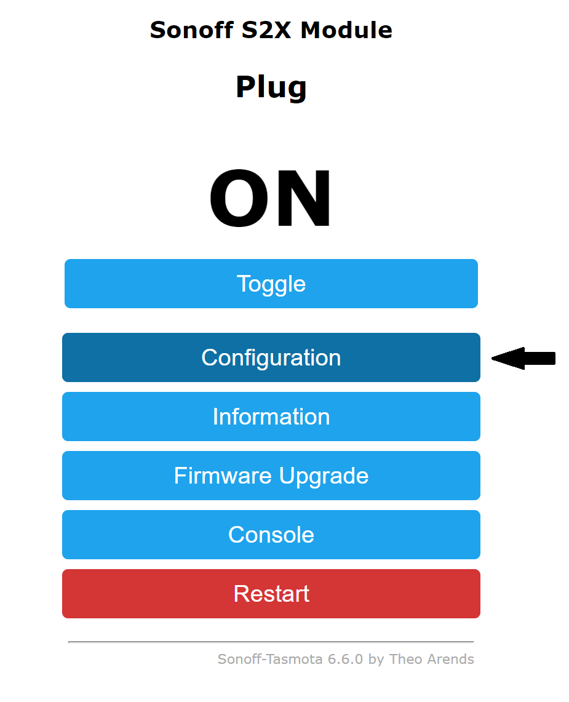
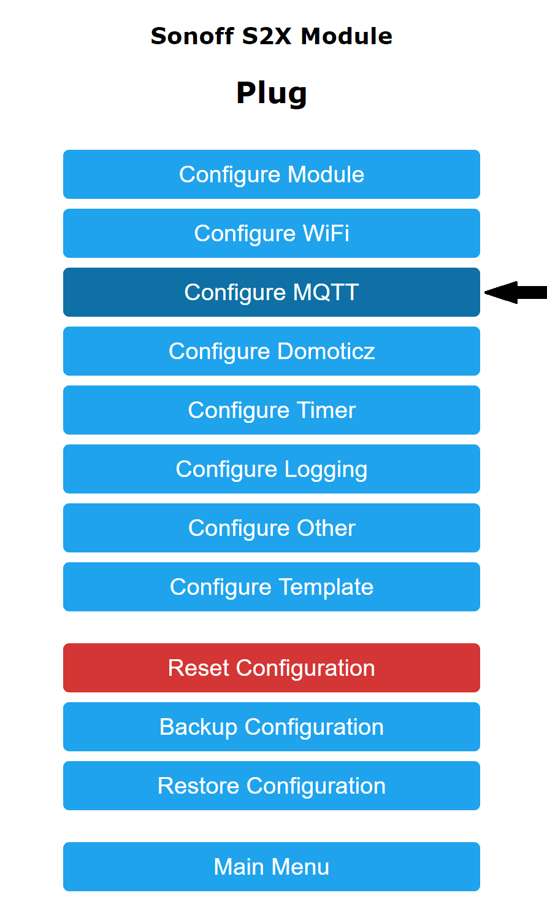
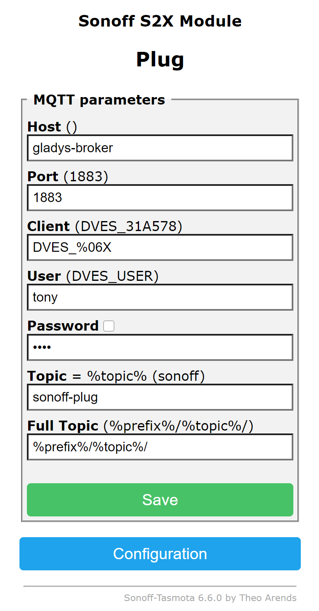

import JsonLd from '@site/src/components/seo/JsonLd';

[Tasmota](https://tasmota.github.io/docs/) est un firmware libre et open source pour les appareils à base d'ESP8266, ESP8285 et ESP32. Il remplace le firmware cloud du fabricant sur les prises connectées, interrupteurs, ampoules et capteurs pour qu'ils fonctionnent **entièrement en local**, sans compte fabricant ni dépendance à Internet, et les expose en MQTT, HTTP ou série.

Comme Tasmota communique en MQTT standard, il s'accorde parfaitement avec Gladys Assistant : une fois flashés, vos appareils sont découverts et pilotés en local, sur votre propre réseau, sans passer par aucun cloud tiers.

Pour connecter un appareil Tasmota à Gladys, trois étapes :

- flashez votre appareil avec le firmware Tasmota
- configurez le MQTT sur l'appareil
- ajoutez-le dans `Intégrations / Tasmota` dans Gladys

## Pourquoi utiliser Tasmota avec Gladys ?

- **100 % local et privé** : l'appareil ne communique plus avec les serveurs du fabricant. Il dialogue uniquement avec votre broker MQTT local et Gladys.
- **Sans cloud, sans abonnement** : Tasmota est gratuit et open source, et continue de fonctionner même si le fabricant d'origine ferme son service.
- **Réutilisez du matériel bon marché** : de nombreuses prises et interrupteurs connectés abordables (Sonoff et autres appareils à base d'ESP) peuvent être reflashés plutôt que jetés.
- **Fiable et rapide** : les commandes locales ne dépendent pas de votre connexion Internet, vos automatisations s'exécutent instantanément.

:::tip Tasmota ou Zigbee ?
Tasmota fonctionne sur des appareils Wi-Fi, chacun se connectant directement à votre box — pratique pour quelques prises et interrupteurs sur secteur. Pour des capteurs sur batterie et de grands parcs d'appareils, un maillage [Zigbee](./zigbee2mqtt.md) basse consommation est souvent préférable. Les deux sont locaux et fonctionnent très bien dans Gladys, et vous pouvez les mélanger. Consultez notre [guide d'achat des clés Zigbee](/fr/best-zigbee-dongle/) si vous partez sur le Zigbee.
:::

## Flashez votre appareil avec Tasmota

Le moyen le plus simple d'installer Tasmota est le **web installer** officiel : [tasmota.github.io/install](https://tasmota.github.io/install/). Il flashe votre appareil directement depuis un navigateur Chrome ou Edge via USB (grâce à l'API WebSerial), sans aucun logiciel à installer.

Il prend en charge tous les appareils à base d'Espressif ESP8266, ESP8285, ESP32, ESP32-S et ESP32-C3.

Si votre appareil nécessite un flash manuel, suivez le [guide d'installation de Tasmota](https://tasmota.github.io/docs/Getting-Started/). Il existe de nombreux tutoriels spécifiques à chaque appareil ; vous trouverez le bon en cherchant le nom de votre modèle suivi de « Tasmota ».

## Configurez le MQTT sur l'appareil

Une fois le firmware installé, ouvrez la page web de l'appareil (son adresse IP sur votre réseau) et configurez le MQTT comme indiqué sur la [documentation MQTT de Tasmota](https://tasmota.github.io/docs/MQTT/).

Cliquez sur le menu `Configuration`.

Cliquez sur le menu `Configuration MQTT`.

Puis remplissez le formulaire avec les informations de votre broker MQTT :

- `Host` : l'adresse du broker MQTT
- `Port` : le port du broker
- `User` : l'identifiant pour se connecter au broker
- `Password` : le mot de passe pour se connecter au broker
- `Topic` : un identifiant unique pour cet appareil

:::note
Gladys embarque son propre broker MQTT. Si vous n'en avez pas encore configuré, installez d'abord l'[intégration MQTT](./mqtt.md) dans Gladys, puis faites pointer vos appareils Tasmota dessus.
:::

## Ajouter un appareil dans Gladys

Une fois l'appareil configuré, il ne reste qu'à :

1. aller sur la page `Intégration -> Tasmota`
2. sélectionner le menu `Découverte MQTT`
3. cliquer sur le bouton `Scanner` en haut à droite (si le périphérique n'est pas déjà dans la liste)
4. enfin, cliquer sur `Sauvegarder`
5. et voilà !

Votre appareil Tasmota est désormais pilotable depuis Gladys, intégré à vos dashboards et utilisable dans vos [scènes](/fr/docs/scenes/intro/) — le tout en local.

## Questions fréquentes

### Tasmota est-il compatible avec Gladys Assistant ?

Oui. Tasmota communique en MQTT, et Gladys dispose d'une intégration Tasmota native qui découvre et pilote les appareils Tasmota sur votre réseau local. Il suffit de flasher le firmware, de configurer le MQTT sur l'appareil, puis de le scanner dans `Intégrations / Tasmota`.

### Tasmota fonctionne-t-il sans cloud ni Internet ?

Oui. C'est tout l'intérêt de Tasmota : il remplace le firmware cloud du fabricant par un contrôle local en MQTT et HTTP. Une fois flashé et associé à Gladys, votre appareil fonctionne entièrement sur votre réseau local, même sans connexion Internet.

### Quels appareils peuvent fonctionner avec Tasmota ?

Tout appareil basé sur une puce Espressif ESP8266, ESP8285, ESP32, ESP32-S ou ESP32-C3 peut être flashé avec Tasmota. Cela concerne de nombreuses prises, interrupteurs, relais, ampoules et capteurs connectés (comme plusieurs appareils Sonoff).

### Comment flasher Tasmota ?

Le plus simple est le web installer officiel sur tasmota.github.io/install, qui flashe votre appareil directement depuis un navigateur Chrome ou Edge via USB, sans logiciel à installer. Le flash manuel est également possible en suivant le guide d'installation de Tasmota.

### Faut-il un broker MQTT séparé pour Tasmota ?

Il faut un broker MQTT, mais Gladys en embarque un. Installez l'intégration MQTT dans Gladys, puis faites pointer la configuration MQTT de vos appareils Tasmota vers ce broker : Gladys les découvrira automatiquement.

<JsonLd
  data={{
    "@context": "https://schema.org",
    "@type": "FAQPage",
    mainEntity: [
      {
        "@type": "Question",
        name: "Tasmota est-il compatible avec Gladys Assistant ?",
        acceptedAnswer: {
          "@type": "Answer",
          text: "Oui. Tasmota communique en MQTT, et Gladys dispose d'une intégration Tasmota native qui découvre et pilote les appareils Tasmota sur votre réseau local. Il suffit de flasher le firmware, de configurer le MQTT sur l'appareil, puis de le scanner dans Intégrations / Tasmota.",
        },
      },
      {
        "@type": "Question",
        name: "Tasmota fonctionne-t-il sans cloud ni Internet ?",
        acceptedAnswer: {
          "@type": "Answer",
          text: "Oui. Tasmota remplace le firmware cloud du fabricant par un contrôle local en MQTT et HTTP. Une fois flashé et associé à Gladys, votre appareil fonctionne entièrement sur votre réseau local, même sans connexion Internet.",
        },
      },
      {
        "@type": "Question",
        name: "Quels appareils peuvent fonctionner avec Tasmota ?",
        acceptedAnswer: {
          "@type": "Answer",
          text: "Tout appareil basé sur une puce Espressif ESP8266, ESP8285, ESP32, ESP32-S ou ESP32-C3 peut être flashé avec Tasmota. Cela concerne de nombreuses prises, interrupteurs, relais, ampoules et capteurs connectés, comme plusieurs appareils Sonoff.",
        },
      },
      {
        "@type": "Question",
        name: "Comment flasher Tasmota ?",
        acceptedAnswer: {
          "@type": "Answer",
          text: "Le plus simple est le web installer officiel sur tasmota.github.io/install, qui flashe votre appareil directement depuis un navigateur Chrome ou Edge via USB, sans logiciel à installer. Le flash manuel est également possible en suivant le guide d'installation de Tasmota.",
        },
      },
      {
        "@type": "Question",
        name: "Faut-il un broker MQTT séparé pour Tasmota ?",
        acceptedAnswer: {
          "@type": "Answer",
          text: "Il faut un broker MQTT, mais Gladys en embarque un. Installez l'intégration MQTT dans Gladys, puis faites pointer la configuration MQTT de vos appareils Tasmota vers ce broker : Gladys les découvrira automatiquement.",
        },
      },
    ],
  }}
/>
