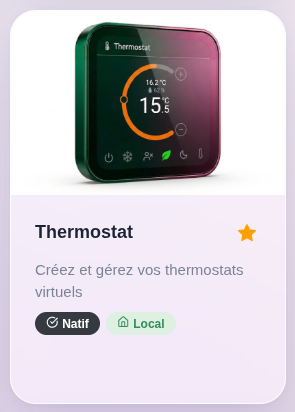
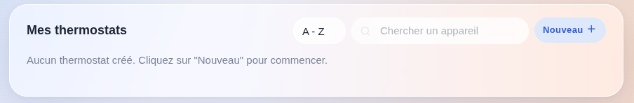
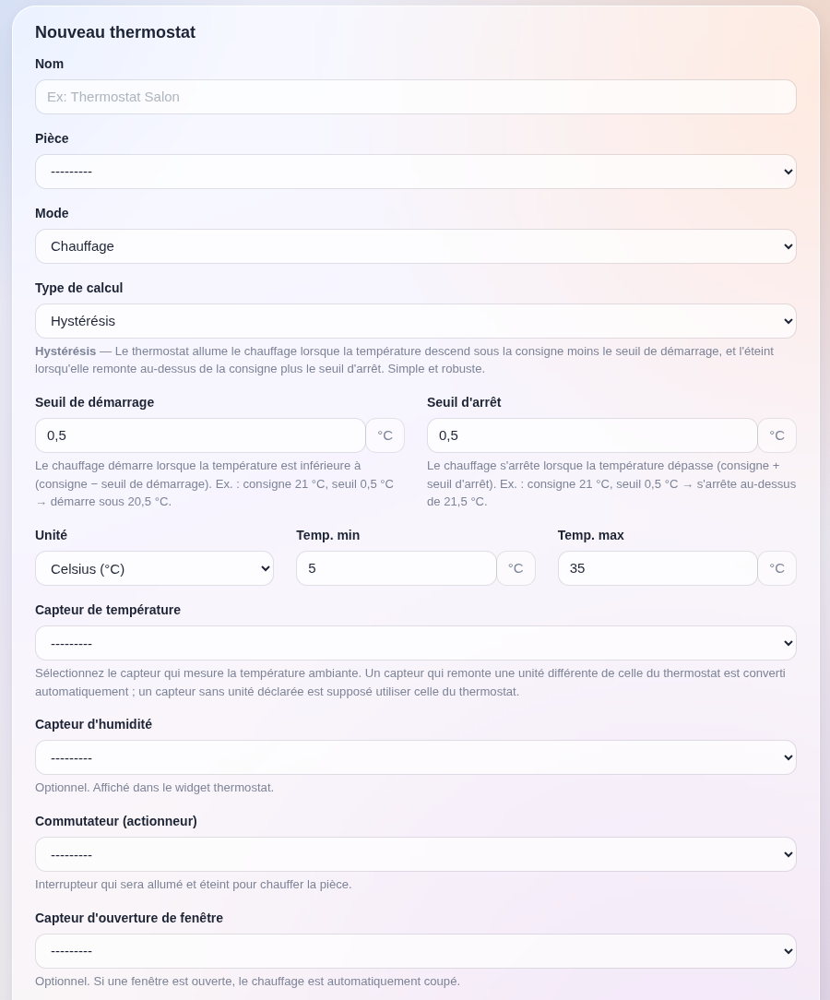
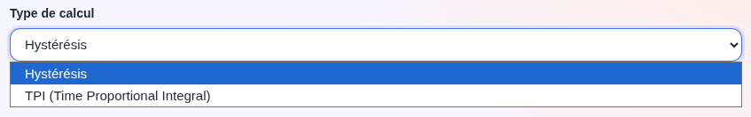
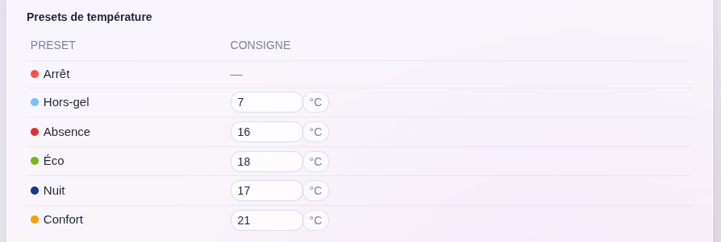
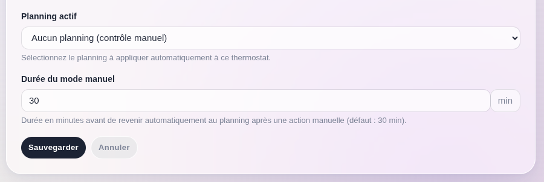
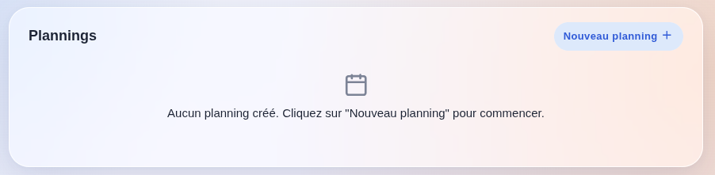
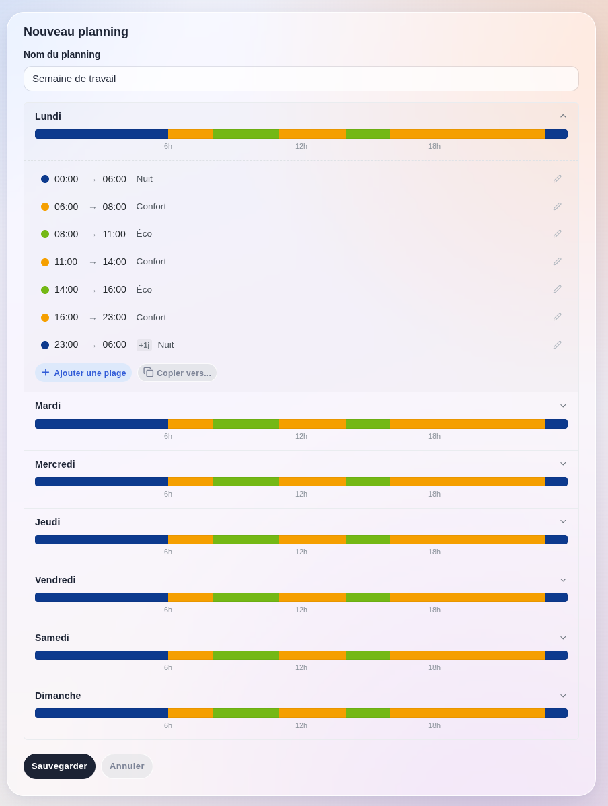
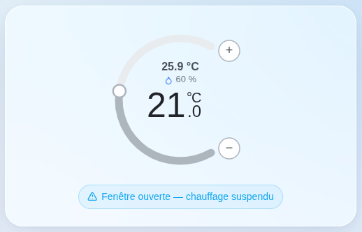

L'intégration **Thermostat** transforme n'importe quel capteur de température associé à n'importe quel interrupteur en une zone de chauffage (ou de climatisation) régulée, avec un planning hebdomadaire.

Elle vise l'installation la plus répandue en France : un radiateur électrique ou un circuit de chauffage piloté par un relais, une prise connectée ou un contact sec sur la chaudière, un capteur de température séparé dans la pièce, et aucun thermostat de marque nulle part. Plutôt que d'écrire une scène par seuil de température, vous créez un thermostat virtuel, vous lui indiquez quel capteur lire et quel interrupteur piloter, et Gladys régule la pièce à votre place.

Le thermostat créé par Gladys est un appareil comme un autre : il apparaît dans vos pièces, dans les scènes, dans l'API REST, dans MQTT et dans Gladys Plus, exactement comme le ferait un thermostat Netatmo ou Zigbee.

## Prérequis

Avant de créer un thermostat, il vous faut deux appareils déjà fonctionnels dans Gladys :

- un **capteur de température** dans la pièce (Zigbee, Z-Wave, MQTT, Bluetooth… peu importe l'intégration),
- un **interrupteur** qui allume et éteint votre chauffage (une prise connectée, un relais, un contact sec sur la chaudière…).

En option, vous pouvez également utiliser :

- un **capteur d'humidité**, affiché dans le widget,
- un **capteur d'ouverture** sur une fenêtre, qui suspend le chauffage tant que la fenêtre est ouverte.

:::note
Les radiateurs à fil pilote ne sont pas encore gérés : le sélecteur d'actionneur n'accepte qu'une fonctionnalité interrupteur / binaire.
:::

## Créer votre premier thermostat

Rendez-vous dans « Intégrations » → « Thermostat », puis cliquez sur « Nouveau ».

### Nom et pièce

Donnez un nom à votre thermostat (par exemple « Thermostat Salon ») et choisissez la pièce qu'il régule.

### Mode

- **Chauffage** : l'interrupteur est allumé lorsque la pièce est trop froide.
- **Climatisation** : l'interrupteur est allumé lorsque la pièce est trop chaude.

### Appareils

| Champ | Description |
| --- | --- |
| Capteur de température | Le capteur sur lequel la régulation s'appuie. Obligatoire. |
| Capteur d'humidité | Optionnel, affiché uniquement dans le widget. |
| Commutateur (actionneur) | L'interrupteur qui sera allumé et éteint. Obligatoire. |
| Capteur d'ouverture de fenêtre | Optionnel. Tant que la fenêtre est ouverte, l'interrupteur est coupé. |

:::note
Un capteur qui remonte une unité différente de celle du thermostat (une sonde en °C à côté d'un thermostat réglé en °F) est converti automatiquement. Un capteur sans unité déclarée est supposé utiliser déjà celle du thermostat.
:::

### Type de calcul

L'**hystérésis** (par défaut) est la méthode simple et robuste. En mode chauffage, le chauffage démarre lorsque la température descend sous `consigne − seuil de démarrage`, et s'arrête lorsqu'elle remonte au-dessus de `consigne + seuil d'arrêt`. Avec une consigne de 21 °C et des seuils de 0,5 °C, le chauffage tourne sous 20,5 °C et s'arrête au-dessus de 21,5 °C. Entre les deux, l'état courant est conservé, ce qui évite au relais de battre en permanence.

Le **TPI** (Time Proportional Integral) calcule un rapport ON/OFF sur un cycle fixe, proportionnel à l'écart entre la pièce et la consigne. Avec un cycle de 30 minutes et une bande proportionnelle de 2 °C, un écart de 1 °C donne 50 % du cycle en marche, soit 15 minutes allumé puis 15 minutes éteint. C'est le bon choix pour un plancher chauffant ou tout système à forte inertie, où l'hystérésis dépasse la consigne.

| Réglage | Défaut | Plage |
| --- | --- | --- |
| Seuil de démarrage (hystérésis) | 0,5 ° | — |
| Seuil d'arrêt (hystérésis) | 0,5 ° | — |
| Durée du cycle TPI | 30 min | 5 à 120 min |
| Bande proportionnelle TPI | 2 ° | 0,5 à 10 ° |

:::note
Le TPI ne concerne que le chauffage : un compresseur ne peut pas être piloté par impulsions de cette façon, un thermostat en mode climatisation repasse donc toujours en hystérésis.
:::

### Presets

Un preset est une température de consigne nommée. L'intégration en propose six, dont vous pouvez modifier chaque température :

| Preset | Défaut |
| --- | --- |
| Arrêt | pas de consigne, le chauffage est coupé |
| Hors-gel | 7 °C |
| Absence | 16 °C |
| Éco | 18 °C |
| Nuit | 17 °C |
| Confort | 21 °C |

Ce sont les presets qui rendent un planning hebdomadaire lisible : vous programmez « Confort à 7 h » plutôt que « 21 °C à 7 h », et changer d'avis sur ce que veut dire « confort » ne demande qu'une seule modification.

### Durée du mode manuel

Lorsque vous tournez la molette du widget, ou lorsqu'une scène définit une température, le thermostat passe en **mode manuel** : votre consigne prend le pas sur le planning pendant la durée réglée ici (30 minutes par défaut), puis le planning reprend la main.

Si le thermostat ne suit **aucun** planning, une consigne manuelle est conservée indéfiniment, comme sur un thermostat physique.

## Créer un planning hebdomadaire

Rendez-vous dans l'onglet « Plannings », puis cliquez sur « Nouveau planning ».

Un planning est un ensemble de plages horaires, chacune portant un preset, pour chaque jour de la semaine. Donnez-lui un nom (« Semaine de travail », « Vacances »…) et ajoutez vos plages.

Quelques points utiles :

- Une plage qui se termine à `00:00` signifie « fin de journée ». Une plage `00:00 → 00:00` couvre la journée entière.
- Une plage dont la fin est **avant** le début passe minuit : une seule plage « Nuit » `22:00 → 06:00` suffit, inutile de la couper en deux.
- **Copier vers…** applique le jour que vous êtes en train d'éditer aux autres jours que vous cochez : c'est le moyen le plus rapide de construire un planning du lundi au vendredi.
- **Dupliquer** copie un planning entier, pratique pour créer une variante d'un planning existant.
- Si certaines heures d'une journée ne sont pas couvertes, un avertissement les liste. Pendant ces plages, le thermostat conserve simplement son preset courant.

Une fois le planning sauvegardé, retournez sur votre thermostat, éditez-le, et sélectionnez-le dans « Planning actif ». Plusieurs thermostats peuvent partager le même planning.

:::note
Les plannings sont résolus dans le fuseau horaire configuré dans Gladys, et non dans celui de votre navigateur. Une plage à 7 h chauffe la maison à 7 h, heure locale, même si vous consultez votre tableau de bord depuis un autre pays.
:::

## Détection de fenêtre ouverte

Si vous avez configuré un capteur d'ouverture, le chauffage est coupé dès l'ouverture de la fenêtre — immédiatement, sans attendre le cycle de régulation suivant — et reprend à la fermeture. Le widget affiche un bandeau « Fenêtre ouverte — chauffage suspendu » pendant toute la durée.

## Piloter votre thermostat

Trois moyens, tous équivalents :

- Le **widget du tableau de bord**, documenté dans [Widget Thermostat](../dashboard/thermostat.md).
- Une **scène**, avec l'action « Définir une valeur sur un appareil » ciblant la consigne de votre thermostat. Comme la molette, cela compte comme une commande manuelle.
- L'**API REST**, puisque le thermostat est un appareil Gladys standard.

## FAQ

### À quelle fréquence la régulation est-elle appliquée ?

Toutes les minutes. Seule l'ouverture d'une fenêtre est appliquée immédiatement : attendre jusqu'à une minute pour couper un radiateur à côté d'une fenêtre ouverte serait du gaspillage.

### Mon chauffage ne démarre jamais

Vérifiez, dans l'ordre : que le capteur de température remonte bien une valeur (son état doit être visible dans Gladys), que l'interrupteur peut être allumé à la main depuis Gladys, que la consigne est supérieure à la température mesurée, et qu'aucun capteur de fenêtre n'est en position « ouvert ».

Si le thermostat est réglé en Fahrenheit alors que le capteur remonte des degrés Celsius sans déclarer son unité, la comparaison se fait sur les valeurs brutes et le chauffage reste éteint : déclarez l'unité sur la fonctionnalité du capteur.

### Pourquoi ma consigne manuelle disparaît-elle au bout d'un moment ?

C'est le mode manuel qui expire et le planning qui reprend la main. Augmentez la « Durée du mode manuel » dans les réglages du thermostat, ou retirez le planning de ce thermostat si vous préférez le piloter à la main.

### Que se passe-t-il si je supprime un planning ?

Les thermostats qui le suivaient en sont détachés automatiquement et retombent sur leur preset courant. Rien ne reste pointé vers un planning qui n'existe plus.

### Puis-je utiliser un même capteur pour plusieurs thermostats ?

Oui. Le même capteur de température, et même le même interrupteur, peuvent être utilisés par plusieurs thermostats — même si piloter un seul interrupteur depuis deux thermostats revient à laisser le dernier qui décide gagner, ce qui est rarement souhaitable.
