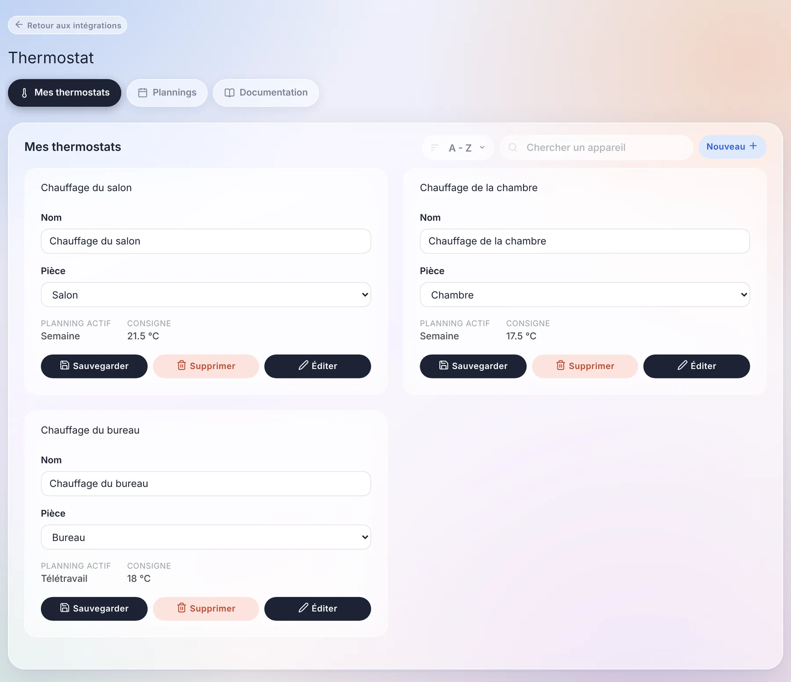
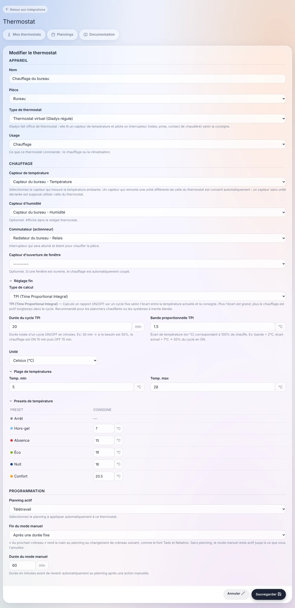
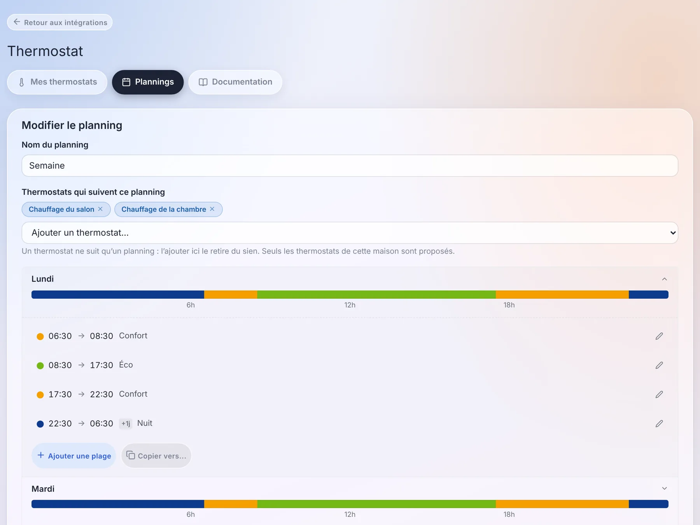
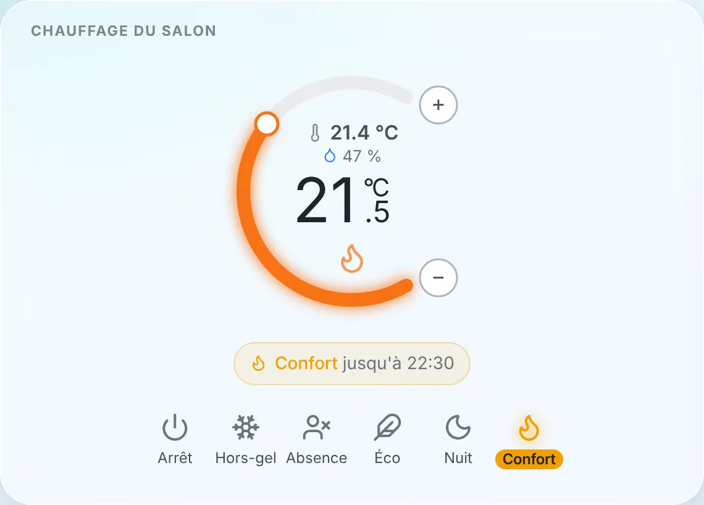

L'intégration « Thermostat » fait deux choses, disponibles depuis Gladys Assistant 5.2 :

- **Gladys devient le thermostat.** Un capteur de température et un interrupteur (un relais, une prise connectée, un contact de chaudière) suffisent pour créer une zone de chauffage régulée : Gladys lit la température et allume ou éteint le chauffage pour atteindre la consigne.
- **Gladys programme les thermostats que vous avez déjà.** Un Netatmo, une tête thermostatique Zigbee, un thermostat Matter ou MQTT régule très bien tout seul : Gladys écrit sa consigne selon un planning hebdomadaire, juste à côté du reste de votre maison.

Dans les deux cas, vous obtenez la même chose : des préréglages (Hors-gel, Absence, Éco, Nuit, Confort), des plannings hebdomadaires par maison, un widget de tableau de bord, et des fonctionnalités que les scènes, l'IA et les assistants vocaux savent lire et écrire.

Tout fonctionne en local, sans aucun cloud.

## Créer un thermostat

Rendez-vous dans `Intégrations / Thermostat`, onglet « Mes thermostats », et cliquez sur « Nouveau ».

Donnez un nom et une pièce au thermostat, puis choisissez son **type**.

### Thermostat virtuel (Gladys régule)

Gladys joue le rôle du thermostat. Il vous faut :

- un **capteur de température**, celui qui mesure la température de la pièce. Un capteur qui remonte une autre unité que le thermostat (°F et °C) est converti automatiquement ;
- un **commutateur (actionneur)** : le relais, la prise ou le contact de chaudière qui allume et éteint le chauffage ;
- éventuellement un **capteur d'humidité**, affiché dans le widget ;
- éventuellement un **capteur d'ouverture de fenêtre** : quand la fenêtre s'ouvre, le chauffage est coupé immédiatement, et reprend à sa fermeture.

Dans « Réglage fin », choisissez comment Gladys régule :

- **Hystérésis** (par défaut) : le chauffage s'allume sous la consigne moins le seuil de démarrage, et s'éteint au-dessus de la consigne plus le seuil d'arrêt. Avec une consigne de 21 °C et des seuils de 0,5 °C, il s'allume sous 20,5 °C et s'éteint au-dessus de 21,5 °C.
- **TPI** (Time Proportional Integral) : sur un cycle fixe (30 minutes par défaut), le chauffage reste allumé pendant une part du cycle proportionnelle à l'écart avec la consigne. Plus la pièce est loin de la consigne, plus il chauffe longtemps. Ça évite les dépassements d'un radiateur qui a beaucoup d'inertie.

### Thermostat réel (l'appareil régule lui-même)

Votre thermostat régule déjà : Gladys écrit seulement la consigne de son planning, et affiche l'état de l'appareil. Vous choisissez :

- la **consigne du thermostat réel** : la fonctionnalité sur laquelle Gladys écrit la température de consigne. Certains appareils en exposent plusieurs (chauffage / refroidissement, présent / absent) : choisissez celle qui pilote réellement votre chauffage ;
- l'**état de chauffe** (facultatif), pour afficher dans le widget si l'appareil chauffe. Un état de fonctionnement comme un contact de chaudière conviennent ;
- le **mode de fonctionnement** (facultatif), si le thermostat en a un : Gladys le bascule sur Arrêt quand le thermostat est arrêté, et le rétablit dès qu'une consigne reprend la main.

:::warning
Désactivez le programme du fabricant sur l'appareil (application Netatmo, Tado...) avant de le piloter depuis Gladys. Sinon le programme de l'appareil et celui de Gladys écrivent tour à tour la consigne, et le thermostat suit celui qui a écrit en dernier.
:::

Si vous changez la consigne directement sur l'appareil (sa molette, son application), Gladys le voit et le traite comme un changement manuel : elle ne l'écrase pas une minute plus tard.

### Réglages communs aux deux types

- **Usage** : chauffage ou climatisation.
- **Unité** (°C ou °F) et **plage de température** de la molette. Pour un thermostat réel, Gladys propose de reprendre la plage annoncée par l'appareil.
- **Presets de température** : la consigne de chaque préréglage. Par défaut Hors-gel 7 °C, Absence 16 °C, Éco 18 °C, Nuit 17 °C et Confort 21 °C.
- **Planning actif** : le planning hebdomadaire que suit ce thermostat.
- **Fin du mode manuel** : quand vous changez la température à la main, au bout de combien de temps le planning reprend la main. « Au prochain créneau du planning » (par défaut, comme chez Tado et Netatmo) ou « Après une durée fixe » en minutes. Sans planning, un changement manuel reste jusqu'à ce que vous le changiez à nouveau, comme sur un thermostat classique.

## Les plannings hebdomadaires

Dans l'onglet « Plannings », cliquez sur « Nouveau planning ».

Un planning appartient à une **maison** : avec deux maisons, chacune a ses propres plannings, et deux maisons peuvent avoir chacune leur « Semaine ». Pour chaque jour, ajoutez des créneaux (« Ajouter une plage ») avec un début, une fin et un préréglage. Un créneau peut passer minuit : une nuit de 22:30 à 06:30 est un seul créneau, marqué « +1j ».

Quelques règles rendent l'édition simple :

- **« Copier vers… »** copie un jour sur d'autres jours : écrivez le lundi, copiez-le sur toute la semaine.
- **Ajouter un créneau n'échoue jamais** : le créneau ajouté prend sa place, et raccourcit ou coupe en deux les créneaux qu'il recouvre.
- **Supprimer un créneau prolonge le précédent** : ça ne coupe jamais le chauffage. Pour arrêter le chauffage sur une période, utilisez le préréglage **Arrêt**.
- **Un jour sans créneau à lui garde le dernier préréglage de la veille.** Un planning dont le seul point est le vendredi soir « Absence » reste en Absence tout le week-end. Les barres de l'éditeur le montrent exactement comme il sera appliqué.

Sous « Thermostats qui suivent ce planning », ajoutez les thermostats de la maison qui doivent le suivre. Un thermostat suit un seul planning à la fois : l'ajouter à un planning le retire de celui qu'il suivait.

Les horaires sont ceux de votre maison, dans le fuseau horaire réglé dans `Paramètres / Système`.

## Le widget du tableau de bord

Sur votre tableau de bord, ajoutez un widget « Thermostat » et choisissez le thermostat.

Le widget affiche la température de la pièce (et l'humidité), la consigne en grand, et un halo quand l'appareil chauffe. Vous pouvez :

- tourner la molette ou utiliser **+** et **−** pour changer la consigne : c'est un changement manuel, qui dure jusqu'à la fin que vous avez configurée ;
- choisir un **préréglage** dans la barre du bas : Arrêt, Hors-gel, Absence, Éco, Nuit ou Confort. Sur un thermostat qui suit un planning, le préréglage s'applique jusqu'au prochain créneau, puis le planning reprend la main ;
- lire ce que fait le thermostat dans le bandeau : « Confort jusqu'à 22:30 » quand il suit son planning, « Mode manuel » pour une température réglée à la main, « Fenêtre ouverte — chauffage suspendu » quand une fenêtre est ouverte. Le ✕ du bandeau annule le mode manuel.

## Dans vos scènes

Un thermostat créé par cette intégration est un appareil comme les autres, avec une **consigne**, un **préréglage** et un **mode**. Avec l'action « Contrôler un appareil », une scène peut :

- choisir un **préréglage**, par exemple « Absence » quand la maison est vide, ou « Confort » quand la première personne rentre. Choisir la valeur « Planning » rend le thermostat à son planning ;
- écrire une **consigne**, qui agit comme un changement manuel ;
- **arrêter** le thermostat (mode Arrêt) et le redémarrer.

Les mêmes fonctionnalités sont visibles par l'IA, MQTT, Gladys Plus et les assistants vocaux.

## Bon à savoir

- Gladys régule toutes les minutes. Le capteur d'ouverture de fenêtre agit immédiatement.
- Un thermostat ne peut pas piloter un autre thermostat de cette intégration : les sélecteurs de fonctionnalités ne proposent que les appareils des autres intégrations.
- Les radiateurs à **fil pilote** ne sont pas encore pris en charge comme actionneur : l'interrupteur d'un thermostat virtuel est un interrupteur marche / arrêt. Pour piloter des radiateurs à fil pilote, voir [la page fil pilote](/fr/docs/integrations/pilot-wire).
- Un thermostat réversible (chauffage et climatisation) est piloté sur une seule consigne : créez deux thermostats si vous voulez programmer les deux.
