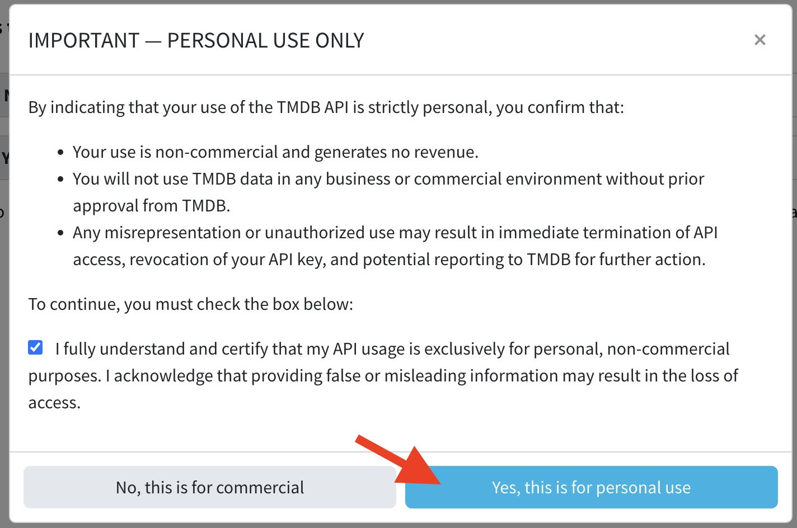
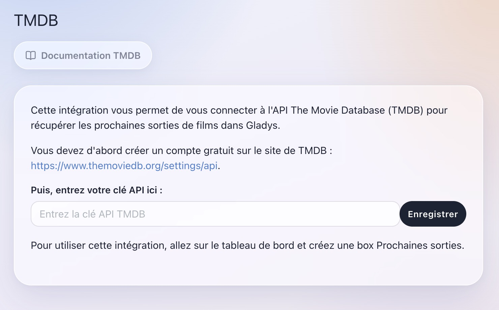
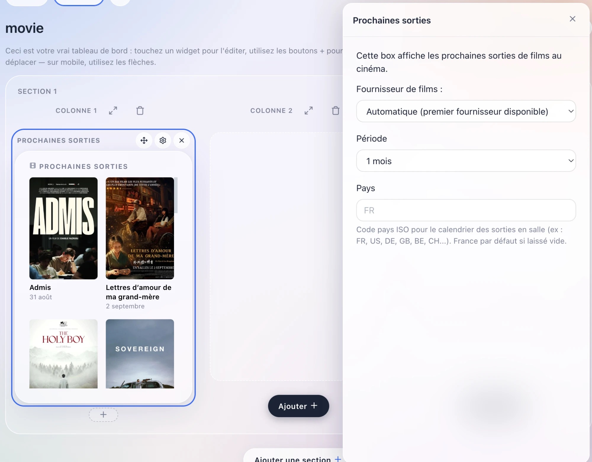
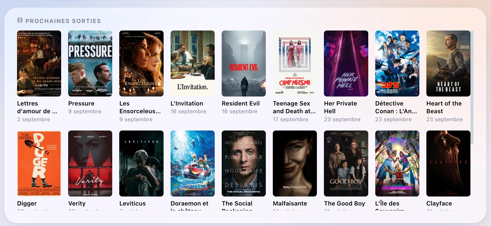

Cette intégration vous permet d'afficher les prochaines sorties de films dans Gladys Assistant, grâce à [The Movie Database (TMDB)](https://www.themoviedb.org/).

## Créez un compte TMDB

Rendez-vous sur [https://www.themoviedb.org/settings/api](https://www.themoviedb.org/settings/api).

Créez un compte gratuit si vous n'en avez pas déjà un.

Une fois connecté·e, ouvrez les paramètres de votre compte et allez dans la section "API".

Cliquez sur "Create" (ou "Request an API key" si c'est votre première fois), choisissez "Developer", puis remplissez le court formulaire décrivant votre usage (un usage personnel convient très bien).

Votre "API Key (v3 auth)" est générée instantanément — c'est cette valeur dont Gladys a besoin.

## Entrez cette clé dans Gladys Assistant

Allez dans "Intégrations" -> "TMDB". Entrez votre clé d'API puis cliquez sur "Enregistrer".

## Ajoutez un widget Prochaines sorties au tableau de bord

Allez sur le dashboard, puis cliquez sur "Editer".

Ajoutez un widget "Prochaines sorties".

Choisissez éventuellement la période à afficher (15 jours, 1 mois ou 2 mois — 1 mois par défaut), et le pays dont vous voulez suivre le calendrier des sorties en salle (code à 2 lettres, ex. `FR`, `US`, `DE`... — France par défaut si laissé vide).

Cliquez sur "Enregistrer".

Voilà ! Touchez une affiche pour voir son synopsis, sa bande-annonce et un lien vers sa fiche TMDB.

