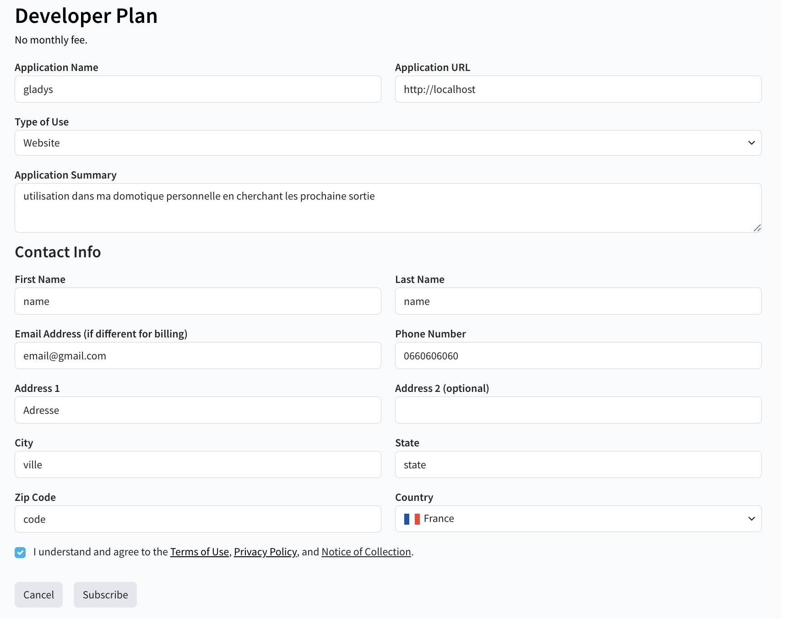
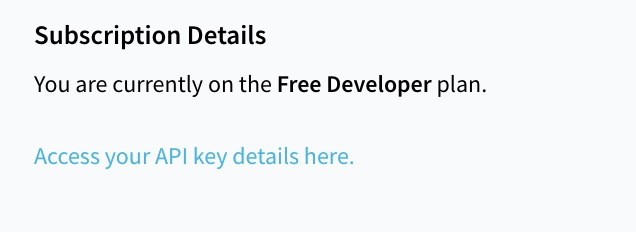
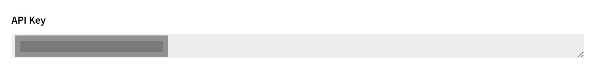

Cette intégration vous permet d'afficher les prochaines sorties de films dans Gladys Assistant, grâce à [The Movie Database (TMDB)](https://www.themoviedb.org/).

## Créez un compte TMDB

Rendez-vous sur [https://www.themoviedb.org/settings/api](https://www.themoviedb.org/settings/api). Si vous n'êtes pas encore connecté·e, TMDB vous demande de vous connecter (ou de créer un compte gratuit si vous n'en avez pas déjà un).

Une fois connecté·e, vous arrivez sur la page des paramètres "API". Cliquez sur "click here" à côté de "To generate a new API key".

Répondez "Yes, this is for my own personal use only".

Confirmez que vous comprenez les conditions d'usage personnel, cochez la case, puis cliquez sur "Yes, this is for personal use".

Remplissez le court formulaire de candidature : n'importe quel nom d'application convient (ex. `gladys`), et `http://localhost` fonctionne comme Application URL. Décrivez votre usage en une phrase, renseignez vos coordonnées, puis validez.

Votre compte est maintenant sur le plan Free Developer.

Votre "API Key (v3 auth)" est générée instantanément — c'est cette valeur dont Gladys a besoin.

## Entrez cette clé dans Gladys Assistant

Allez dans "Intégrations" -> "TMDB". Entrez votre clé d'API puis cliquez sur "Enregistrer".

## Ajoutez un widget Prochaines sorties au tableau de bord

Allez sur le dashboard, puis cliquez sur "Editer".

Ajoutez un widget "Prochaines sorties".

Choisissez éventuellement la période à afficher (15 jours, 1 mois ou 2 mois — 1 mois par défaut), et le pays dont vous voulez suivre le calendrier des sorties en salle (code à 2 lettres, ex. `FR`, `US`, `DE`... — France par défaut si laissé vide).

Cliquez sur "Enregistrer".

Voilà ! Touchez une affiche pour voir son synopsis, sa bande-annonce et un lien vers sa fiche TMDB.

