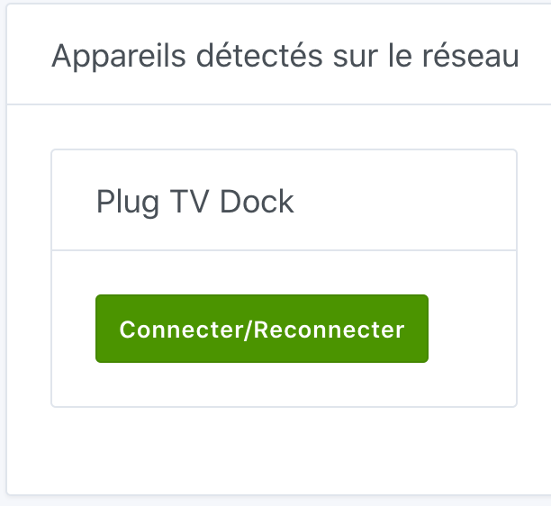
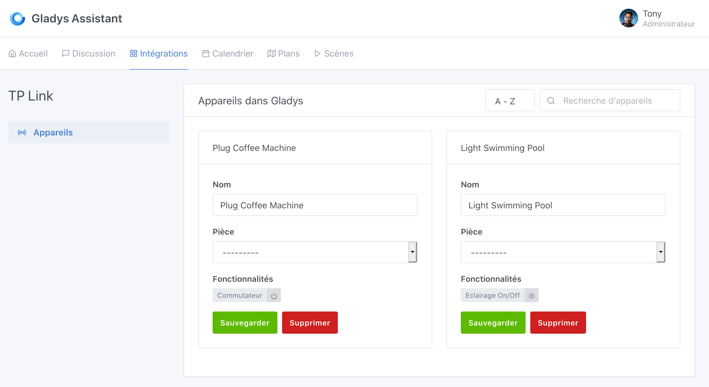

Pour connecter vos ampoules et prises TP-Link, allez dans `Intégrations / TP-Link` dans Gladys.

## Scannez les appareils sur le réseau

En cliquant sur le bouton `Scanner le réseau`, Gladys va automatiquement reconnaître les différents appareils disponibles sur votre réseau Wifi. Assurez-vous d'avoir installé, configuré (avec l'application Kasa) et allumé votre appareil pour qu'il soit visible.

## Ajoutez un appareil

Que ce soit une prise ou une ampoule, Gladys vous propose d'ajouter cet appareil grâce au bouton `Se connecter`. Une fois votre appareil ajouté, vous pouvez indiquer dans quelle pièce il est installé.

Vous verrez dans la fiche de l'appareil les différentes fonctionnalités disponibles dans Gladys.

Et voilà !
