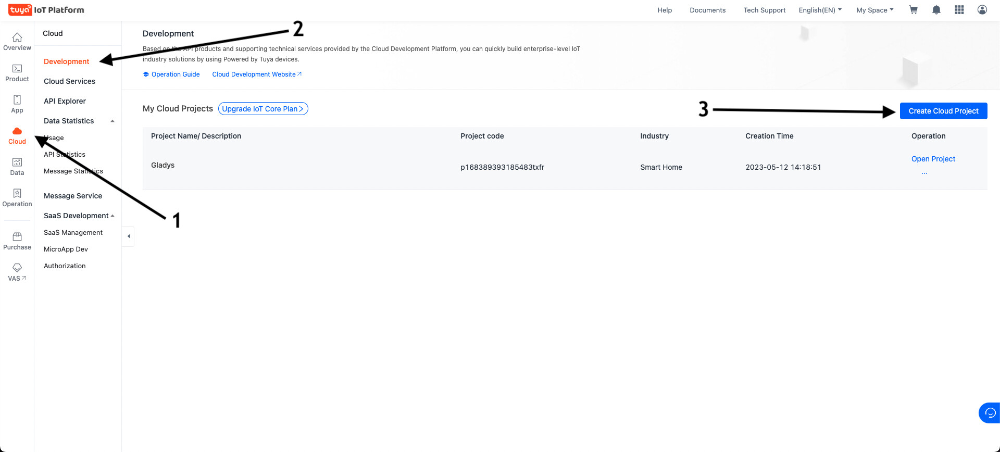
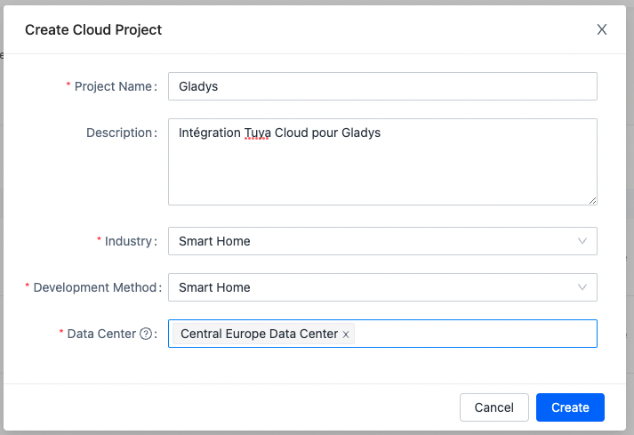
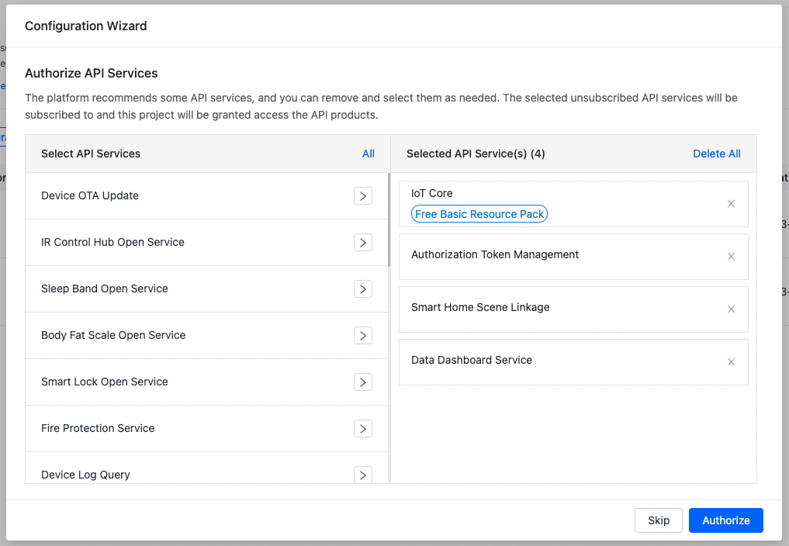
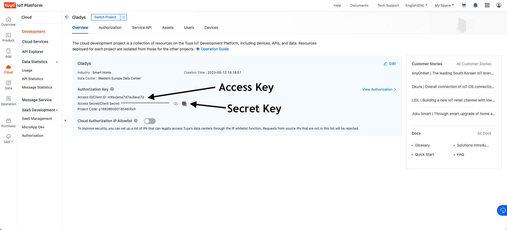
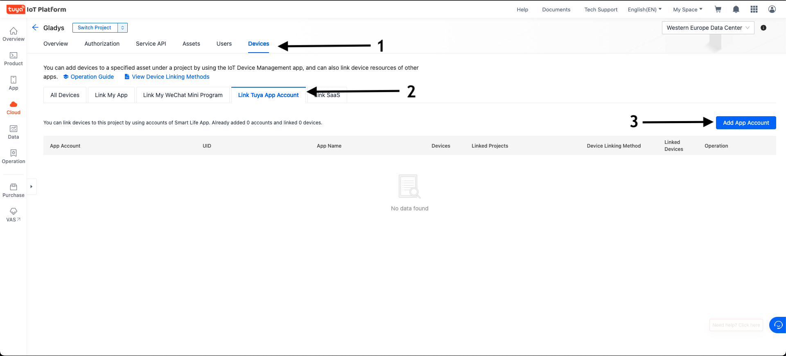
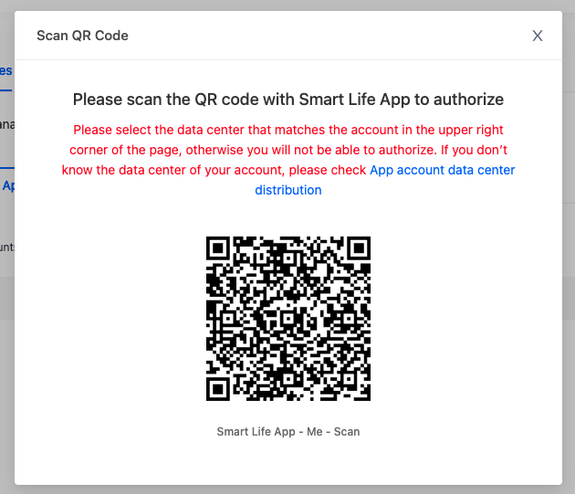
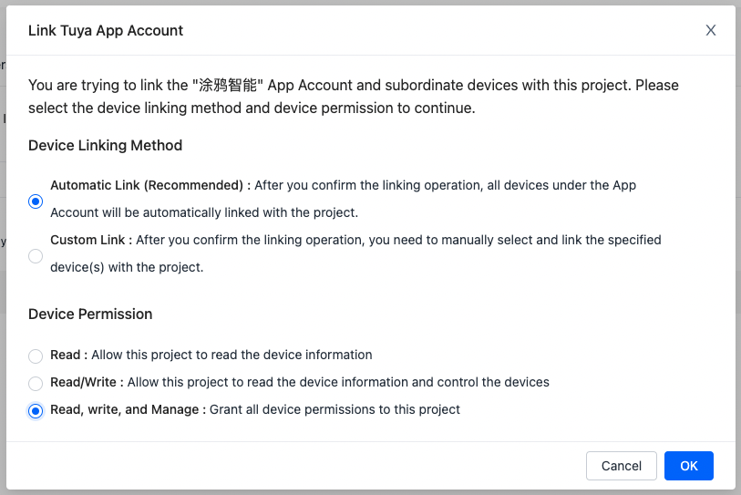
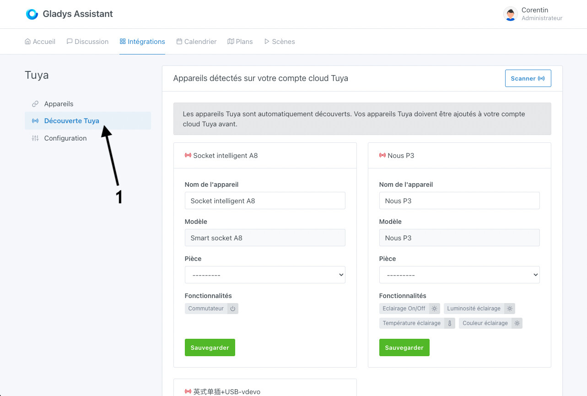

## Connecter Tuya à Gladys

1. Créer un compte sur [iot.tuya.com](http://iot.tuya.com).

2. Créer un project cloud dans la section « Cloud » → « Development » → « Create Cloud Project »

3. Choisissez un nom de projet, renseignez les différents champs :

* Project Name : Le nom de votre project (ex: Gladys)
* Industry : Smart Home ;
* Development method : Smart Home ;
* Data Center : Central Europe Data Center (même si vous vivez en Europe de l’Ouest, c’est mieux, sinon sélectionnez le datacenter le plus proche de chez vous).

Cliquez sur « Create ».

4. Autorisez les services API suivants :
   (Elles sont normalement sélectionnées par default)
* IoT Core 
* Authorization Token Management 
* Smart Home Scene Linkage 
* Data Dashboard Service

5. Copier les informations d’« Access key » et de « Secret Key » dans Gladys

6. Allez sur l’onglet Devices puis Link Tuya App Account et cliquez sur le bouton Add App Account à droite.

7. Scannez le QR Code avec votre application Smart Life en vous rendant dans Profil puis sur le scanner de codes situé en haut à droite.

8. Sélectionnez Automatic Link puis Read, Write and Manage et validez avec OK .

9. Copier l’information « App account UID » dans Gladys.

10. Enregistrer la configuration sur Gladys, allez dans l’onglet « Découverte Tuya » et TADAM… vos appareils sont apparus 🙂

## FAQ
