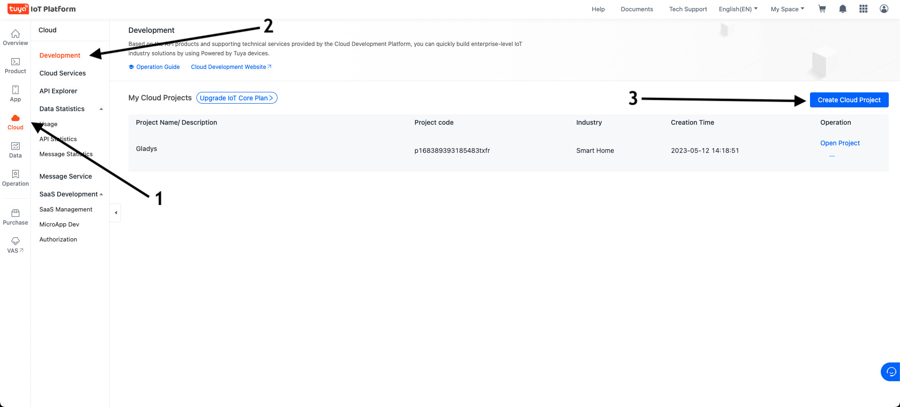
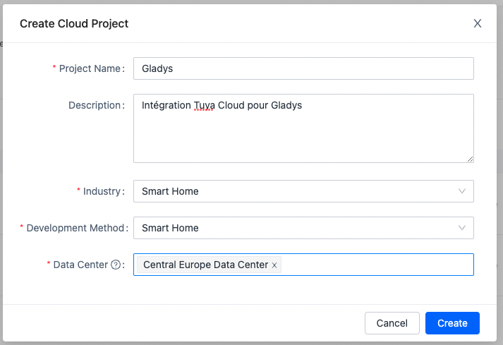
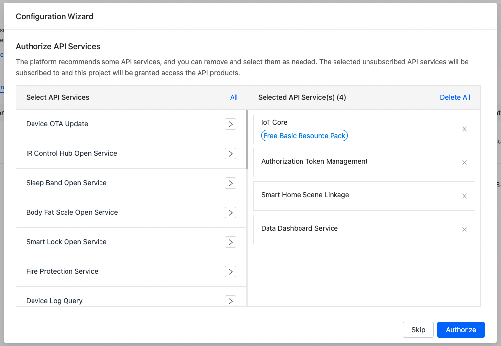
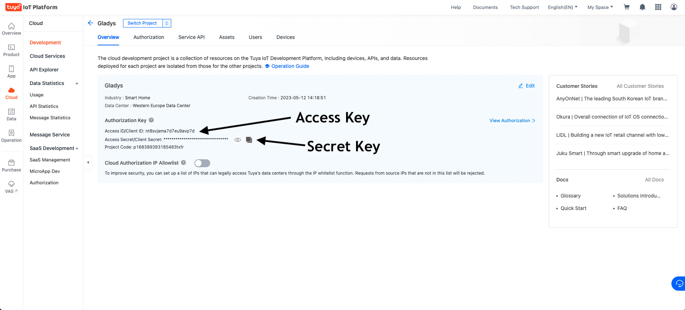
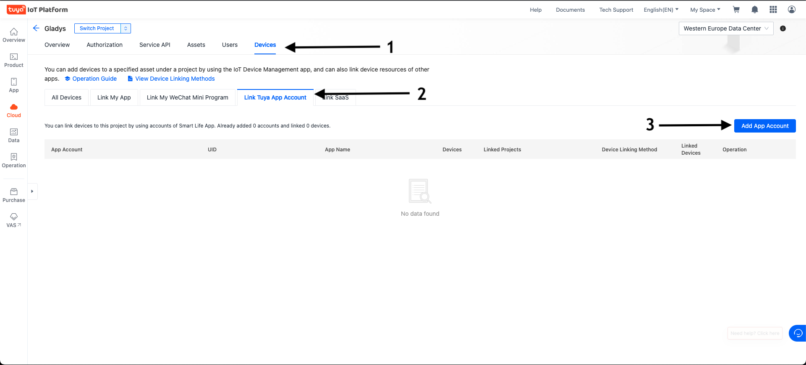
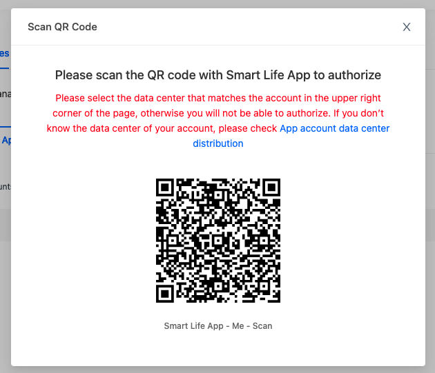
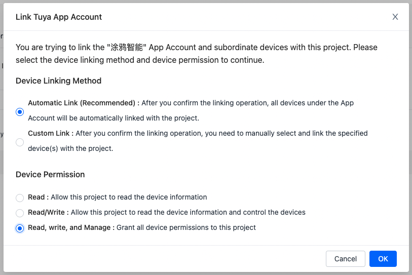
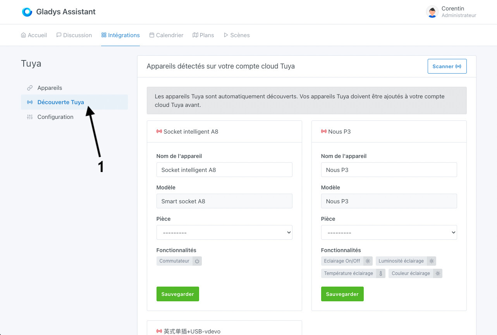
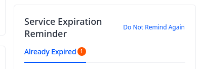

## Connecter Tuya à Gladys

1. Créer un compte sur [iot.tuya.com](http://iot.tuya.com).

2. Créer un project cloud dans la section « Cloud » → « Development » → « Create Cloud Project »

3. Choisissez un nom de projet, renseignez les différents champs :

- Project Name : Le nom de votre project (ex: Gladys)
- Industry : Smart Home ;
- Development method : Smart Home ;
- Data Center : Central Europe Data Center (même si vous vivez en Europe de l’Ouest, c’est mieux).

Cliquez sur « Create ».

4. Autorisez les services API suivants :
   (Ils sont normalement sélectionnés par default)

- IoT Core
- Authorization Token Management
- Smart Home Scene Linkage
- Data Dashboard Service

5. Copier les informations d’« Access key » et de « Secret Key » dans Gladys

6. Allez sur l’onglet Devices puis Link Tuya App Account et cliquez sur le bouton Add App Account à droite.

7. Scannez le QR Code avec votre application Smart Life en vous rendant dans Profil puis sur le scanner de codes situé en haut à droite.

8. Sélectionnez Automatic Link puis Read, Write and Manage et validez avec OK .

9. Copier l’information « App account UID » dans Gladys.

10. Enregistrer la configuration sur Gladys, allez dans l’onglet « Découverte Tuya » et TADAM… vos appareils sont apparus 🙂

## FAQ

### Le scan ne fonctionne pas ?

Sur le forum, Francis66 avait ce souci, et il l'a résolu de cette façon:

- Je n’avais plus de droits aux ressources API
  - acces à Cloud Develop Base Resource et IoT Core car la période Trial était dépassée.
- Pour la zone: j’avais renseigné Europe de l’ouest au lieu d’Europe Centrale

Source: https://community.gladysassistant.com/t/configuration-de-lintegration-tuya/9140/7

### Erreur : `Error: Unable to start service tuya TypeError: Cannot destructure property 'list' of 'result' as it is undefined.`

Si cette erreur apparaît dans vos logs Gladys, vérifiez les points suivants :

- **Connectivité Internet de l’appareil**
  - Assurez-vous que le système dispose d’une bonne résolution DNS et que l’accès Internet n’est pas bloqué par Pi-hole ou un logiciel similaire.
- **Identifiants et data center**
  - Vérifiez vos identifiants Tuya et assurez-vous d’avoir sélectionné le bon data center.
- **Validité du package IoT Core**
  - Le package d’essai IoT Core est actif pendant **un mois** seulement et doit être renouvelé manuellement.

> 

> En raison de l’évolution rapide de la plateforme développeur Tuya, il n’existe pas de tutoriel permanent pour ce processus.  
> Ouvrez la section **Détails** dans la console développeur Tuya et suivez l’assistant à l’écran pour prolonger votre période d’essai.  
> Après avoir prolongé la période d’essai, il peut s’écouler jusqu’à **15 minutes** avant que votre matériel ne soit à nouveau accessible.  
> Ce processus est **uniquement nécessaire** lors de la **première connexion** de votre compte à Gladys.
