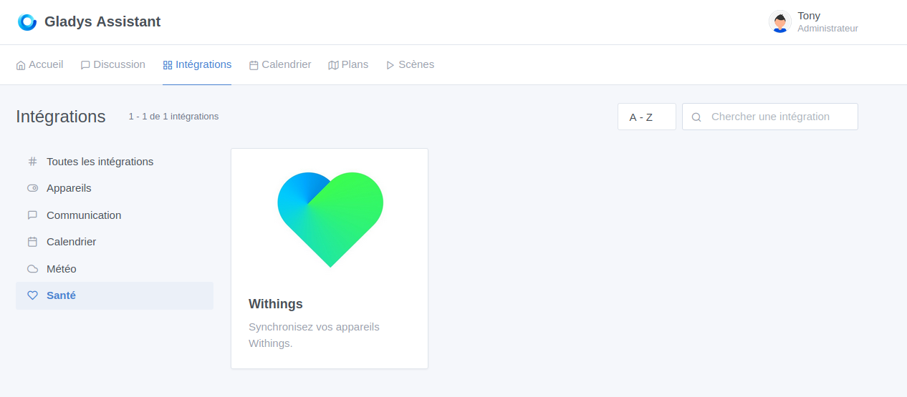
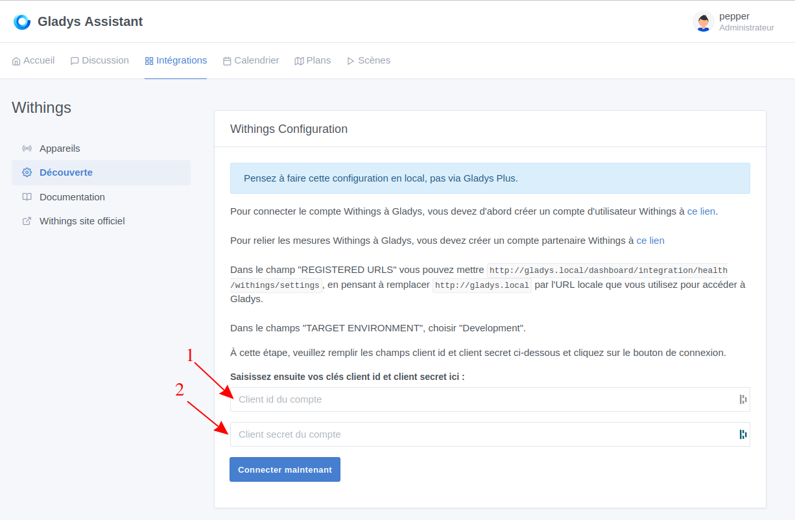
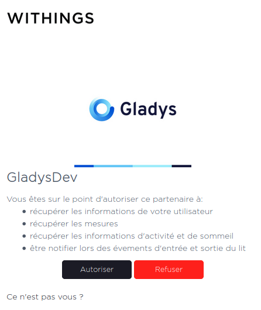
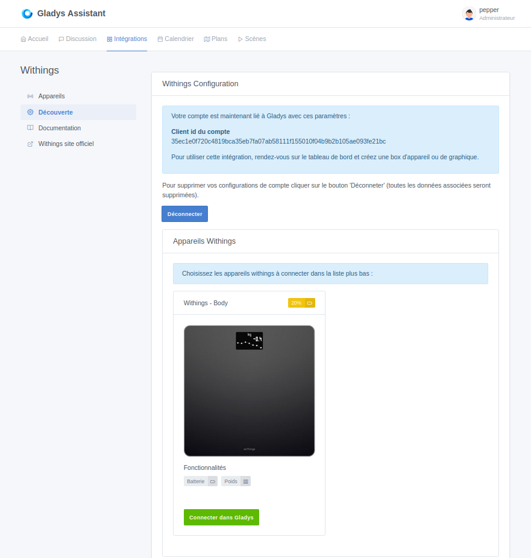
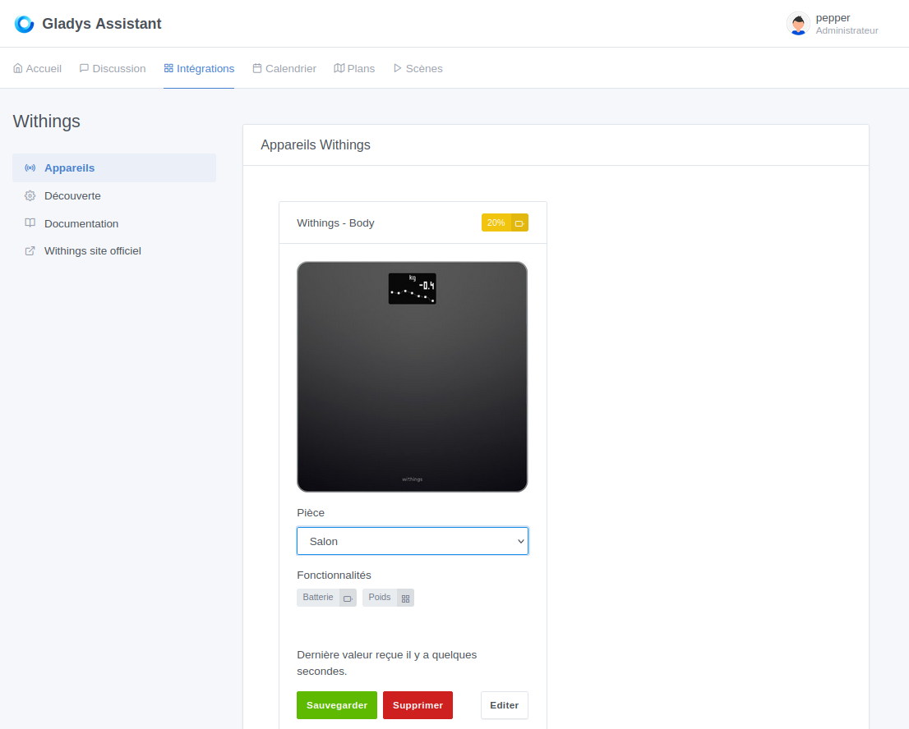

Cette intégration vous permet de récupérer les données des appareils Withings dans Gladys Assistant.

## Pré requis

Pour intégrer les données de vos appareils Withings vous devez au préalable les avoir configuréssur votre compte withings (https://account.withings.com/connectionwou/account_login).

Si vos appareils supporte le multi utilisateurs il est nécéssaire de configurer un compte Withings par utilisateur, détails disponible ici: https://support.withings.com/hc/fr/articles/218554788-Body-Param%C3%A9trer-la-balance-pour-plusieurs-utilisateurs.

## Configuration compte partner Withings

Création d'un compte 'partner' pour permettre l'échange de données vers Gladys: https://developer.withings.com/dashboard/welcome

Sur la page suivange choisissez 'Withings Public Cloud':

Après vous être authentifié avec votre compte utilisateur, cliquez sur le bouton', choisissez Create an application' 'Public API integration' et acceptez les condition d'utilisation.

Sur la page suivante, remplissez le formulaire comme ceci:

ATTENTION: vous devrez adapter l'url de callback avec l'url que vous utilisez pour accéder à Gladys (ex: http://gladys.local/dashboard/integration/health/withings/settings).

Puis cliquez sur "Done".

Les clé client_id et secret seront à copier dans l'intégration Withings dans Gladys.

## Intégration Withings dans Gladys

Dans Gladys rejoignez la page de configuration Withings:

Allez dans le menu 'Découverte' et renseigner les champs:
1. client_id du compte Withings partner
2. secret du compte Withings partner

Puis cliquez sur "Connecter maintenant".

Vous êtes redirigé vers le site d'authorisation de withigs:

Cliquer sur"Authoriser".

Vous êtes de retour sur l'interface Gladys, si tout c'est bien passé vous verrez la page suivante:

Pour ajouter un appareil dans Gladys, vous devez cliquer sur "Connecter dans Gladys" pour chaque appareil. Après la connexion, les données historiques stockées sur le serveur Withngs sont téléchargées.

Vous pouvez cliquer sur le lien "Appareils" du menu gauche pour visualiser les appareils syncrhonisés:

## Usage

You can now use these Withings devices from the [Dashboard](../dashboard/devices-in-room.md) or from the [Scenes](../scenes/intro.md) automatically. Depending on the feature of each device, you will have access to measures, states or actions.
