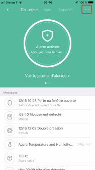
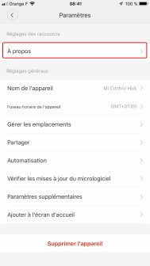
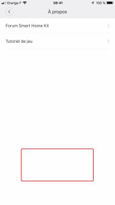
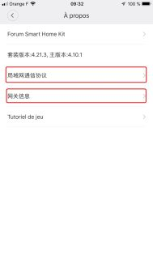
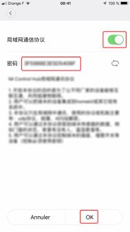
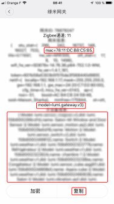

:::warning
2025: Cette intégration n'a plus trop d'intérêt, il est plus simple d'utiliser Zigbee ou Matter pour ce genre d'appareils.
:::

## Activation du mode développeur

L'activation du mode développeur permet à Gladys d'accéder à l'API de la passerelle Xiaomi, donc de recevoir les messages des différentes sondes, ainsi que de piloter les matériels et la passerelle elle-même.

L'activation se fait à partir de l'application "Mi Home". Si elle n'est pas installée sur votre téléphone, commencez par le faire :

- Une fois cela fait, lancez-la.
- Définissez votre région sur "Chine continentale" en créant votre compte.
- Puis connectez tous vos appareils, selon leur procédure propre.
- Enfin, mettez à jour le firmware.

## La passerelle

Ouvrez votre passerelle en cliquant sur son icône. Sa page de gestion s'ouvre, suivez les étapes ci-dessous, dans l'ordre indiqué :

### Etape 1

Cliquez sur les 3 petits points.

### Etape 2

Cliquez sur "A propos"

### Etape 3

Cliquez plusieurs fois sur la zone en rouge, de façon à afficher les menus supplémentaires de l'étapes suivantes.

### Etape 4

Le premier menu vous amènera à l'étape 5, le 2ième, à l'étape 6.

### Etape 5

Activez le mode développeur avec le bouton, et notez le mot de passe, puis validez par ok.

### Etape 6

Dans ce menu, vous trouverez l'adresse Mac de votre passerelle, qui est son sid ; utile pour relier le mot de passe de l'étape précédente à la passerelle, si vous en avez plusieurs. Vous avez en dessous la liste des périphériques qui sont gérés par cette passerelle.

Vous êtes maintenant prêt à intégrer vos équipements Xiaomi dans Gladys.
