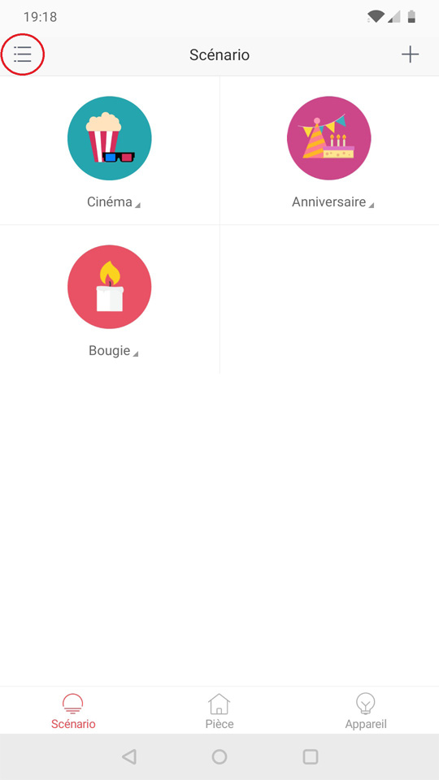
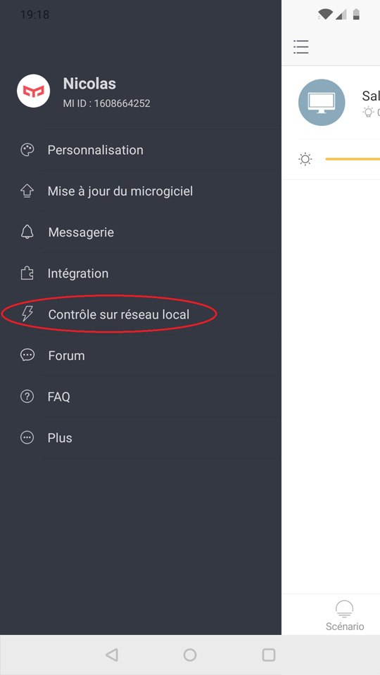
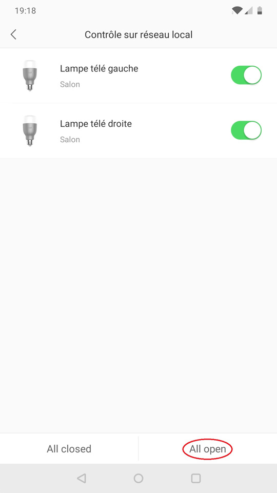

Pour connecter vos appareils Yeelight :
- activez "LAN Control" sur vos appareil Yeelight
- allez dans `Intégrations / Yeelight` dans Gladys

L'activation de "LAN Control" permet à Gladys d'accéder aux appareils Yeelight sur le réseau local.
Vous devez d'abord installer l'application "Yeelight" et connecter tous vos appareils ([how-to](https://www.yeelight.com/faqs/yeelight-app)), avant d'activer "LAN Control" (*si cela est déjà fait, allez à "[Activer "LAN Control"](#activer-lan-control)"*).

- [Yeelight pour Android](https://play.google.com/store/apps/details?id=com.yeelight.cherry "Yeelight pour Android")
- [Yeelight pour iPhone/iPad](https://apps.apple.com/fr/app/yeelight/id977125608 "Yeelight pour iPhone/iPad")

## Activer "LAN Control"

### Etape 1

Ouvrez l'application "Yeelight" et allez dans le menu principal.

### Etape 2

Choisissez "Contrôle sur réseau local".

### Etape 3

Activez "Contrôle sur réseau local".

Vous êtes maintenant prêt à intégrer vos appareils Yeelight dans Gladys !
