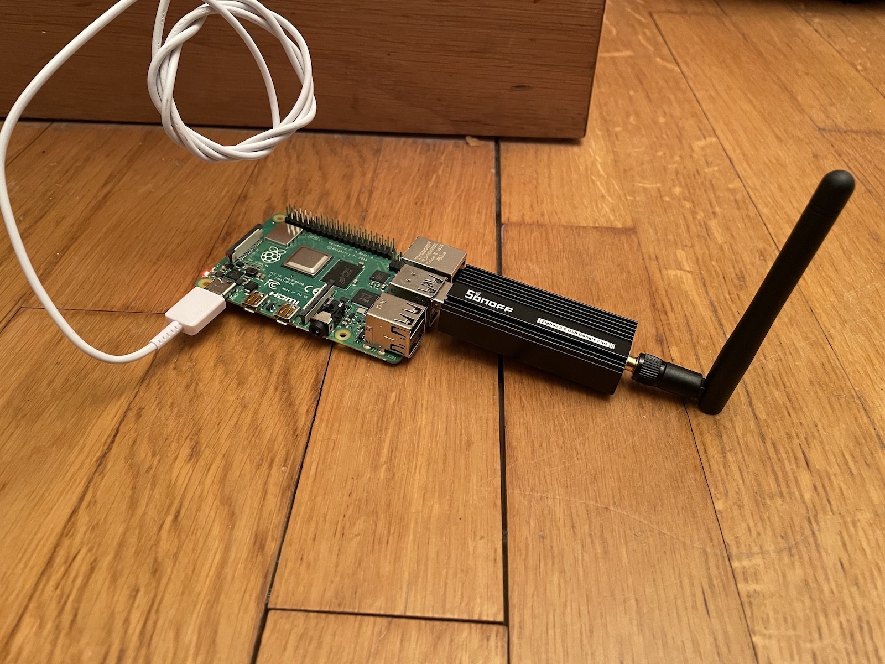
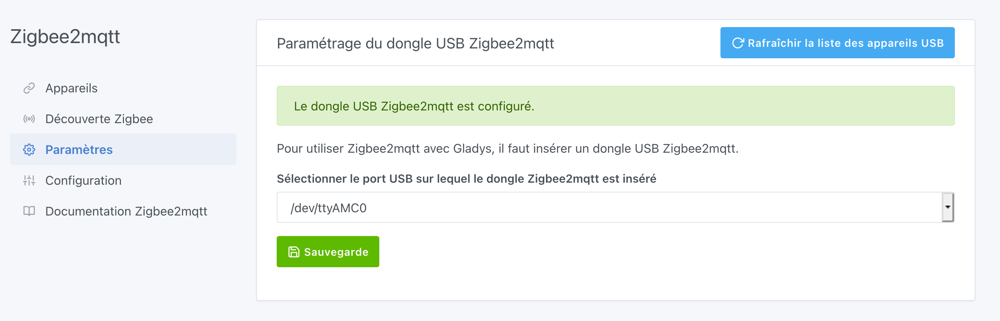
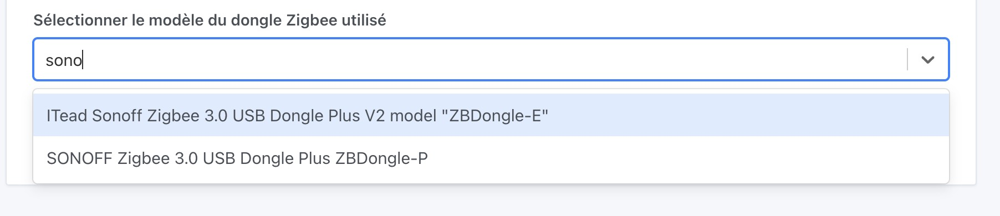
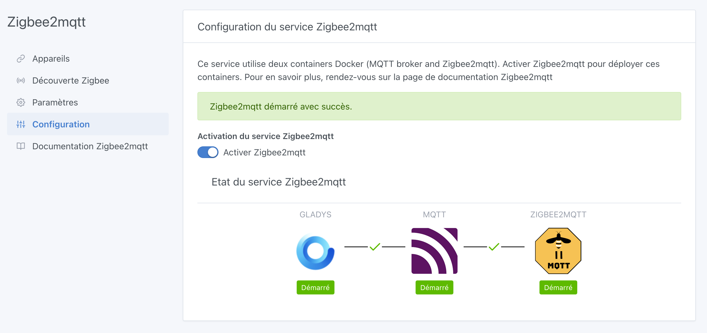
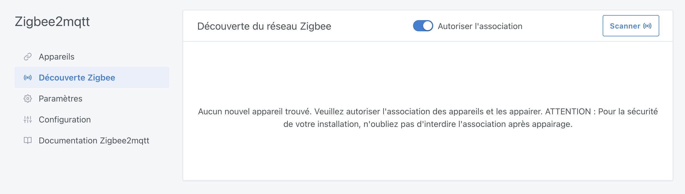
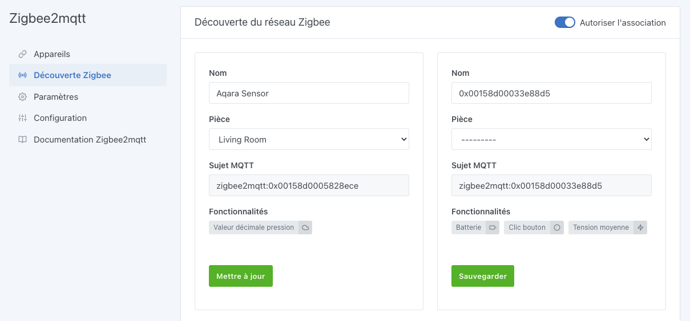
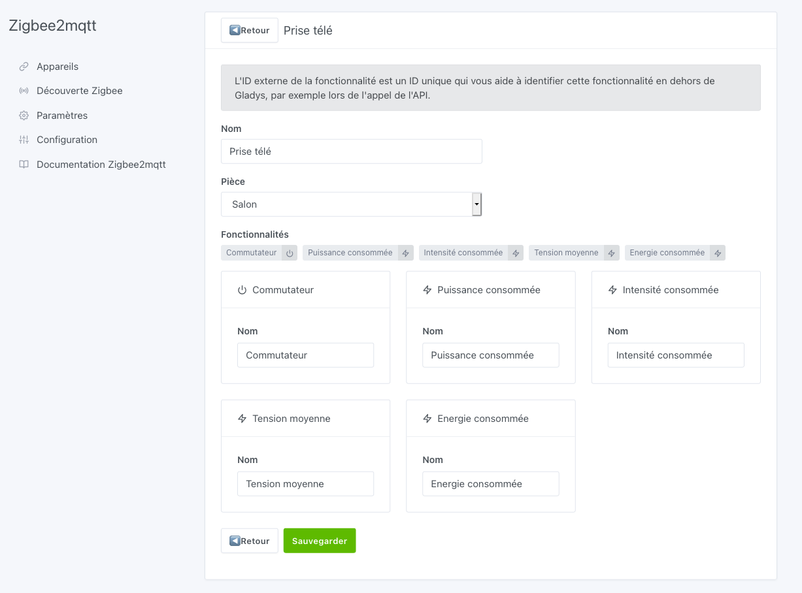

Dans ce tutoriel, nous allons vous expliquer comment intégrer vos appareils Zigbee dans Gladys via une clé USB Zigbee.

Vous pourrez ainsi connecter tout type d'appareils Zigbee en direct, et vous affranchir des bridges Zigbee souvent fournis par les constructeurs (Bridge Philips Hue, Hub Xiaomi).

Nous utilisons pour cela l'excellent projet open-source [Zigbee2Mqtt](https://www.zigbee2mqtt.io/).

Si vous préférez en vidéo, j'ai filmé ce tutoriel sur Youtube pour vous montrer comment faire concrètement :

<iframe src="https://www.youtube.com/embed/ALW3uDB9P0s" frameborder="0" allow="accelerometer; autoplay; clipboard-write; encrypted-media; gyroscope; picture-in-picture" allowfullscreen></iframe>

## Le matériel nécessaire

Pour commencer, vous aurez besoin d'un dongle USB Zigbee.

Nous avons testé par exemple le Sonoff Zigbee 3.0 USB Dongle Plus, qui fonctionne très bien avec Gladys et Zigbee2mqtt. Dans mon cas je l'ai acheté [chez Domadoo](https://www.domadoo.fr/fr/interface-domotique/5976-sonoff-cle-usb-zigbee-30-antenne-externe-20dbm-compatible-zha-zigbee2mqtt.html?domid=17), mais il est aussi trouvable sur [Amazon](https://amzn.to/3FpIlcZ).

Le gros avantage de ce dongle est qu'il est déjà flashé, par conséquent il est prêt à l'emploi, il n'y a rien à faire.

Vous pouvez consulter la liste des adapteurs Zigbee supportés [ici](https://www.zigbee2mqtt.io/guide/adapters/#recommended).

Vous pouvez consulter la liste des appareils Zigbee compatibles [ici](https://www.zigbee2mqtt.io/supported-devices/).

:::warning
Si vous faites tourner Gladys sur un Raspberry Pi avec un disque externe, votre Raspberry Pi risque d'avoir des problèmes d'alimentation pour alimenter en même temps le disque externe et la clé USB Zigbee.

Nous recommandons d'utiliser un hub USB alimenté de manière externe.

Si Zigbee2Mqtt ne démarre pas chez vous, je vous recommande de lire la FAQ sur le site de Zigbee2mqtt : [Zigbee2MQTT fails to start](https://www.zigbee2mqtt.io/guide/installation/20_zigbee2mqtt-fails-to-start.html)
:::

## Configurez le port du dongle USB

Connectez votre dongle USB Zigbee à votre machine faisant tourner Gladys (Raspberry Pi, NAS).

Dans Gladys, Rendez-vous dans `Intégrations / Zigbee2Mqtt`.

En cliquant dans le menu sur `Paramètres`, Gladys va automatiquement scanner les différents ports USB pour vous proposer une liste déroulante. Indiquez dans le paramètrage le port USB à utiliser pour permettre à Gladys de communqiuer en Zigbee.

**13 Mai 2023:** Il est maintenant possible de sélectionner directement dans Gladys le modèle de dongle Zigbee que vous utilisez :

Cela permet de charger directement la configuration Zigbee2mqtt correspondante.

:::warning
Si vous avez un dongle basé sur [EmberZNet](https://www.zigbee2mqtt.io/guide/adapters/emberznet.html) (comme par exemple le Sonoff Zigbee 3.0 ZBDongle-E), il est recommandé de [mettre à jour](https://www.zigbee2mqtt.io/guide/adapters/emberznet.html#firmware-flashing) le firmware de votre dongle. Dans le cas contraire, vous devez choisir l'option `(legacy ezsp)` dans la liste.
:::

## Activez Zigbee2Mqtt

Une fois votre dongle configuré, Gladys a besoin d'installer deux containers (MQTT et Zigbee2Mqtt) pour utiliser le dongle et communiquer avec tous vos appareils. Ne vous inquiétez pas, tout cela a été automatisé.

Rendez-vous dans la partie `Configuration` et cliquez sur le bouton **Activer Zigbee2mqtt**. Après quelques instants (le temps dépend de votre modèle de Raspberry Pi et de votre bande passante), vous devriez visualiser tous les éléments démarrés et les liens entre chacun au vert.

## Autorisez l'association d'appareils

Pour permettre aux périphériques d'êtres associés à votre réseau Zigbee, il faut autoriser l'association dans la configuration de Zigbee.

Cliquez sur le menu `Découverte Zigbee`, puis cliquez sur le bouton `Autoriser l'association`.

:warning: Attention, une fois vos appareils associés, vous devrez revenir ici pour interdire l'association, par sécurité.

## Ajoutez des appareils

Pour que votre périphérique rejoigne le réseau, reportez-vous à la notice de celui-ci. Dans la majorité des cas, un appui long sur le bouton physique permet cette opération.

Les appareils déjà associés à votre réseau Zigbee apparaîtront automatiquement avec la liste des fonctionnalités détectées. Vous pouvez les renommer et les associer à une pièce grâce à la liste déroulante.

## Modifiez les appareils

Si nécessaire, vous pouvez vous rendre dans le menu `Appareils` pour modifier/compléter la configuration de vos appareils.

Cliquez sur le bouton **Editer** d'un appareil. Vous pourrez alors éditer son nom, la pièce à laquelle il appartient et le nom de chaque fonctionnalité.

## Utilisation

Vous pouvez maintenant utiliser ces appareils Zigbee depuis le [Tableau de bord](../dashboard/devices.md) ou depuis les [Scènes](../scenes/intro.md) de manière automatique. Selon les fonctionnalités de chaque appareil, vous aurez accès à des mesures, des états ou des actions.
