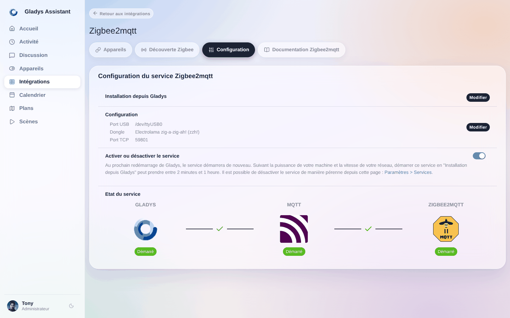
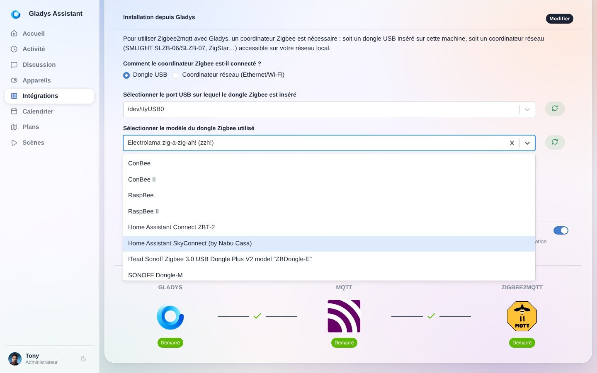
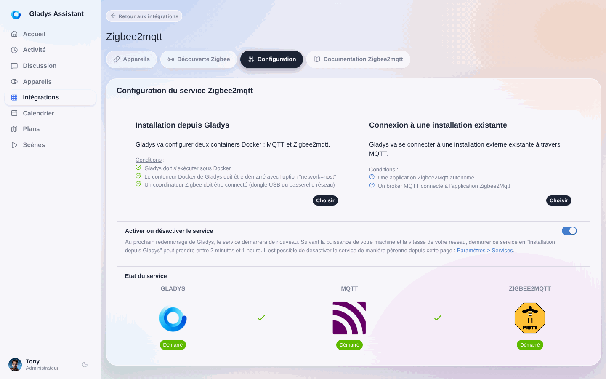
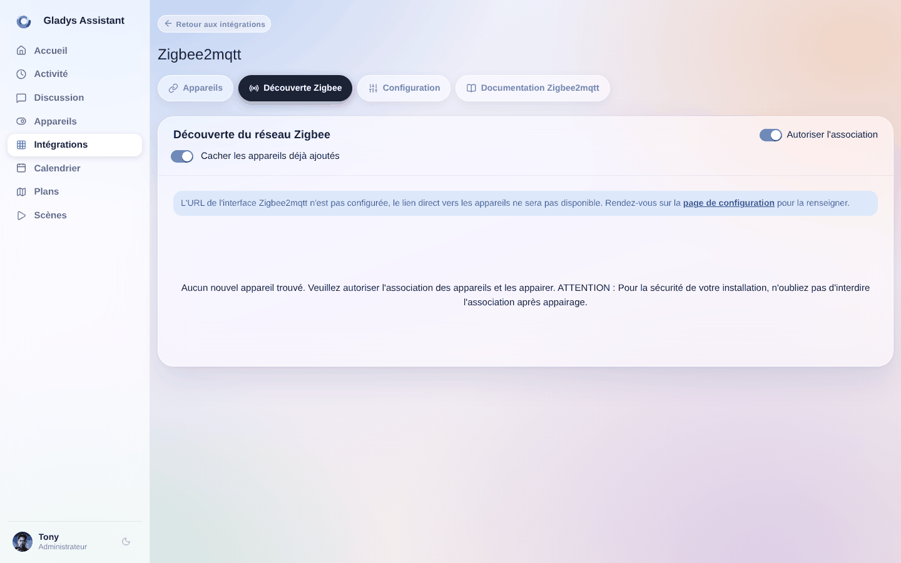
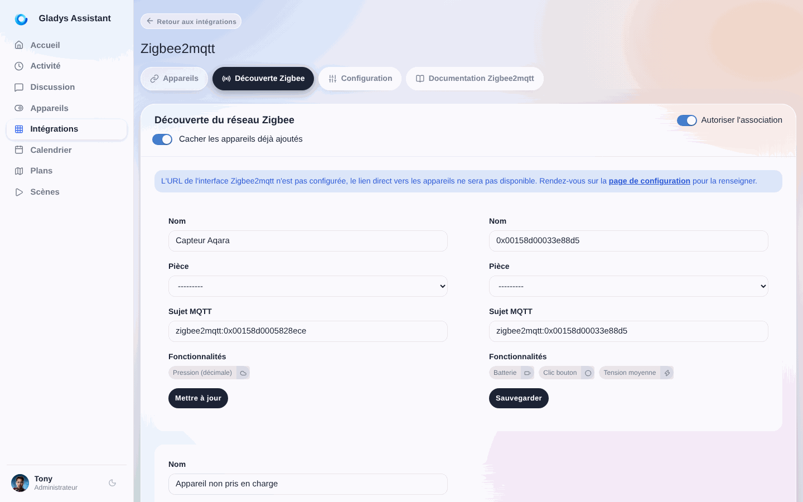
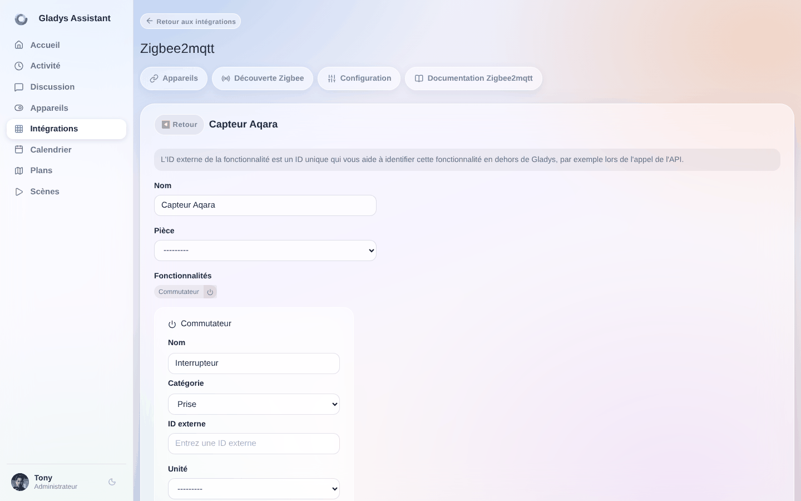

import JsonLd from '@site/src/components/seo/JsonLd';

Dans ce tutoriel, nous allons vous expliquer comment intégrer vos appareils Zigbee dans Gladys via une clé USB Zigbee.

Vous pourrez ainsi connecter tout type d'appareils Zigbee en direct, et vous affranchir des bridges Zigbee souvent fournis par les constructeurs (Bridge Philips Hue, Hub Xiaomi).

Nous utilisons pour cela l'excellent projet open-source [Zigbee2Mqtt](https://www.zigbee2mqtt.io/).

Si vous préférez en vidéo, j'ai filmé ce tutoriel sur Youtube pour vous montrer comment faire concrètement :

<iframe src="https://www.youtube.com/embed/ALW3uDB9P0s" frameborder="0" allow="accelerometer; autoplay; clipboard-write; encrypted-media; gyroscope; picture-in-picture" allowfullscreen></iframe>

## Le matériel nécessaire

Pour commencer, vous aurez besoin d'un dongle USB Zigbee.

Nous avons testé par exemple le Sonoff Zigbee 3.0 USB Dongle Plus, qui fonctionne très bien avec Gladys et Zigbee2mqtt. Dans mon cas je l'ai acheté [chez Domadoo](https://www.domadoo.fr/fr/interface-domotique/5976-sonoff-cle-usb-zigbee-30-antenne-externe-20dbm-compatible-zha-zigbee2mqtt.html?domid=17), mais il est aussi trouvable sur [Amazon](https://amzn.to/3FpIlcZ).

Le gros avantage de ce dongle est qu'il est déjà flashé, par conséquent il est prêt à l'emploi, il n'y a rien à faire.

Vous pouvez consulter la liste des adapteurs Zigbee supportés [ici](https://www.zigbee2mqtt.io/guide/adapters/#recommended).

Vous pouvez consulter la liste des appareils Zigbee compatibles [ici](https://www.zigbee2mqtt.io/supported-devices/).

:::warning
Si vous faites tourner Gladys sur un Raspberry Pi avec un disque externe, votre Raspberry Pi risque d'avoir des problèmes d'alimentation pour alimenter en même temps le disque externe et la clé USB Zigbee.

Nous recommandons d'utiliser un hub USB alimenté de manière externe.

Si Zigbee2Mqtt ne démarre pas chez vous, je vous recommande de lire la FAQ sur le site de Zigbee2mqtt : [Zigbee2MQTT fails to start](https://www.zigbee2mqtt.io/guide/installation/20_zigbee2mqtt-fails-to-start.html)
:::

## Configurez le port du dongle USB

Connectez votre dongle USB Zigbee à votre machine faisant tourner Gladys (Raspberry Pi, NAS).

Dans Gladys, Rendez-vous dans `Intégrations / Zigbee2Mqtt`.

En cliquant dans le menu sur `Paramètres`, Gladys va automatiquement scanner les différents ports USB pour vous proposer une liste déroulante. Indiquez dans le paramètrage le port USB à utiliser pour permettre à Gladys de communqiuer en Zigbee.

**13 Mai 2023:** Il est maintenant possible de sélectionner directement dans Gladys le modèle de dongle Zigbee que vous utilisez :

Cela permet de charger directement la configuration Zigbee2mqtt correspondante.

:::warning
Si vous avez un dongle basé sur [EmberZNet](https://www.zigbee2mqtt.io/guide/adapters/emberznet.html) (comme par exemple le Sonoff Zigbee 3.0 ZBDongle-E), il est recommandé de [mettre à jour](https://www.zigbee2mqtt.io/guide/adapters/emberznet.html#firmware-flashing) le firmware de votre dongle. Dans le cas contraire, vous devez choisir l'option `(legacy ezsp)` dans la liste.
:::

## Activez Zigbee2Mqtt

Une fois votre dongle configuré, Gladys a besoin d'installer deux containers (MQTT et Zigbee2Mqtt) pour utiliser le dongle et communiquer avec tous vos appareils. Ne vous inquiétez pas, tout cela a été automatisé.

Rendez-vous dans la partie `Configuration` et cliquez sur le bouton **Activer Zigbee2mqtt**. Après quelques instants (le temps dépend de votre modèle de Raspberry Pi et de votre bande passante), vous devriez visualiser tous les éléments démarrés et les liens entre chacun au vert.

## Autorisez l'association d'appareils

Pour permettre aux périphériques d'êtres associés à votre réseau Zigbee, il faut autoriser l'association dans la configuration de Zigbee.

Cliquez sur le menu `Découverte Zigbee`, puis cliquez sur le bouton `Autoriser l'association`.

:warning: Attention, une fois vos appareils associés, vous devrez revenir ici pour interdire l'association, par sécurité.

## Ajoutez des appareils

Pour que votre périphérique rejoigne le réseau, reportez-vous à la notice de celui-ci. Dans la majorité des cas, un appui long sur le bouton physique permet cette opération.

Les appareils déjà associés à votre réseau Zigbee apparaîtront automatiquement avec la liste des fonctionnalités détectées. Vous pouvez les renommer et les associer à une pièce grâce à la liste déroulante.

## Modifiez les appareils

Si nécessaire, vous pouvez vous rendre dans le menu `Appareils` pour modifier/compléter la configuration de vos appareils.

Cliquez sur le bouton **Editer** d'un appareil. Vous pourrez alors éditer son nom, la pièce à laquelle il appartient et le nom de chaque fonctionnalité.

## Utilisation

Vous pouvez maintenant utiliser ces appareils Zigbee depuis le [Tableau de bord](../dashboard/devices.md) ou depuis les [Scènes](../scenes/intro.md) de manière automatique. Selon les fonctionnalités de chaque appareil, vous aurez accès à des mesures, des états ou des actions.

## Résoudre les erreurs Zigbee2MQTT les plus fréquentes

La grande majorité des problèmes Zigbee2MQTT vient de trois causes : le mauvais port USB, le mauvais type de coordinateur, ou des interférences en 2,4 GHz. Voici les erreurs que vous rencontrerez le plus souvent, et ce qu'elles signifient vraiment.

### Error while starting zigbee-herdsman

Zigbee2MQTT n'a pas réussi à dialoguer avec votre clé. Vérifiez, dans cet ordre :

1. Le **port USB** sélectionné dans `Intégrations / Zigbee2Mqtt / Paramètres` est bien celui de votre clé. Si vous avez changé la clé de port, ou redémarré avec un disque branché, le nom du port a pu changer.
2. Le **modèle de clé** sélectionné dans les paramètres correspond bien à votre matériel. Une clé Silicon Labs configurée comme une Texas Instruments (ou l'inverse) échoue ici.
3. Rien d'autre n'utilise la clé : une seule instance de Zigbee2MQTT peut prendre la main sur le coordinateur.
4. La clé est suffisamment alimentée. Débranchez-la, rebranchez-la via un **hub USB alimenté** ou une courte rallonge USB, et redémarrez l'intégration.

### Failed to connect to the adapter (SRSP - SYS - ping after 6000ms)

Cette erreur est propre aux coordinateurs Texas Instruments (CC2652 / ZBDongle-P) : la clé est bien là, mais elle ne répond pas. C'est presque toujours un mauvais port, un mauvais type de coordinateur dans les paramètres, ou une clé qu'il faut débrancher et rebrancher physiquement. Si cela persiste, reflasher le firmware du coordinateur règle les derniers cas.

### Adapter EZSP protocol version (8) is not supported by host

Votre clé EmberZNet (Silicon Labs), typiquement une **Sonoff ZBDongle-E**, utilise un firmware plus ancien que ce qu'attend la version actuelle de Zigbee2MQTT. Deux options :

- [mettre à jour le firmware de la clé](https://www.zigbee2mqtt.io/guide/adapters/emberznet.html#firmware-flashing), c'est la voie recommandée, ou
- sélectionner l'option `(legacy ezsp)` dans la liste des modèles de clé dans Gladys, ce qui demande à Zigbee2MQTT de parler l'ancien protocole.

### MQTT failed to connect, exiting (connection refused: not authorized)

Zigbee2MQTT a démarré, mais le broker MQTT a refusé ses identifiants. Dans Gladys, les deux conteneurs sont gérés pour vous : vous n'avez donc quasiment jamais besoin de toucher à un fichier de configuration. Retournez dans la section `Configuration`, désactivez Zigbee2MQTT puis réactivez-le : Gladys recrée les deux conteneurs avec des identifiants cohérents. Si vous utilisez aussi l'intégration MQTT avec votre propre broker, vérifiez que vous n'avez pas pointé Zigbee2MQTT dessus avec un identifiant ou un mot de passe différent.

### MAC channel access failure

Là, le problème est radio, pas logiciel : le coordinateur n'arrive pas à obtenir un créneau libre sur les ondes. Les causes et correctifs habituels :

- La clé est branchée directement sur la machine, à côté de ports USB 3.0, d'un SSD ou du Raspberry Pi lui-même. Éloignez-la avec une **rallonge USB d'environ un mètre** : c'est de loin le correctif le plus efficace.
- Votre Wi-Fi et votre réseau Zigbee se chevauchent sur la bande 2,4 GHz. Déplacez le canal Wi-Fi, ou le canal Zigbee, pour qu'ils ne se superposent pas.
- L'appareil est trop loin du coordinateur. Ajoutez un appareil Zigbee sur secteur (une prise, une ampoule) entre les deux : ils font office de routeurs et étendent le maillage.

Si votre problème n'est pas listé ici, la [documentation de Zigbee2MQTT](https://www.zigbee2mqtt.io/guide/installation/20_zigbee2mqtt-fails-to-start.html) détaille les échecs au démarrage, et le [forum Gladys](https://community.gladysassistant.com/) est un bon endroit pour chercher votre message exact.

## Questions fréquentes

### Comment ajouter un appareil dans Zigbee2MQTT avec Gladys ?

Une fois Zigbee2MQTT activé, ouvrez le menu `Découvrir` et cliquez sur `Autoriser l'association`, puis mettez votre appareil en mode appairage (en général un appui long sur son bouton). L'appareil apparaît automatiquement dans la liste avec ses fonctionnalités détectées : vous pouvez le renommer et l'affecter à une pièce. Pensez à réinterdire l'association ensuite, par sécurité.

### Quelle clé USB Zigbee utiliser avec un Raspberry Pi ou un NAS ?

N'importe quel adaptateur de la [liste des coordinateurs pris en charge par Zigbee2MQTT](https://www.zigbee2mqtt.io/guide/adapters/) fonctionne. Une clé abordable que nous avons testée avec Gladys est la Sonoff Zigbee 3.0 USB Dongle Plus. Notre [guide d'achat des clés Zigbee](/fr/best-zigbee-dongle/) compare les modèles les plus courants.

### Zigbee2MQTT avec Gladys fonctionne-t-il sans le cloud ?

Oui. Zigbee2MQTT tourne en local sur votre propre matériel et dialogue avec vos appareils via la clé USB : votre réseau Zigbee continue donc de fonctionner sans connexion internet et sans compte cloud de fabricant.

### Pourquoi Zigbee2MQTT ne démarre-t-il pas ?

Presque toujours parce que Zigbee2MQTT n'arrive pas à joindre le coordinateur : mauvais port USB sélectionné, modèle de clé qui ne correspond pas au matériel, clé mal alimentée, ou firmware trop ancien (l'erreur `EZSP protocol version is not supported` sur les Sonoff ZBDongle-E). Vérifiez d'abord le port et le modèle dans les paramètres de l'intégration, puis débranchez et rebranchez la clé via un hub alimenté ou une rallonge USB.

### Pourquoi mes appareils Zigbee se déconnectent-ils ?

Les interférences sur la bande 2,4 GHz sont la cause principale, et elles apparaissent sous la forme d'erreurs `MAC channel access failure` dans les journaux. Éloignez la clé de la machine avec une rallonge USB d'un mètre, tenez-la à l'écart des ports USB 3.0 et des SSD, vérifiez que vos canaux Wi-Fi et Zigbee ne se chevauchent pas, et ajoutez des appareils Zigbee sur secteur, qui font office de routeurs et étendent le maillage.

<JsonLd
  data={{
    "@context": "https://schema.org",
    "@type": "FAQPage",
    mainEntity: [
      {
        "@type": "Question",
        name: "Comment ajouter un appareil dans Zigbee2MQTT avec Gladys ?",
        acceptedAnswer: {
          "@type": "Answer",
          text: "Une fois Zigbee2MQTT activé, ouvrez le menu Découvrir et cliquez sur Autoriser l'association, puis mettez votre appareil en mode appairage (en général un appui long sur son bouton). L'appareil apparaît automatiquement dans la liste avec ses fonctionnalités détectées : vous pouvez le renommer et l'affecter à une pièce. Pensez à réinterdire l'association ensuite, par sécurité.",
        },
      },
      {
        "@type": "Question",
        name: "Quelle clé USB Zigbee utiliser avec un Raspberry Pi ou un NAS ?",
        acceptedAnswer: {
          "@type": "Answer",
          text: "N'importe quel adaptateur de la liste des coordinateurs pris en charge par Zigbee2MQTT fonctionne. Une clé abordable que nous avons testée avec Gladys est la Sonoff Zigbee 3.0 USB Dongle Plus. Branchez-la sur la machine qui fait tourner Gladys, et si vous démarrez sur un disque USB, utilisez un hub alimenté pour que la clé reçoive assez de courant.",
        },
      },
      {
        "@type": "Question",
        name: "Zigbee2MQTT avec Gladys fonctionne-t-il sans le cloud ?",
        acceptedAnswer: {
          "@type": "Answer",
          text: "Oui. Zigbee2MQTT tourne en local sur votre propre matériel et dialogue avec vos appareils via la clé USB : votre réseau Zigbee continue donc de fonctionner sans connexion internet et sans compte cloud de fabricant.",
        },
      },
      {
        "@type": "Question",
        name: "Pourquoi Zigbee2MQTT ne démarre-t-il pas ?",
        acceptedAnswer: {
          "@type": "Answer",
          text: "Presque toujours parce que Zigbee2MQTT n'arrive pas à joindre le coordinateur : mauvais port USB sélectionné, modèle de clé qui ne correspond pas au matériel, clé mal alimentée, ou firmware trop ancien (l'erreur EZSP protocol version is not supported sur les Sonoff ZBDongle-E). Vérifiez d'abord le port et le modèle dans les paramètres de l'intégration, puis débranchez et rebranchez la clé via un hub alimenté ou une rallonge USB.",
        },
      },
      {
        "@type": "Question",
        name: "Pourquoi mes appareils Zigbee se déconnectent-ils ?",
        acceptedAnswer: {
          "@type": "Answer",
          text: "Les interférences sur la bande 2,4 GHz sont la cause principale, et elles apparaissent sous la forme d'erreurs MAC channel access failure dans les journaux. Éloignez la clé de la machine avec une rallonge USB d'un mètre, tenez-la à l'écart des ports USB 3.0 et des SSD, vérifiez que vos canaux Wi-Fi et Zigbee ne se chevauchent pas, et ajoutez des appareils Zigbee sur secteur, qui font office de routeurs et étendent le maillage.",
        },
      },
    ],
  }}
/>
