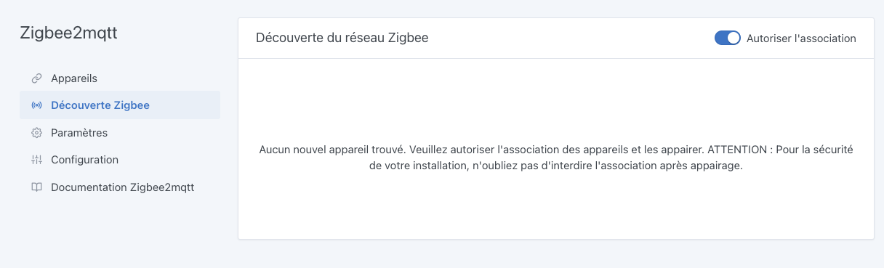

Grâce au projet [Zigbee2Mqtt](https://www.zigbee2mqtt.io/), il est possible d'intégrer facilement la plupart des périphériques utilisant le protocole Zigbee. Vous pouvez d'ailleurs consulter la liste des appareils compatibles [ici](https://www.zigbee2mqtt.io/information/supported_devices.html).

Avant de commencer, vérifiez que vous avez bien connecté un adaptateur USB Zigbee comme le CC2652R ou le CC2652RB.

Rendez-vous dans `Intégrations / Zigbee2Mqtt` dans Gladys.  

## Configurez le port du dongle USB

En cliquant dans le menu sur `Paramètres`, Gladys va automatiquement scanner les différents ports USB pour vous proposer une liste déroulante. Indiquez dans le paramètrage le port USB à utiliser pour permettre à Gladys de communqiuer en Zigbee.

## Activez Zigbee2Mqtt

Une fois votre dongle configuré, Gladys a besoin d'installer deux containers (MQTT et Zigbee2Mqtt) pour utiliser le dongle et communqiuer avec tous vos appareils. Ne vous inquiétez pas, tout cela a été automatisé.

Rendez-vous dans la partie `Configuration` et cliquez sur le bouton **Activer Zigbee2Mqtt**. Après quelques instants (le temps dépend de votre modèle de Raspberry Pi et de votre bande passante), vous devriez visualiser tous les éléments démarrés et les liens entre chacun au vert.

## Autorisez l'association d'appareils

Pour permettre aux périphériques d'êtres associés à votre réseau Zigbee, il faut autoriser l'association dans la 

Cliquez sur le menu `Découverte Zigbee`, puis cliquez sur le bouton `Autoriser l'association`.

:warning: Attention, une fois vos appareils associés, vous devrez revenir ici pour interdire l'association, par sécurité.

## Ajoutez des appareils

Pour que votre périphérique rejoigne le réseau, reportez-vous à la notice de celui-ci. Dans la majorité des cas, un appui long sur le bouton physique permet cette opération.

Toujours dans le même écran, cliquez sur le bouton **Scanner** pour demander au réseau Zigbee la liste des appareils connus.

Les appareils déjà associés à votre réseau Zigbee apparaîtront avec la liste des fonctionnalités détectées. Vous pouvez les renommer et les associer à une pièce grâce à la liste déroulante.

## Modifiez les appareils

Si nécessaire, vous pouvez vous rendre dans le menu `Appareils` pour modifier/compléter la configuration de vos appareils.

Cliquez sur le bouton **Editer** d'un appareil. Vous pourrez alors éditer son nom, la pièce à laquelle il appartient et le nom de chaque fonctionnalité.

## Utilisation

Vous pouvez maintenant utiliser ces appareils Zigbee depuis le [Tableau de bord](../dashboard/devices-in-room.md) ou depuis les [Scènes](../scenes/intro.md) de manière automatique. Selon les fonctionnalités de chaque appareil, vous aurez accès à des mesures, des états ou des actions.