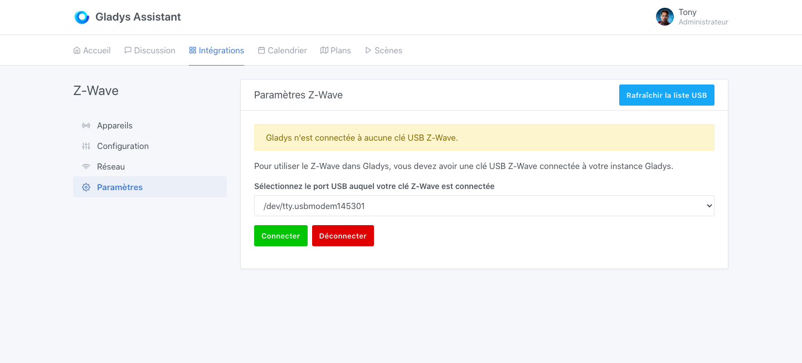
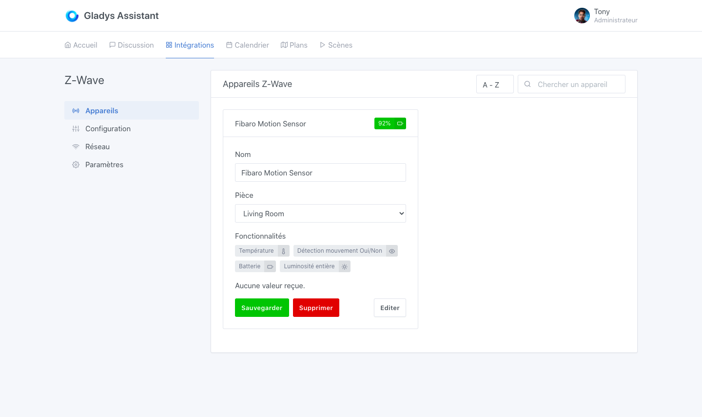

Gladys Assistant utilise [Open-Zwave](http://openzwave.com/) pour contrôler les appareils Z-Wave.

Pour voir si votre périphérique est potentiellement géré par Gladys Assistant, vous pouvez vous rendre sur la [base de donnée d'open-zwave](http://openzwave.com/device-database).

## Connectez votre clé USB Z-Wave à votre Raspberry Pi

Gladys Assistant a été testé avec la clé [Aeotec Z-Stick GEN5](https://www.amazon.fr/Contr%C3%B4leur-Z-Wave-Plus-Z-Stick-GEN5/dp/B00YETCNOE?tag=gladproj-21) et la clé [Z-Wave.me](https://www.amazon.fr/gp/product/B00QJEY6OC/?tag=gladproj-21).

D'autres clés sont sûrement compatibles, n'hésitez pas à nous dire si vous faites fonctionner une autre clé avec Gladys Assistant.

Branchez en USB votre clé USB au Raspberry Pi (ou autre machine) faisant tourner Gladys Assistant.

## Sélectionnez le port USB dans Gladys Assistant

Rendez-vous dans `Intégrations -> Z-Wave -> Paramètres`: vous devriez pouvoir sélectionner le port USB sur lequel est connectée votre clé USB Z-Wave.

Cliquez sur connecter.

## Laissez Gladys Assistant découvrir vos appareils

Pendant quelques minutes, Gladys Assistant va scanner le réseau Z-Wave pour découvrir tous les appareils Z-wave disponible.

Vous devriez ensuite pouvoir connecter vos appareils à Gladys Assistant.

Vous retrouverez dans l'onglet configuration les appareils Z-Wave que Gladys Assistant a trouvé.

Une fois les appareils ajoutés, vous les retrouverez dans l'onglet "Appareils" :

