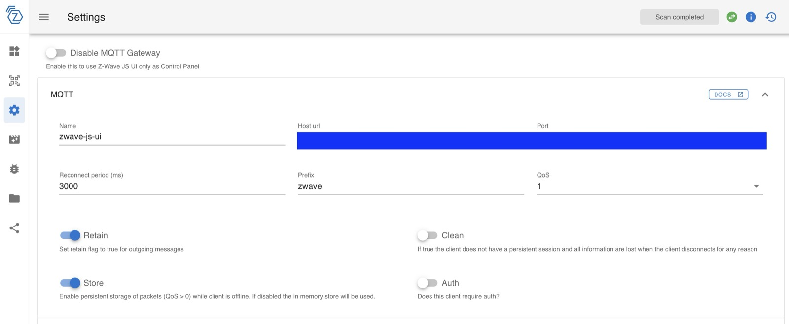
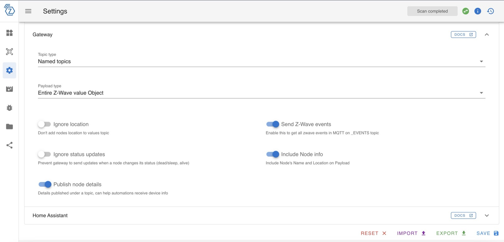

:::warning
Janvier 2024: Cette intégration est en alpha pour l'instant.

Les fonctionnalités suivantes sont supportées : 
 
 - Les détecteurs d'ouverture/fermeture de porte ou fenêtre comme le [Fibaro Door/Window Sensor 2](https://www.domadoo.fr/fr/peripheriques/4105-fibaro-detecteur-d-ouverture-z-wave-doorwindow-sensor-2-blanc-5902701700348.html?domid=17).
 - Les interrupteurs permettant d'allumer et d'éteindre l'éclairage ou des prises électriques. Exemple de périphérique supporté : [Fibaro Wall Plug](https://www.fibaro.com/fr/products/wall-plug/), [Fibaro Switch](https://www.fibaro.com/fr/products/switches/)
 - Mesure de température
 - Mesure de la consommation d'énergie

Nous sommes à la recherche d'aide pour intégrer d'autres appareils !
:::

Gladys Assistant propose une intégration avec [Z-Wave JS UI](https://zwave-js.github.io/zwave-js-ui/#/), un logiciel qui permet de contrôler des appareils Z-Wave.

Gladys se connecte au même broker MQTT que Z-Wave JS UI et reçoit des messages MQTT à chaque changement d'état d'un appareil.

## Installer Z-Wave JS UI

Nous vous invitons à vous rendre sur le site de [Z-Wave JS UI](https://zwave-js.github.io/zwave-js-ui/#/) pour trouver les instructions d'installation de Z-Wave JS UI.

## Configurer Z-Wave JS UI

Afin que l'intégration avec Gladys fonctionne correctement, 2 réglages sont nécessaires.

Il faut d'abord régler dans les paramètres les paramètres MQTT, notamment le champ "name" qui va définir le topic MQTT sur lequel les messages seront envoyés.

Ensuite, il est nécessaire de configurer la section "Gateway" de la manière suivante :

## Connecter Gladys à Z-Wave JS UI

Afin que Gladyus puisse communiquer avec Z-Wave JS UI, il faut fournir à Gladys l'URL et les informations de connexion au broker MQTT sur lequel publie Z-Wave JS UI.

Rendez-vous dans l'onglet "Configuration" pour ajouter ces informations.

## Découverte Z-Wave JS UI

Rendez-vous sur l'onglet "Découvert" pour voir les appareils que votre instance Z-Wave JS UI expose.

Vous pouvez ensuite les ajouter à Gladys d'un seul clic!
