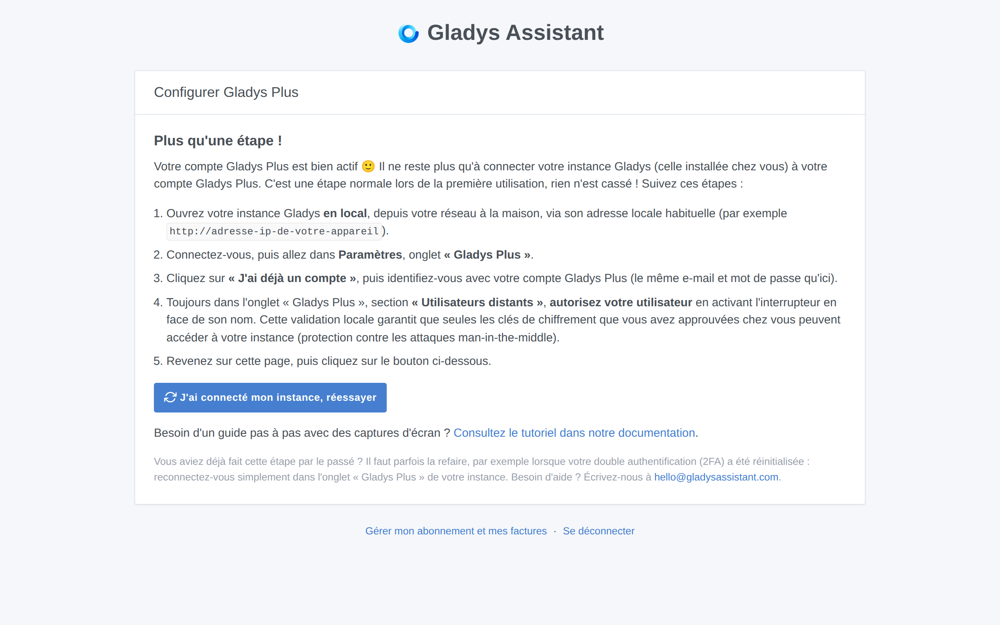
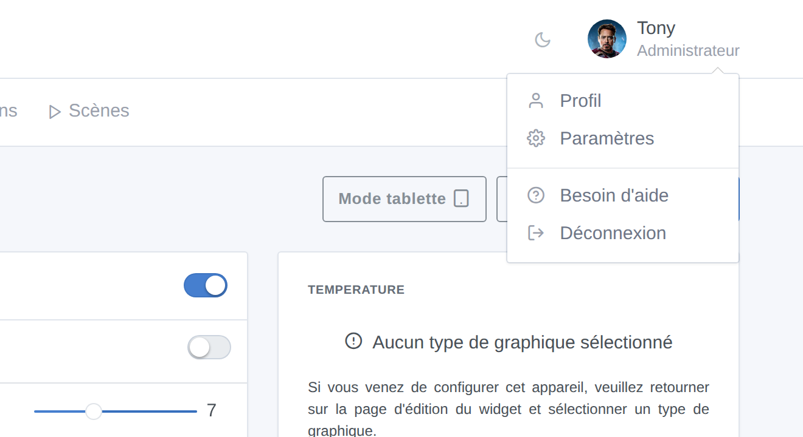
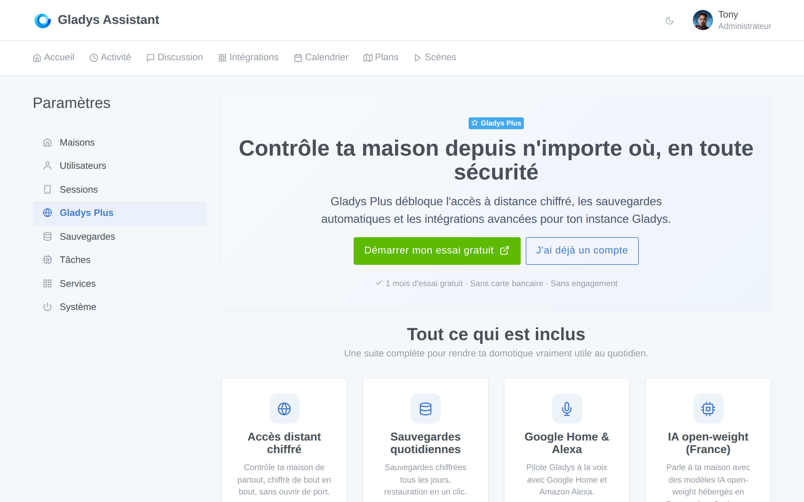
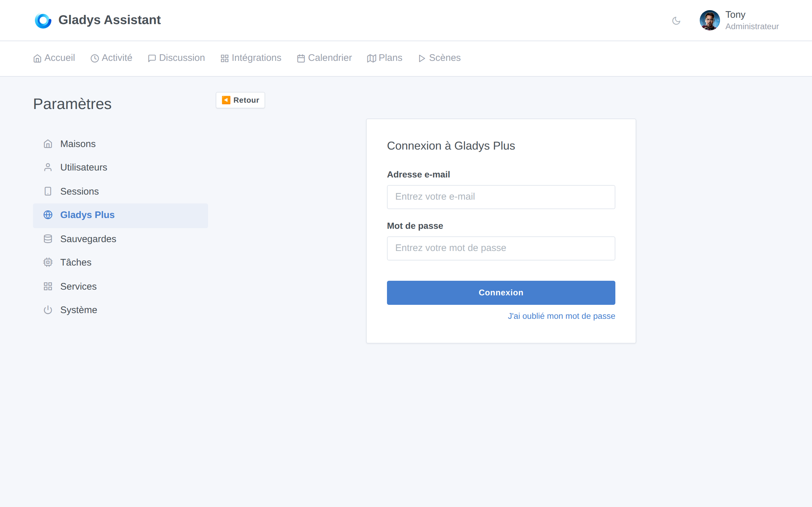
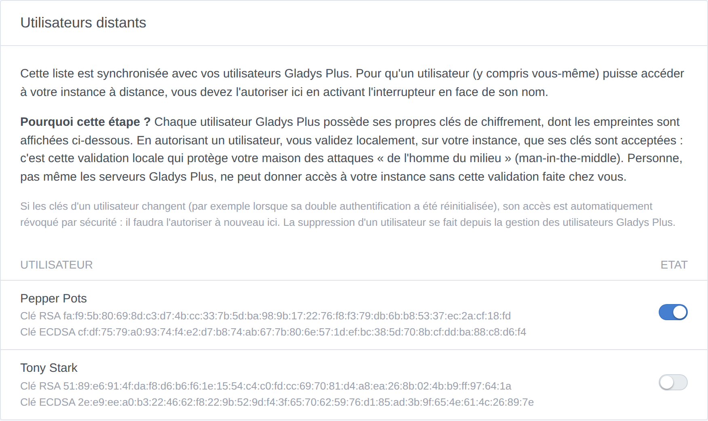

Lorsque vous créez un compte [Gladys Plus](/fr/plus/), il reste une dernière étape à réaliser : **connecter votre instance Gladys locale (celle installée chez vous) à votre compte Gladys Plus.**

Tant que cette étape n'est pas faite, [plus.gladysassistant.com](https://plus.gladysassistant.com) affiche une page « **Plus qu'une étape !** » : c'est tout à fait normal, rien n'est cassé ! Votre compte Gladys Plus est bien actif, il ne sait simplement pas encore à quelle instance Gladys se connecter.

Ce tutoriel vous guide dans cette étape, avec des captures d'écran.

## Prérequis

- Une instance Gladys installée et démarrée chez vous (voir la [documentation d'installation](/fr/docs/) si besoin).
- Un compte Gladys Plus (créé sur [gladysassistant.com/fr/plus](https://gladysassistant.com/fr/plus/)).

## Étape 1 : Ouvrez votre instance Gladys en local

Ouvrez votre instance Gladys **depuis votre réseau à la maison**, via son adresse locale habituelle : par exemple `http://192.168.1.30` (l'adresse IP de votre Raspberry Pi ou de la machine sur laquelle Gladys est installée), ou l'adresse fournie par votre méthode d'installation.

Connectez-vous avec votre **compte Gladys local** (le compte créé lors de l'installation de Gladys — il peut être différent de votre compte Gladys Plus).

## Étape 2 : Allez dans les paramètres

Cliquez sur votre photo de profil en haut à droite, puis cliquez sur **« Paramètres »**.

## Étape 3 : Ouvrez l'onglet « Gladys Plus »

Dans les paramètres, cliquez sur l'onglet **« Gladys Plus »** dans le menu de gauche, puis cliquez sur **« J'ai déjà un compte »**.

## Étape 4 : Connectez-vous avec votre compte Gladys Plus

Entrez **l'e-mail et le mot de passe de votre compte Gladys Plus** (les mêmes identifiants que sur [plus.gladysassistant.com](https://plus.gladysassistant.com)), puis cliquez sur « Connexion ».

Si c'est votre première connexion, Gladys vous demandera de configurer la double authentification (2FA) pour sécuriser votre compte, puis affichera votre **clé de sauvegarde** : enregistrez cette clé en lieu sûr en dehors de Gladys (un gestionnaire de mots de passe par exemple), elle est nécessaire pour restaurer vos sauvegardes chiffrées.

## Étape 5 : Autorisez votre utilisateur localement

Toujours dans l'onglet « Gladys Plus », descendez jusqu'à la section **« Utilisateurs distants »** : elle liste tous les utilisateurs de votre compte Gladys Plus. **Autorisez votre utilisateur en activant l'interrupteur en face de son nom.**

**Pourquoi cette étape ?** Gladys Plus est chiffré de bout en bout : chaque utilisateur Gladys Plus possède ses propres clés de chiffrement, dont les empreintes sont affichées sous son nom. En autorisant un utilisateur ici, vous validez localement, sur votre instance, que ses clés sont acceptées. C'est cette validation locale qui protège votre maison des attaques « de l'homme du milieu » (man-in-the-middle) : personne, pas même les serveurs Gladys Plus, ne peut donner accès à votre instance sans cette validation faite chez vous.

Pour la même raison, si les clés d'un utilisateur changent (par exemple lorsque sa double authentification est réinitialisée), son accès est automatiquement révoqué et devra être autorisé à nouveau ici.

## Étape 6 : Retournez sur Gladys Plus

Votre instance est maintenant connectée ! Retournez sur [plus.gladysassistant.com](https://plus.gladysassistant.com) et cliquez sur le bouton **« J'ai connecté mon instance, réessayer »** de la page « Plus qu'une étape ! ».

Il vous sera alors demandé de **sélectionner votre utilisateur Gladys** : choisissez l'utilisateur local que vous souhaitez lier à votre compte Gladys Plus. Et voilà, vous pouvez maintenant accéder à votre maison à distance, en toute sécurité ! 🎉

## En cas de problème

- **La page « Plus qu'une étape ! » réapparaît alors que vous aviez déjà fait cette étape par le passé** : cela peut arriver lorsque votre double authentification (2FA) a été réinitialisée. Reconnectez-vous simplement dans l'onglet « Gladys Plus » de votre instance locale (étapes 1 à 5 ci-dessus).
- **Erreur « L'utilisateur n'a pas encore été autorisé localement »** : dans votre instance locale, allez dans les paramètres, onglet « Gladys Plus », section « Utilisateurs distants », et activez l'interrupteur en face de son nom (voir l'étape 5 ci-dessus).
- **Besoin d'aide ?** Écrivez-nous à [hello@gladysassistant.com](mailto:hello@gladysassistant.com) ou posez votre question sur le [forum de la communauté](https://community.gladysassistant.com/).
