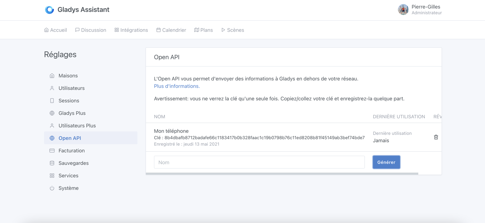
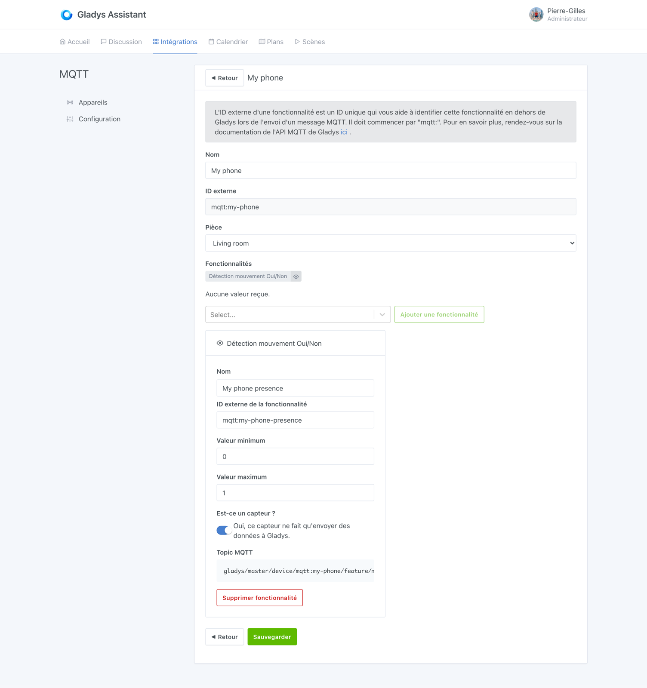
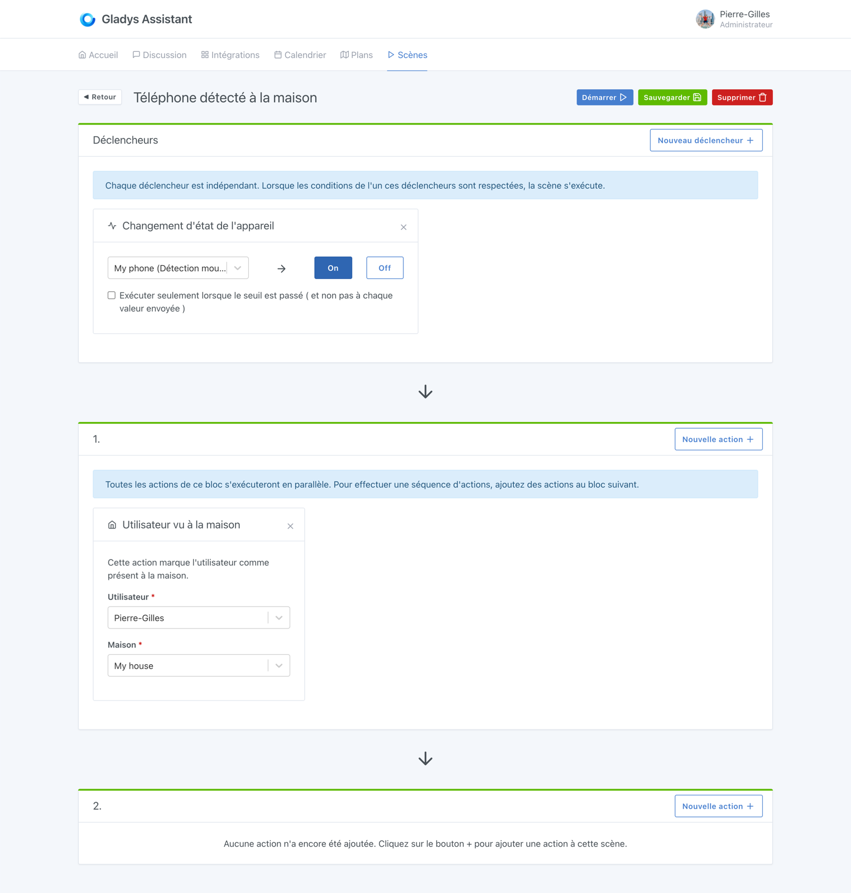
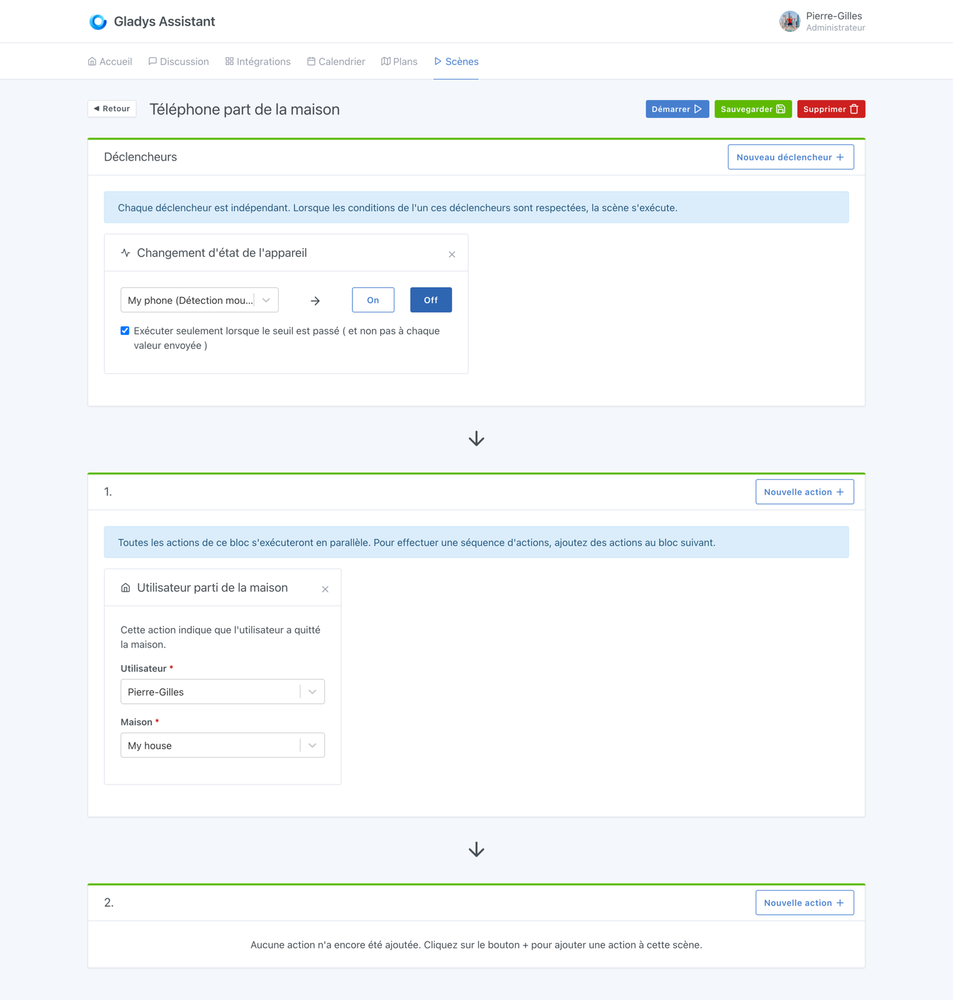
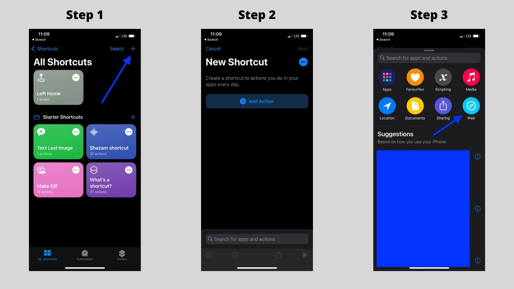
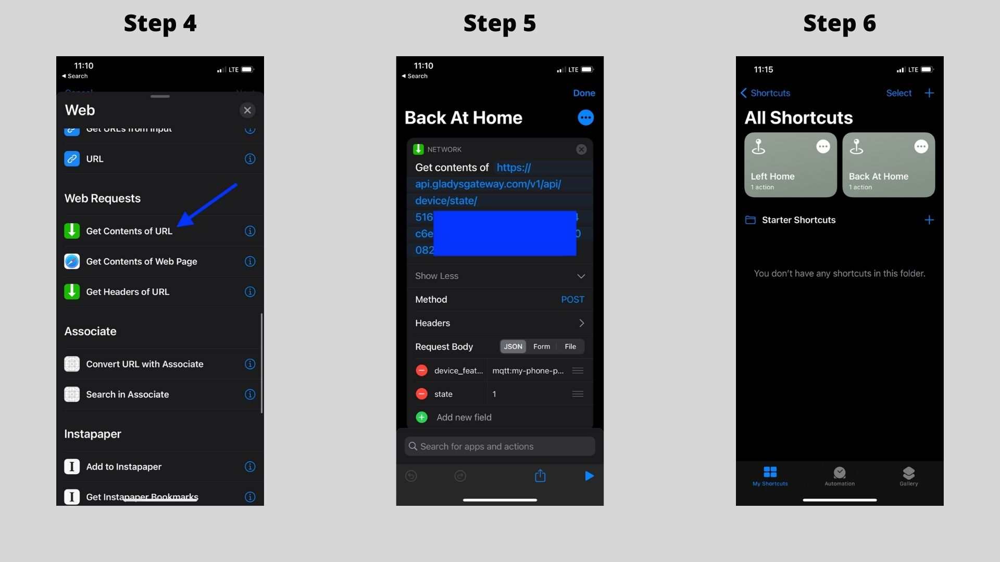
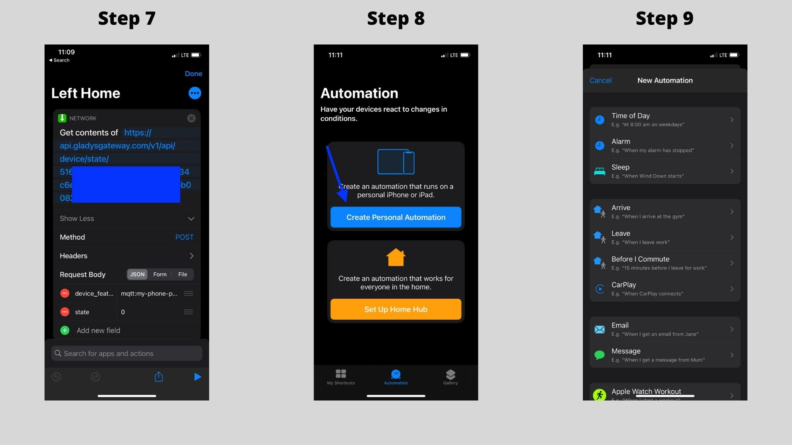
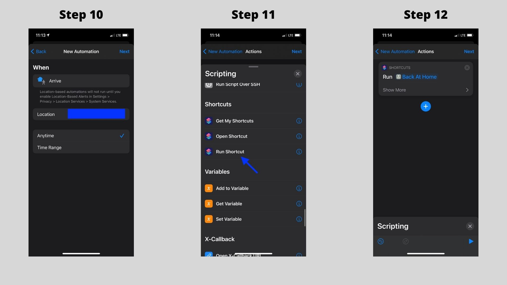
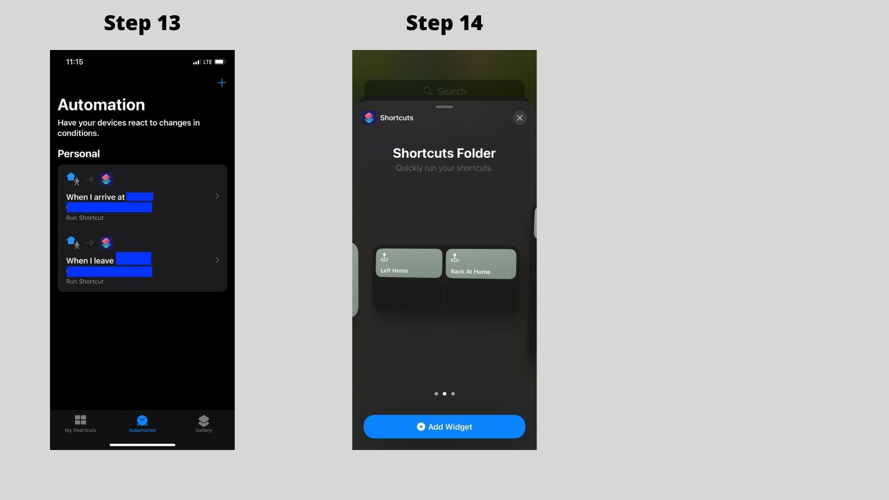

Nous proposons l'Open API Gladys Plus pour permettre aux utilisateurs Gladys Plus d'envoyer des requêtes API depuis l'extérieur de leur réseau.

## Pré-requis

Il faut être utilisateur Gladys Plus pour pouvoir utiliser l'Open API

Vous pouvez souscrire à Gladys Plus [ici](/fr/plus).

## Générer une clé d'API

Vous devez d'abord générer une clé d'API dans Gladys Plus.

Allez à [https://plus.gladysassistant.com/dashboard/settings/gateway-open-api](https://plus.gladysassistant.com/dashboard/settings/gateway-open-api).

Tapez un nom pour votre clé d'API (le nom du périphérique qui va l'utiliser par exemple), puis cliquez sur "Générer".



Copiez-coller la clé générée, et enregistrez la quelque-part: elle ne sera plus jamais affichée.

## Envoyer une nouvelle valeur de capteur

Maintenant, nous allons envoyer une nouvelle valeur de capteur via l'Open API Gladys Plus.

Imaginons que vous vouliez envoyer la présence (ou non) de votre téléphone à la maison (en utilisant Tasker sur Android ou Shortcuts sur iOS par exemple)

### Créer un appareil dans Gladys

Je vous conseille d'utiliser l'intégration MQTT pour créer un nouvel appareil (même si vous n'utilisez pas le MQTT, ça n'a pas d'intérêts)

Créez un périphérique dans Gladys:



**Note:** Nous disons ici que votre téléphone a une fonctionnalité "détecteur de mouvement", car c'est une fonctionnalité "binaire" qui est parfaite pour ce cas d'usage. Peu importe que ce soit un capteur de mouvement pour Gladys, ça ne changera rien ici.

Gardez l'attribute "external_id" pour plus tard, il sera utile.

### Envoyez une requête d'API

Maintenant, nous allons une envoyer une requête d'API, "mon téléphone est à la maison".

Pour cela, nous allons faire la requête suivante:

```
POST https://api.gladysgateway.com/v1/api/device/state/YOUR_OPEN_API_KEY

Body:
{
	"device_feature_external_id": "mqtt:my-phone-presence",
	"state": 1
}
```

Vous pouvez essayer cette requête avec [Insomnia](https://insomnia.rest/).

Pour envoyer le contraire (mon téléphone est absent de la maison), vous pouvez envoyer la requête suivante:

```
POST https://api.gladysgateway.com/v1/api/device/state/YOUR_OPEN_API_KEY

Body:
{
	"device_feature_external_id": "mqtt:my-phone-presence",
	"state": 0
}
```

### Créer une scène pour changer la présence de votre utilisateur

Maintenant, vous pouvez créer deux scènes dans Gladys pour changer la présence/absence de votre utilisateur en fonction de la présence/absence de votre téléphone.





## Utiliser Tasker/Shortcuts pour déclencher automatiquement ces scènes

Sur Android vous pouvez utiliser le super [Tasker](https://play.google.com/store/apps/details?id=net.dinglisch.android.taskerm&hl=fr&gl=US) pour envoyer une requête d'API quand vous rentrez/sortez de la maison, en détectant la présence via le GPS de votre téléphone, ou le NFC, ou la présence sur votre réseau Wi-Fi, tout est vraiment possible... :)

Sur iOS, vous pouvez utiliser l'application Shortcuts.

Exemple avec Shortcuts:

### Utiliser Shortcuts sur iOS avec Gladys Assistant

Vous devez installer l'application "Shortcuts" sur l'App Store. C'est une application développée par Apple, et gratuite d'utilisation.



Copiez l'URL de l'API, et remplissez l'URL et le body JSON comme testé précédemment.

- Le champ "device_feature_external_id" doit être de type "text"
- Le champ "state" doit être de type "number"



Vous pouvez créer un autre shortcut pour le départ de la maison:



Maintenant, nous allons créer une "automation" pour automatiser tout ça. L'objectif est de faire tourner notre action automatiquement quand on rentre/quitte une zone géographique autour de chez soit.



On fait la même automation quand on part de la maison

Il est aussi possible d'ajouter le shortcut à votre écran d'accueil pour lancer manuellement la scène.



## Envoyer la position de son téléphone avec Owntracks

Sinon, il est possible d'utiliser l'Open API pour envoyer des valeurs de capteur avec Owntracks.

[Lire le tutoriel sur Owntracks dans la documentation](/fr/docs/integrations/owntracks)
