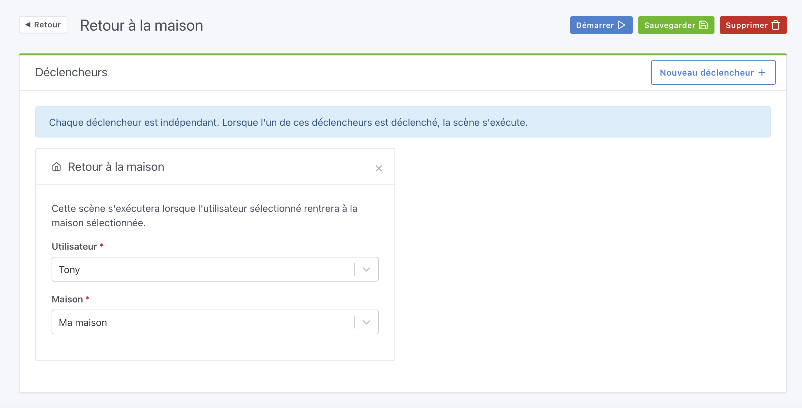

Le scénario sera déclenché quand l'utilisateur sélectionné est de retour à la maison.

## Exemple

Par rapport à la gestion de la présence, il est possible de définir la présence [en Bluetooth](/fr/docs/integrations/bluetooth) ou [dans une scène](/fr/docs/scenes/user-presence).
