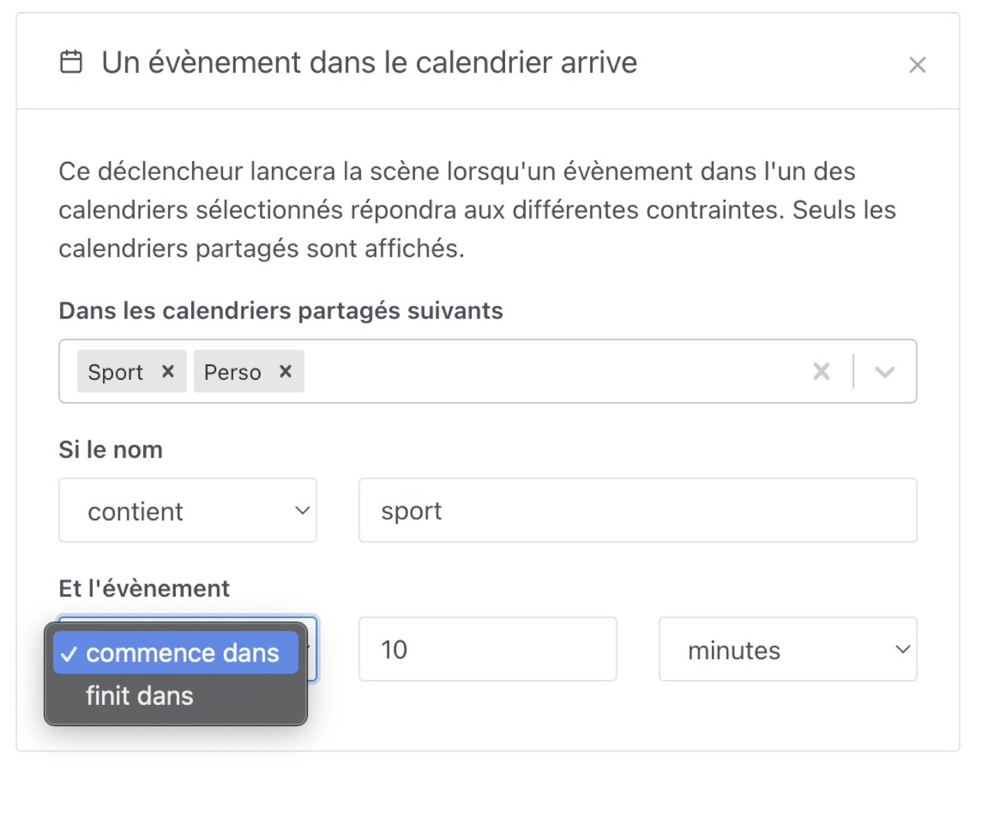

Ce déclencheur vous permet de déclencher une scène lors qu'un évènement arrive ou se termine dans votre calendrier.

Vous devez avoir connecté votre calendrier à Gladys via l'intégration [Caldav](/fr/docs/integrations/caldav/).

Vous pouvez filter sur le titre de l'évènement avec les conditions suivantes :

- est exactement
- contient
- commencer par
- finit par
- a n'importe quel nom ( la condition sera validé pour n'importe quel évènement dans le calendrier, peut importe son nom )

Ensuite, dans votre scène, vous pouvez utiliser cet évènement dans la scène.

Par exemple, dans l'action "envoyer un message", vous pouvez injecter certains attributs de l'évènements :

