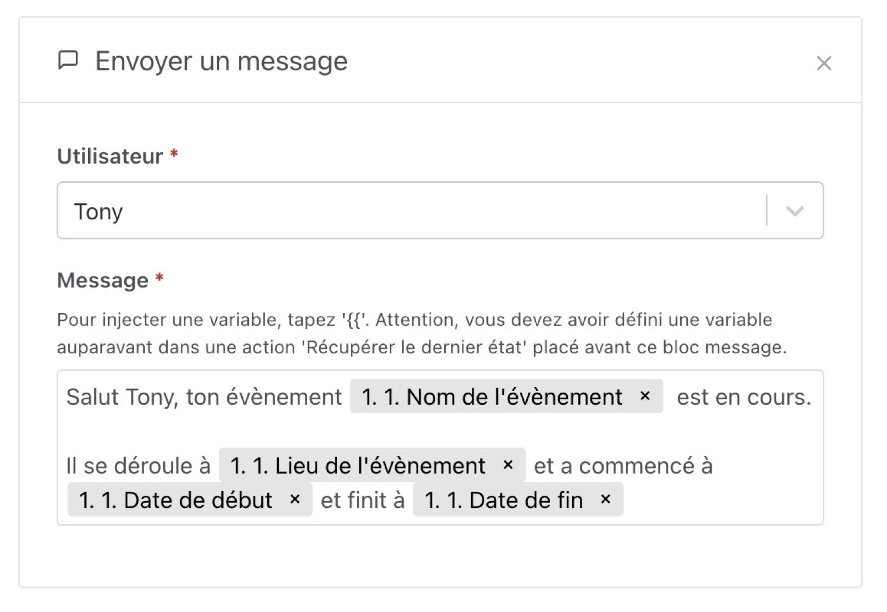

Cette condition vous permet de continuer ou stopper une scène uniquement si un évènement dans le calendrier est actuellement en cours / n'est pas en cours.

Imaginons que vous vouliez mettre une condition sur une scène pour qu'elle ne se déclenche que lorsque que vous êtes en vacances, ou au contraire quand vous êtes au travail.

Vous pouvez connecter votre calendrier dans Gladys (via l'intégration [Caldav](/fr/docs/integrations/caldav/)).

Ensuite, vous pouvez créer la condition suivante :

Si un évènement est en cours dans les calendriers "Perso" ou "Sport", et qu'il contient le mot "travail" dans le titre, alors la scène continuera. Sinon, la scène sera stoppée.

Vous pouvez ensuite utiliser l'évènement trouvé dans la scène, par exemple dans l'action "envoyer un message" :

