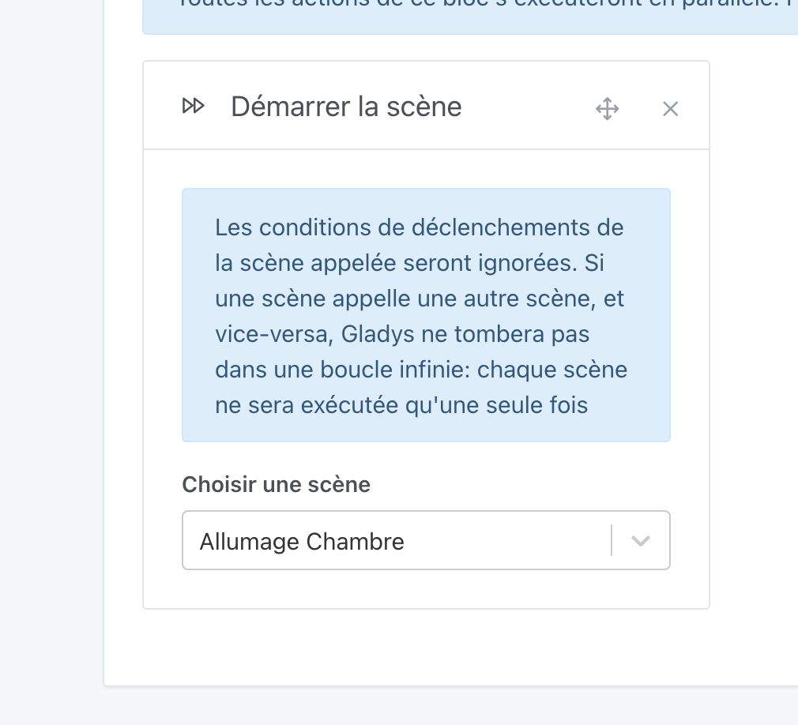

Vous pouvez déclencher une scène à partir d'une autre en ajoutant une action de scène.

La scène enchaînée ne sera déclenchée qu'une seule fois, en ignorant toutes les conditions de déclenchement de cette scène.

L'ajout de la même scène plusieurs fois dans une chaîne, même dans des groupes d'actions différents, n'aura aucun effet. Cela permet d'éviter les boucles.

