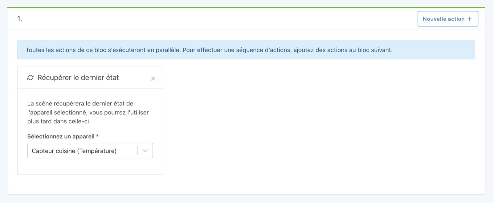
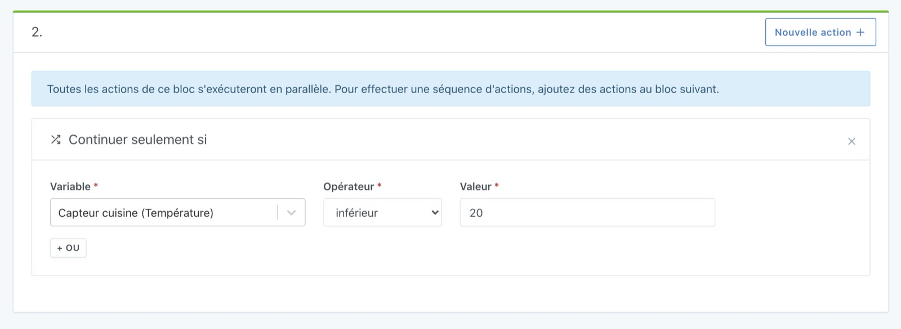

Cette action vous permet de continuer ou non l'exécution de la scène suivant une condition donnée.

Prenons un exemple.

## Continuer la scène avec une condition sur la température d'une pièce

Imaginons que vous voulez faire une scène qui va chercher la température de la pièce, puis qui continue le scénario uniquement si la température est inférieur à 20°C.

La première étape dans votre scène est d'ajouter une action "récupérer le dernier état", et de sélectionner le capteur que vous voulez utiliser.

Ensuite, dans le bloc d'action suivant, vous pouvez ajouter une action "Continuer seulement si", en sélectionnant la variable récupéré précédemment.

En mettant la condition "capteur température cuisine < 20°C", cela nous donne ça:

Dans cette action, vous pouvez injecter des variables et utiliser des fonctions mathématiques.

Voir [Fonctions mathématiques disponibles](/fr/docs/scenes/math-functions/).
