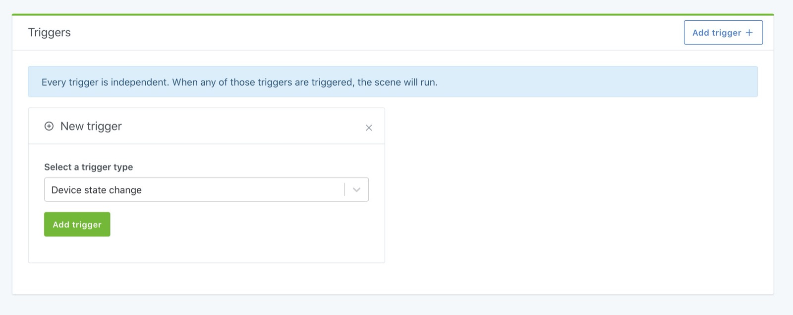
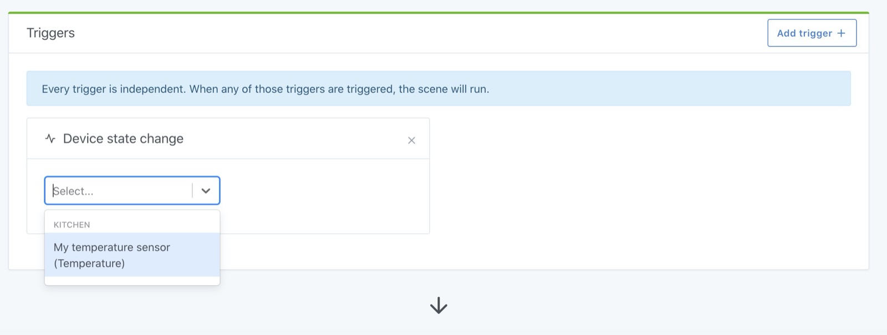
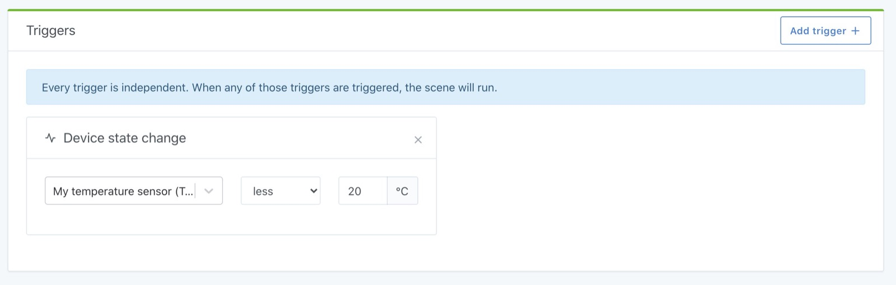
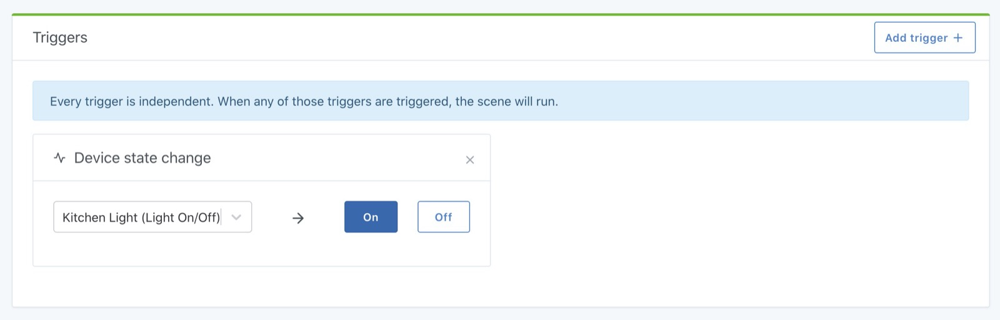

Imaginons que vous vouliez faire une scène qui effectue une action si la température descend en dessous de 20°C dans une pièce.

Pour cela, vous avez besoin d'un déclencheur "changement d'état de l'appareil".

Cliquez sur "Nouveau déclencheur", puis sélectionnez "Changement d'état de l'appareil" :

Ensuite, sélectionnez la fonctionnalité de l'appareil que vous souhaitez "surveiller".

Par exemple, dans notre cas, nous allons sélectionner un capteur de température dans la cuisine :

Ensuite, vous pouvez ajouter sous quelle condition ce déclencheur doit exécuter la scène.

Dans notre cas, nous voulons que la scène soit exécutée si "La température soit moins que 20°C" :

Suivant le type d'appareil que vous sélectionnez dans ce déclencheur, l'interface s'adapte. Par exemple, si vous voulez exécuter une scène "quand la lumière de la cuisine s'allume", votre interface ressemblera à ça :

