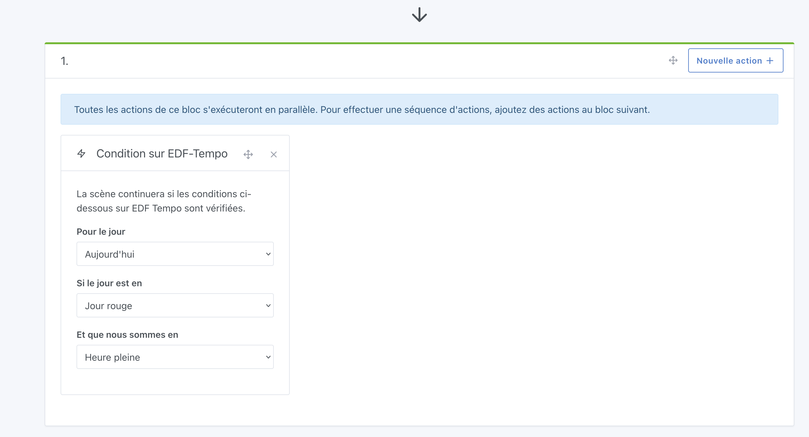

En France, EDF fournit un service [EDF Tempo](https://particulier.edf.fr/fr/accueil/gestion-contrat/options/tempo.html) où le coût de l'électricité est globalement moins cher toute l'année, sauf certains jours "blancs" et "rouges" où le prix de l'électricité est bien plus cher.

En 2024, il y a 301 jours bleus, 43 jours blancs et 22 jours rouges.

Ce type de contrat est pratique pour les utilisateurs pouvant facilement décaler leurs usages.

### Des scénarios automatiques avec Gladys

Dans Gladys, vous pouvez dans une scène aller chercher l'état actuel du jour Tempo et si nous sommes en heure pleine/heure creuse.

Pour ceci, créez une action de scène "Condition sur EDF-Tempo" :

Cette condition pourra bloquer l'exécution de la scène si la condition n'est pas vérifiée.

Cette condition vous permet de créer tout type de scènes intelligentes :

- Lancer la machine à laver UNIQUEMENT si on est en jour bleu
- Le matin à 8h, si on est en jour rouge, m'envoyer un message sur Telegram
- Le soir à 19h, si le lendemain est un jour rouge, m'envoyer un message pour me prévenir de lancer le lave vaisselle ce soir

Bref, les possibilités sont illimitées !
