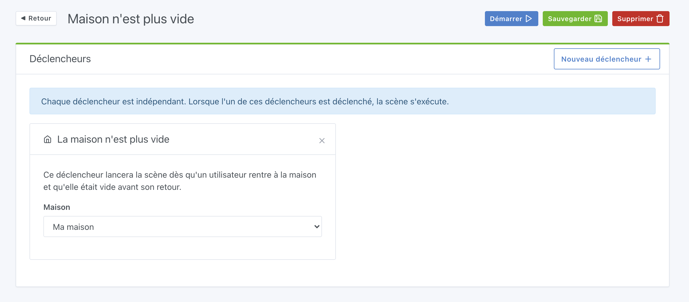
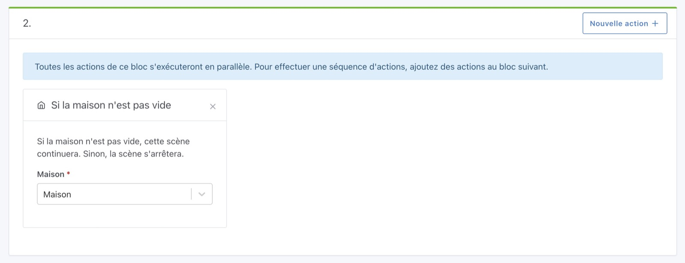

Le scénario se déclenchera quand la maison était vide et qu'un utilisateur rentre à la maison.

Il est aussi possible d'utiliser cette condition dans une scène.

## Déclencheur

Par rapport à la gestion de la présence, il est possible de définir la présence [en Bluetooth](/fr/docs/integrations/bluetooth) ou [dans une scène](/fr/docs/scenes/user-presence).

## Condition dans une scène

