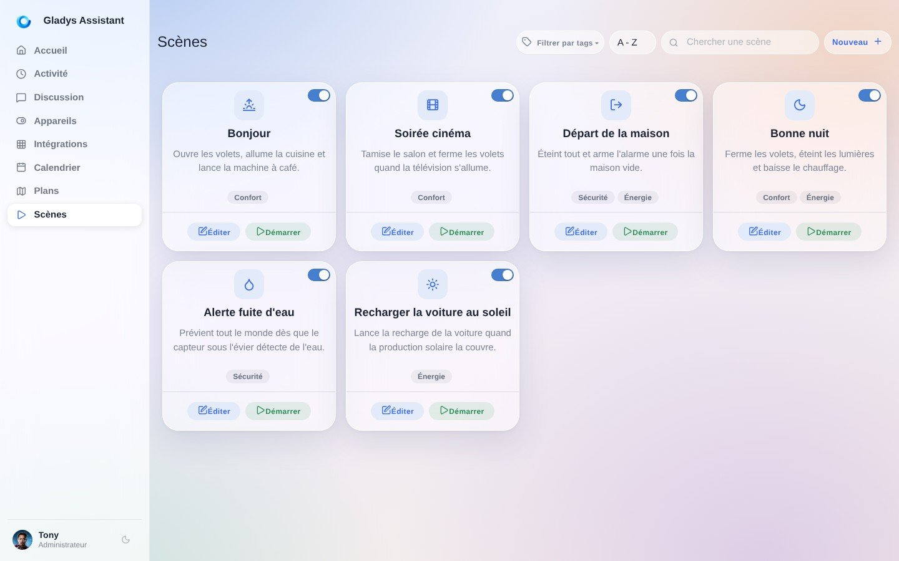
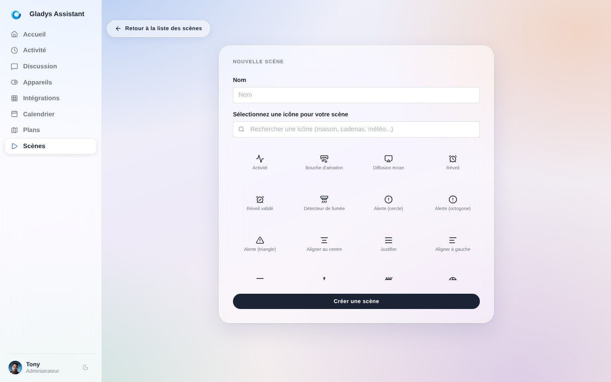
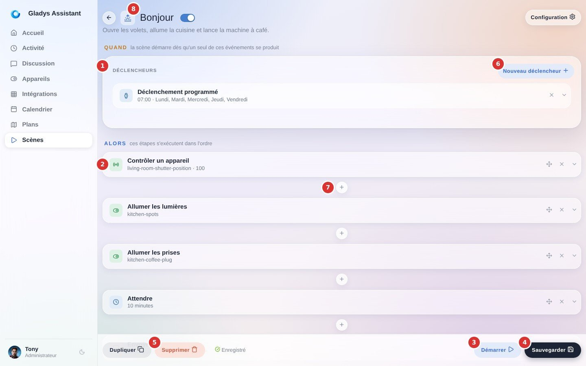

Dans Gladys Assistant, il est possible de créer des **scènes** : un ensemble d'**actions** exécutées à la suite ou en parallèle.

Les scènes sont entièrement personnalisées : c'est l'utilisateur qui compose dans l'éditeur de scène de Gladys cette suite d'action.

Ces scènes peuvent être déclenchées manuellement, ou automatiquement via un **déclencheur**.

Quelques exemples :

- Une scène "éteindre toute la maison", qui couperait toutes les lumières de la maison. Cette scène est utile en déclenchement manuel si l'on veut pouvoir tout couper à la maison à distance.
- Une scène "Alerte intrusion", qui envoie un message Telegram à l'utilisateur. Cette scène serait configurée pour s'exécuter après un déclencheur "Si un mouvement est détecté".

## Créer une scène

Pour créer une scène, vous pouvez vous rendre dans l'onglet "Scènes" de votre interface Gladys, et cliquer sur le bouton "Nouveau +".

Ensuite, vous pouvez choisir un nom pour votre scène, ainsi qu'une icône. Cette icône n'est utile que dans l'interface de Gladys.

Vous voilà maintenant dans l'éditeur de scène. Analysons ensemble chaque partie de l'éditeur :

1. Les déclencheurs : si vous ajoutez des déclencheurs à votre scène (ce qui est optionnel), ils apparaitront ici. Une même scène peut être déclenchée par plusieurs déclencheurs différents. Ces déclencheurs sont tous indépendants. Ajouter plusieurs déclencheurs veut tout simplement dire : "Quand cet évènement se produit OU Quand cet évènement se produit OU..."
2. Une étape : une scène est une suite d'étapes, qui s'exécutent les unes après les autres. Gladys attend qu'une étape soit terminée avant de passer à la suivante. À l'intérieur d'une étape, "Ajouter une action en parallèle" ajoute une action qui s'exécute en même temps que les autres actions de cette étape. Ainsi, vous pouvez paralléliser les différentes actions, et pas seulement faire du séquentiel, puissant non ?
3. Démarrer : Ce bouton vous permet de tester l'exécution de la scène. Ce bouton ne prend pas en compte les déclencheurs, il exécute uniquement les étapes.
4. Sauvegarder : Ce bouton enregistre la scène.
5. Supprimer : Ce bouton supprime la scène.
6. Nouveau déclencheur : Ce bouton vous permet d'ajouter un déclencheur à la scène. Vous pouvez ajouter autant de déclencheurs que vous voulez.
7. Le bouton "+" entre deux étapes : il insère une nouvelle étape à cet endroit de la scène.
8. Cliquez sur le titre de la scène pour l'éditer.
