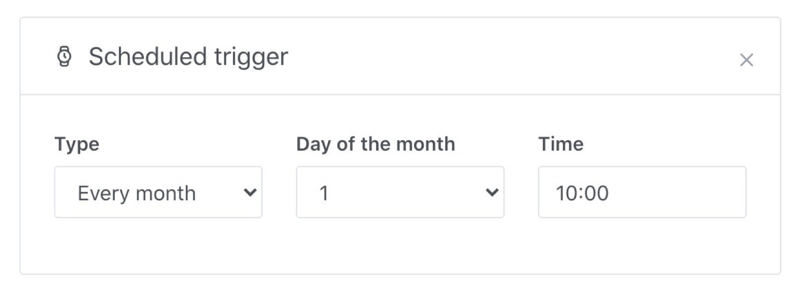
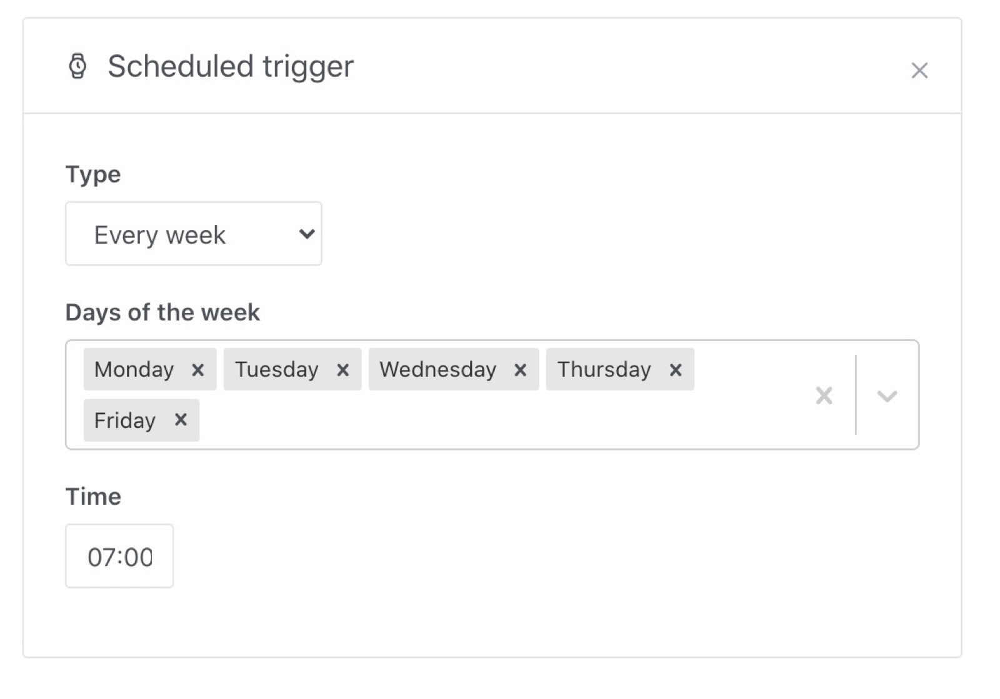
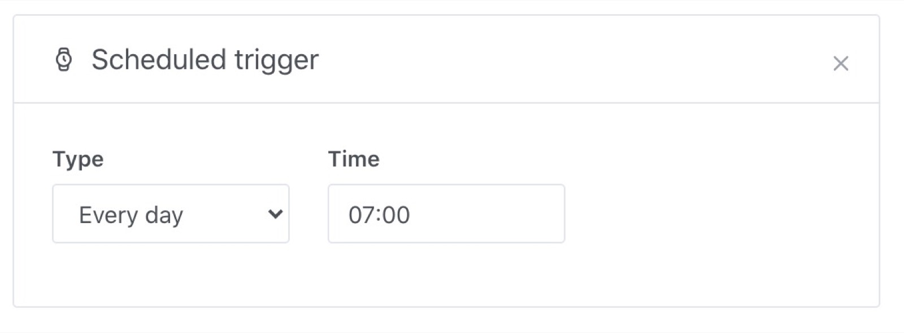
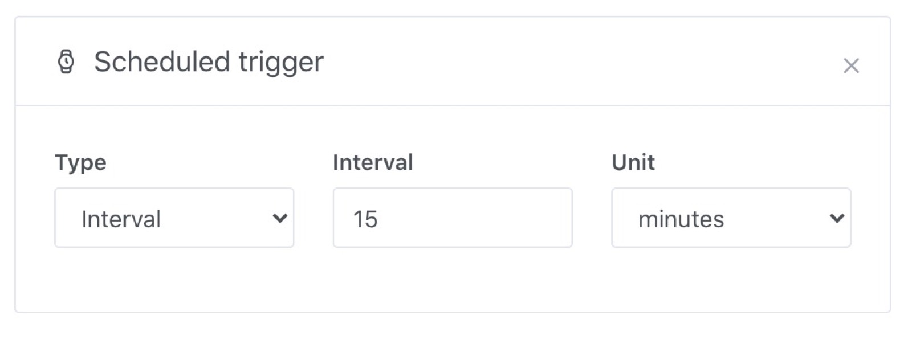

Il est récurrent en domotique de vouloir programmer une scène : tous les jours ? Une fois par jour ? une fois par semaine ? Une fois par mois ? Toutes les 15 minutes ?

Gladys propose un déclencheur qui permet de programmer l'exécution d'une scène.

Il y a 5 types de programmations possibles :

- Tous les mois
- Toutes les semaines
- Tous les jours
- A intervalle
- A un jour précis

Présentation des différentes possibilités :

## Tous les mois

Ce déclencheur vous permet de programmer l'exécution d'une scène, tous les mois à un jour précis du mois.

C'est utile si vous voulez par exemple exécuter une scène tous les 1er du mois.

## Toutes les semaines

Ce déclencheur vous permet de programmer l'exécution d'une scène certains jours de la semaine, à une heure précise.

C'est probablement le déclencheur le plus utilisé, car il permet de mettre en place tout ce qui est "routine quotidienne".

Si vous voulez vous réveiller avec une scène personnalisées, tous les jours de la semaine (lundi-vendredi) à 7h, voilà à quoi cela ressemblera :

## Tous les jours

Ce déclencheur vous permet de déclencher une scène tous les jours à un horaire précis.

Utile pour toutes les tâches récurrentes qui interviennent tous les jours de la semaine.

## Intervalle

Ce déclencheur est particulier. Il vous permet de programmer une scène, non pas par "jour" mais à un intervalle particulier (toutes les 30 secondes, toutes les 15 minutes, toutes les heures).

Exemple :

## A une date précise

Ce déclencheur vous permet de programmer votre scène à un jour précis et à une heure précise.

Exemple : le 4 juin 2020 à 14h00

