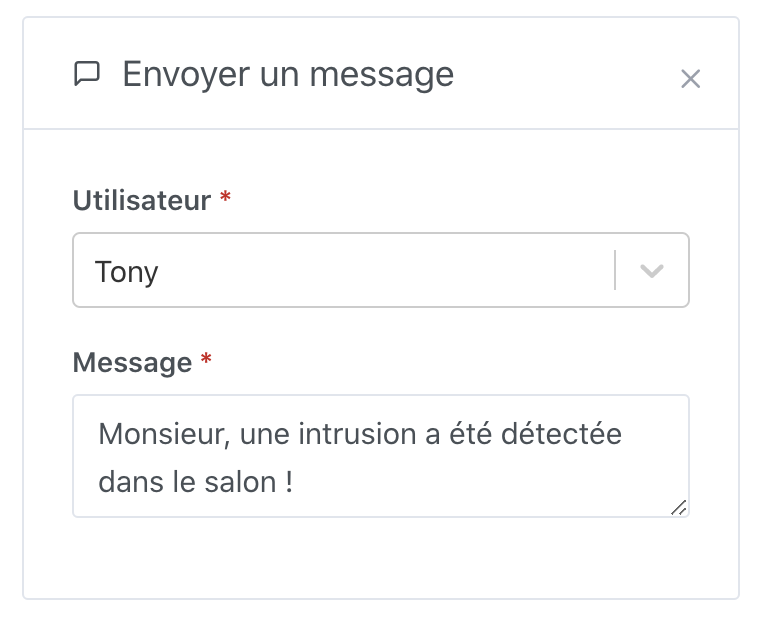
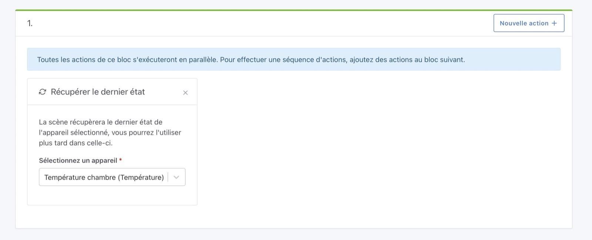

Cette action vous permet d'envoyer un message à un utilisateur Gladys dans une scène.

Gladys utilisera ensuite Telegram/le chat web Gladys pour contacter l'utilisateur.

## Exemple simple

Pour envoyer un message, c'est très simple, créez une action "Envoyer un message" dans une scène, et sélectionnez l'utilisateur qui doit recevoir le message.

## Injecter une variable dans un message

Imaginons que vous voulez vous envoyer une alerte quand la température est trop basse chez vous.

Vous voulez injecter la valeur de la température actuelle dans le message, afin de savoir la valeur de température actuelle.

Pour cela, vous devez dans votre scène ajouter une action "Récupérer le dernier état" puis vous sélectionnez le capteur que vous voulez requêter.

Ensuite, plus loin dans la scène, vous pouvez ajouter une action "Envoyer un message" et dans le message vous tapez "{{ " puis vous sélectionnez la variable précédemment définie.

<video  width="100%" controls autoplay loop muted>
<source src="/fr/img/docs/fr/scenes/send-a-message-action/inject-variable-demo.mp4" type="video/mp4" />
  Your browser does not support the video tag.
</video>

Lorsque la scène s'exécutera, vous devriez récupérer la valeur dans votre message 🥳
