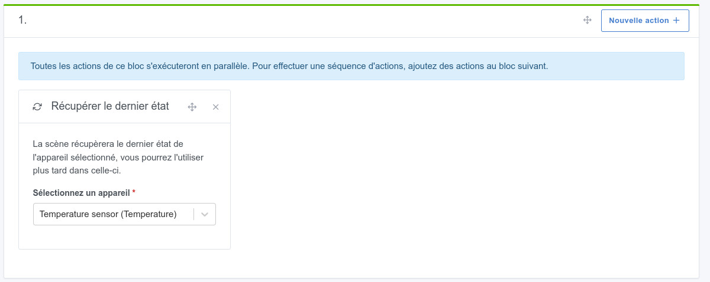
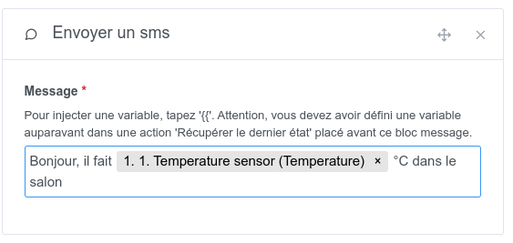

Cette action vous permet d'envoyer un SMS sur votre téléphone portable via l'opérateur mobile français [Free Mobile](https://mobile.free.fr) dans une scène.

## Exemple simple

Pour envoyer un SMS, c'est très simple, créez une action "Envoyer un SMS" dans une scène.

## Injecter une variable dans un message

Imaginons que vous voulez vous envoyer une alerte quand la température est trop basse chez vous.

Vous voulez injecter la valeur de la température actuelle dans le message, afin de savoir la valeur de température actuelle.

Pour cela, vous devez dans votre scène ajouter une action "Récupérer le dernier état" puis vous sélectionnez le capteur que vous voulez requêter.

Ensuite, plus loin dans la scène, vous pouvez ajouter une action "Envoyer un SMS" et dans le message vous tapez `{{ ` puis vous sélectionnez la variable précédemment définie.

Lorsque la scène s'exécutera, vous devriez récupérer la valeur dans votre message 🥳
