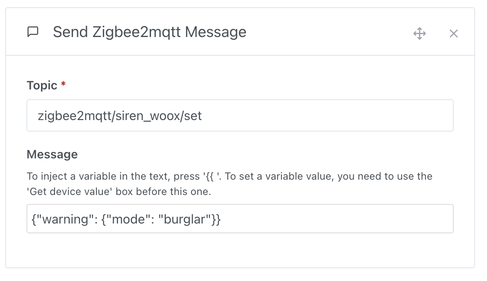
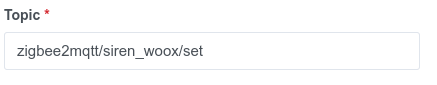
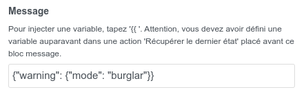
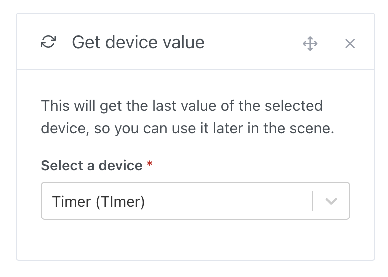
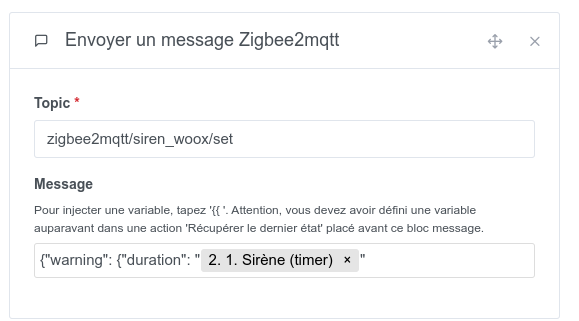

Dans les scènes, il est parfois utile d'envoyer une commande pour contrôler des appareils Zigbee2Mqtt qui ne sont pas gérés par Gladys Assistant.

## Envoyer un message Zigbee2Mqtt dans une scène

Pour envoyer un message Zigbee2Mqtt, c'est très simple : créez une action "envoyer un message Zigbee2Mqtt" dans une scène.

## Exemple concret : Déclencher une sirène [Woox R7051](https://www.zigbee2mqtt.io/devices/R7051.html) depuis une scène Gladys Assistant

### Dans Gladys, créer une scène

Créez une nouvelle scène dans Gladys, puis ajoutez une action "envoyer un message Zigbee2Mqtt".

Spécifiez le topic de votre appareil.

Spécifiez la commande pour contrôler votre appareil. Vous pouvez trouver les informations de votre appareil sur le site [Zigbee2mqtt](https://www.zigbee2mqtt.io/devices/R7051.html#warning-composite).

Enregistrez la scène et lancez-la.

## Injecter une variable dans un message

Vous voulez injecter la valeur de durée actuelle dans le message, afin de savoir la valeur de durée actuelle.

Pour cela, vous devez dans votre scène ajouter une action "Récupérer le dernier état" puis vous sélectionnez l'appareil que vous voulez requêter.

Ensuite, plus loin dans la scène, vous pouvez ajouter une action "Envoyer un message" et dans le message vous tapez `{{ ` puis vous sélectionnez la variable précédemment définie.

Lorsque la scène est lancée, vous devriez obtenir la valeur dans votre message 🥳
