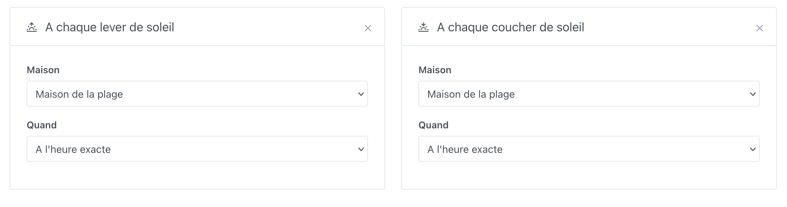
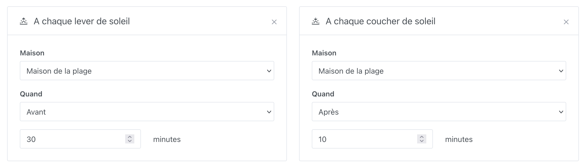

Vous pouvez déclencher une scène en fonction du lever ou du coucher du soleil. C'est utile, par exemple, si vous souhaitez allumer les lumières au coucher du soleil ou les éteindre au lever du soleil.

## Lever ou coucher du soleil exact

« À chaque lever du soleil » ou « À chaque coucher du soleil » déclencheront la scène au moment précis où le soleil se lève ou se couche.

## Lever ou coucher du soleil avec délai

« 30 minutes avant le coucher du soleil » ou « 10 minutes après le lever du soleil » déclencheront la scène avec un certain délai avant/après.