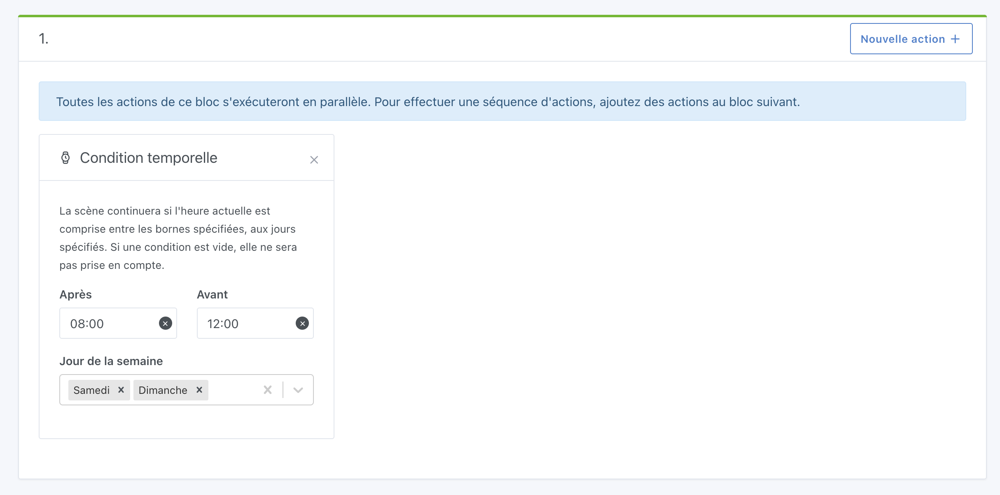

La scène continuera si la condition est valide, c'est à dire si l'heure actuelle est comprise dans les bornes sélectionnées, et si le jour est dans les jours sélectionnés.

## Exemple

"Quand il est entre 8h et 12h, le week-end"
