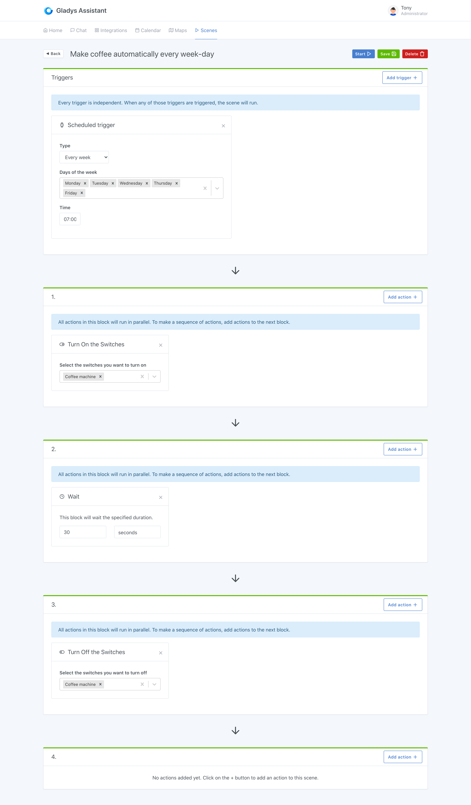

Que ce soit pour contrôler une simple lampe de chevet, une bande de LED, ou même une machine à café, les prises télécommandées sont très utilisées en domotique.

Dans Gladys, vous pouvez contrôler vos prises télécommandées, que ce soit sur le dashboard ou dans les scènes.

Nous verrons ici un exemple concret.

Prenons les cafetière filtres très basiques que l'on peut trouver dans le commerce pour une dizaine d'euros. Ces cafetières ont l'avantages d'avoir un bouton on/off physique, qui peut rester en position "allumé" permanente.

Avec une prise télécommandée devant, il devient possible de contrôler la machine, et donc de faire du café sur commande !

## Faire du café automatiquement tous les matins de la semaine avec Gladys

On peut donc imaginer la scène suivante :

```
Déclencheur: "Du lundi au vendredi, à 7h"
Actions:
    - Allumer la prise "machine à café"
    - Attendre 30 secondes (que le café soit préparé)
    - Eteindre la prise "machine à café"
```

Dans Gladys, la scène va ressembler à ça :



Comme vous pouvez le voir, il y a en premier un déclencheur qui se déclenche sur tous les jours de la semaine hors week-end (de lundi à vendredi).

Ensuite, la scène allume la prise, attend 30 secondes, puis éteint la prise.

Super simple, non ?
