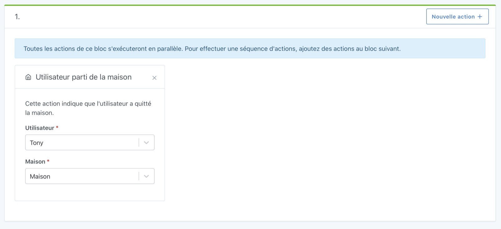

Sur le tableau de bord, Gladys vous permet d'afficher quels utilisateurs sont présents/absents de la maison.

Pour définir la présence/absence d'un utilisateur, vous pouvez le faire dans les scènes.

- Soit avec pour objectif de lancer la scène manuellement quand vous partez/rentrez de la maison (pratique, mais bon peut-être un peu contraignant, on veut de l'automatisation nous !)
- Soit en automatisant la détection de la présence: Cela peut-être un bouton dans l'entrée, une détection de mouvement si vous êtes seul chez vous, un petit Tasker qui envoie un message en MQTT quand vous êtes connecté au Wi-Fi de chez vous, un Nut: c'est à vous de décider!

## Pré-requis

Vous devez être en Gladys Assistant v4.0.3 minimum pour avoir cette fonctionnalité.

## Définir l'utilisateur comme "présent à la maison" dans une scène

L'objectif de cette action est de dire à Gladys : "l'utilisateur a été vu à la maison".

Avec cette information, Gladys pourra :

- Soit émettre un évènement "retour à la maison" si l'utilisateur était absent de la maison avant cela.
- Soit ne rien faire si l'utilisateur était déjà à la maison.

Pour cela, dans une scène, vous pouvez créer une action "Utilisateur vu à la maison" :

## Définir l'utilisateur comme "absent de la maison" dans une scène

L'objectif de cette action est de dire à Gladys "L'utilisateur n'est pas dans cette maison".

Avec cette information, Gladys pourra:

- Soit émettre un évènement "départ de la maison" si l'utilisateur était marqué comme "à la maison" avant cela.
- Soit ne rien faire si l'utilisateur n'était pas à la maison, ou pas dans **cette** maison.

Pour cela, dans une scène, vous pouvez créer une action "Utilisateur parti de la maison" :

## Remarque sur l'utilisation des Nuts

Une gestion native des périphériques de présence Bluetooth de type Nut est désormais possible dans l'intégration "Bluetooth" depuis la version 4.10 de Gladys !
