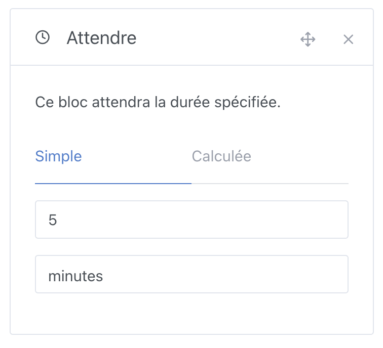

Cette action vous permet d'attendre une durée fixe ou calculée.

## Variable simple fixe

Vous pouvez spécifier une durée d'attente fixe qui ne variera pas :

## Variable calculée

Vous pouvez définir une durée d'attente dynamique qui varie selon des variables ou des calculs mathématiques.

Par exemple, si vous avez récupéré la valeur d'un capteur plus tôt dans votre scène (avec l'action "Récupérer le dernier état"), vous pouvez utiliser cette variable comme base pour calculer votre temps d'attente :

### Les fonctions mathématiques disponibles

- `+` : addition
- `-` : soustraction
- `*` : multiplication
- `/` : division
- `%` : modulo
- `^` : puissance
- `abs(-5)` : valeur absolue (Résult = 5)
- `round(5.2)` : arrondi (Résult = 5)
- `round(5.8, 1)` : arrondi avec 1 chiffre après la virgule (Résult = 5.8)
- `floor(5.2)` : arrondi inférieur (Résult = 5)
- `ceil(5.2)` : arrondi supérieur (Résult = 6)
- `random(1, 10)` : nombre aléatoire entre 1 et 10
