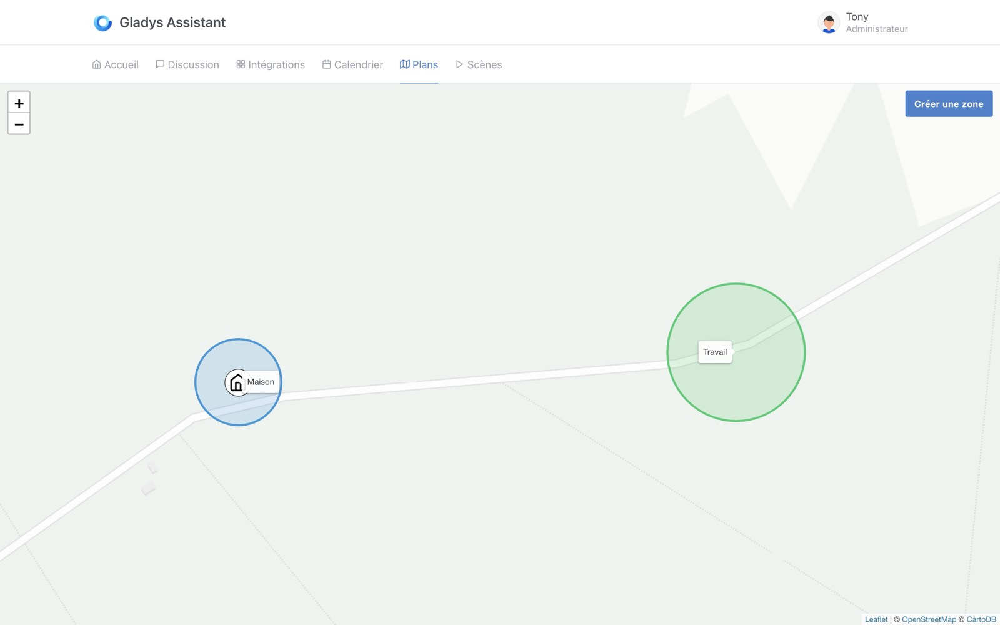
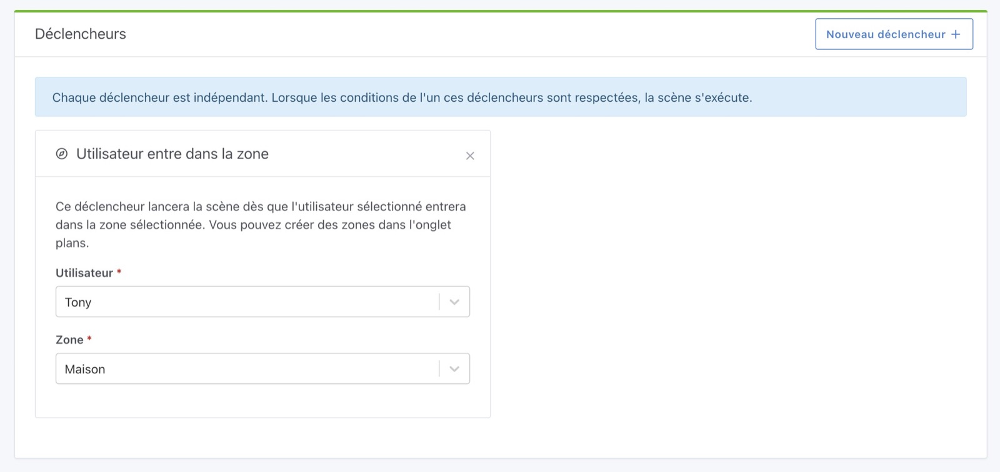
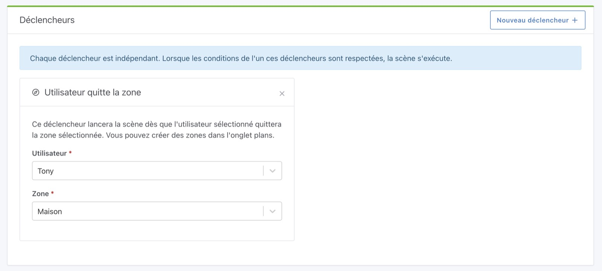

Il est possible de déclencher une scène quand un utilisateur entre/sort d'une zone.

Les zones peuvent être créées dans la vue "Plans".

## Utilisateur entre dans une zone

## Utilisateur sort d'une zone

